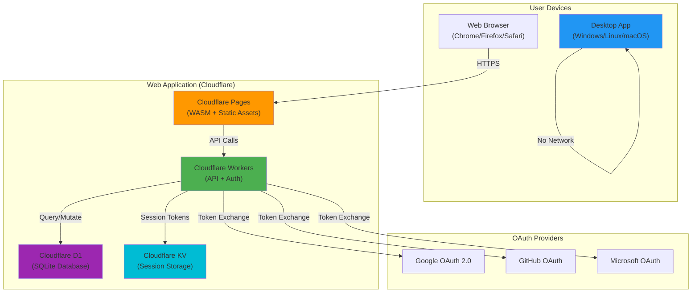
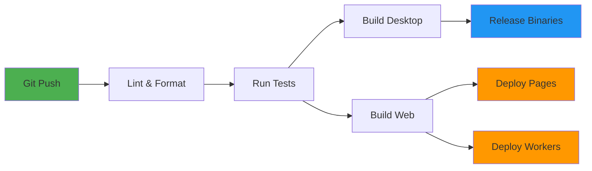

# Deployment Architecture

## Overview

This document describes the complete deployment architecture for Rusty Audio, covering both the desktop application and the web/PWA application with authentication.

---

## 1. Architecture Overview



---

## 2. Desktop Application Deployment

### 2.1 Platform-Specific Builds

#### Windows
**Build Target:** `x86_64-pc-windows-msvc`

**Features:**
- ASIO support for professional audio interfaces
- MMCSS thread priority for real-time audio
- Windows manifest for high-DPI support

**Build Command:**
```bash
cargo build --release --package rusty-audio-desktop
```

**Output:**
```
target/release/rusty-audio.exe (~15-20 MB)
```

**Installer:**
- **Tool:** Inno Setup or WiX Toolset
- **Format:** `.exe` installer
- **Install Location:** `C:\Program Files\Rusty Audio\`
- **Registry Entries:** File associations for audio formats
- **Uninstaller:** Standard Windows uninstall

**Example Inno Setup Script:**
```inno
[Setup]
AppName=Rusty Audio
AppVersion=0.2.0
DefaultDirName={pf}\Rusty Audio
DefaultGroupName=Rusty Audio
OutputDir=dist\windows
OutputBaseFilename=rusty-audio-setup-0.2.0-x64
Compression=lzma2
SolidCompression=yes

[Files]
Source: "target\release\rusty-audio.exe"; DestDir: "{app}"
Source: "resources\icon.ico"; DestDir: "{app}"

[Icons]
Name: "{group}\Rusty Audio"; Filename: "{app}\rusty-audio.exe"
Name: "{commondesktop}\Rusty Audio"; Filename: "{app}\rusty-audio.exe"

[Run]
Filename: "{app}\rusty-audio.exe"; Description: "Launch Rusty Audio"; Flags: postinstall nowait skipifsilent
```

---

#### Linux
**Build Target:** `x86_64-unknown-linux-gnu`

**Dependencies:**
- `libasound2-dev` (ALSA)
- `libudev-dev` (device enumeration)
- `libx11-dev`, `libxcursor-dev`, `libxrandr-dev` (X11/Wayland)

**Build Command:**
```bash
cargo build --release --package rusty-audio-desktop
```

**Output:**
```
target/release/rusty-audio (~15-20 MB)
```

**Distribution Formats:**

1. **AppImage** (Universal)
```bash
# Build AppImage
linuxdeploy --executable=target/release/rusty-audio \
  --appdir=AppDir \
  --desktop-file=resources/rusty-audio.desktop \
  --icon-file=resources/icon.png \
  --output=appimage

# Output: rusty-audio-0.2.0-x86_64.AppImage
```

2. **Flatpak** (Flathub)
```yaml
# org.rustyaudio.RustyAudio.yml
app-id: org.rustyaudio.RustyAudio
runtime: org.freedesktop.Platform
runtime-version: '23.08'
sdk: org.freedesktop.Sdk
sdk-extensions:
  - org.freedesktop.Sdk.Extension.rust-stable
command: rusty-audio
finish-args:
  - --socket=pulseaudio
  - --device=all
  - --share=ipc
  - --socket=x11
  - --socket=wayland
  - --filesystem=xdg-music:ro
modules:
  - name: rusty-audio
    buildsystem: simple
    build-commands:
      - cargo build --release --package rusty-audio-desktop
      - install -D target/release/rusty-audio /app/bin/rusty-audio
```

3. **Debian/Ubuntu Package**
```bash
# Build .deb package
cargo deb --package rusty-audio-desktop

# Output: target/debian/rusty-audio_0.2.0_amd64.deb
```

**Desktop Entry:**
```desktop
[Desktop Entry]
Type=Application
Name=Rusty Audio
Comment=Car-stereo-style audio player
Exec=rusty-audio
Icon=rusty-audio
Categories=AudioVideo;Audio;Player;
Terminal=false
```

---

#### macOS
**Build Target:** `x86_64-apple-darwin` or `aarch64-apple-darwin` (Apple Silicon)

**Build Command:**
```bash
# Intel
cargo build --release --target x86_64-apple-darwin --package rusty-audio-desktop

# Apple Silicon
cargo build --release --target aarch64-apple-darwin --package rusty-audio-desktop

# Universal Binary
lipo -create \
  target/x86_64-apple-darwin/release/rusty-audio \
  target/aarch64-apple-darwin/release/rusty-audio \
  -output target/universal/rusty-audio
```

**Application Bundle:**
```
RustyAudio.app/
├── Contents/
│   ├── Info.plist
│   ├── MacOS/
│   │   └── rusty-audio (universal binary)
│   ├── Resources/
│   │   ├── Icon.icns
│   │   └── ...
│   └── _CodeSignature/
```

**Info.plist:**
```xml
<?xml version="1.0" encoding="UTF-8"?>
<!DOCTYPE plist PUBLIC "-//Apple//DTD PLIST 1.0//EN" "http://www.apple.com/DTDs/PropertyList-1.0.dtd">
<plist version="1.0">
<dict>
    <key>CFBundleName</key>
    <string>Rusty Audio</string>
    <key>CFBundleDisplayName</key>
    <string>Rusty Audio</string>
    <key>CFBundleIdentifier</key>
    <string>com.rustyaudio.app</string>
    <key>CFBundleVersion</key>
    <string>0.2.0</string>
    <key>CFBundleExecutable</key>
    <string>rusty-audio</string>
    <key>CFBundleIconFile</key>
    <string>Icon.icns</string>
    <key>NSHighResolutionCapable</key>
    <true/>
    <key>LSMinimumSystemVersion</key>
    <string>10.15</string>
</dict>
</plist>
```

**Notarization:**
```bash
# Sign the app
codesign --force --deep --sign "Developer ID Application: Your Name" RustyAudio.app

# Create DMG
create-dmg \
  --volname "Rusty Audio" \
  --window-pos 200 120 \
  --window-size 800 400 \
  --icon-size 100 \
  --icon "RustyAudio.app" 200 190 \
  --hide-extension "RustyAudio.app" \
  --app-drop-link 600 185 \
  "rusty-audio-0.2.0.dmg" \
  "RustyAudio.app"

# Notarize (required for macOS 10.15+)
xcrun notarytool submit rusty-audio-0.2.0.dmg \
  --apple-id "your-apple-id@example.com" \
  --team-id "YOUR_TEAM_ID" \
  --password "APP_SPECIFIC_PASSWORD"

# Staple notarization
xcrun stapler staple rusty-audio-0.2.0.dmg
```

---

### 2.2 Desktop Continuous Delivery

**GitHub Actions Workflow:**
```yaml
# .github/workflows/desktop-release.yml
name: Desktop Release

on:
  push:
    tags:
      - 'v*'

jobs:
  build-windows:
    runs-on: windows-latest
    steps:
      - uses: actions/checkout@v4
      - uses: dtolnay/rust-toolchain@stable
      - name: Build Windows binary
        run: cargo build --release --package rusty-audio-desktop
      - name: Create installer
        run: iscc scripts/windows-installer.iss
      - name: Upload artifact
        uses: actions/upload-artifact@v4
        with:
          name: rusty-audio-windows
          path: dist/windows/rusty-audio-setup-*.exe

  build-linux:
    runs-on: ubuntu-latest
    steps:
      - uses: actions/checkout@v4
      - uses: dtolnay/rust-toolchain@stable
      - name: Install dependencies
        run: |
          sudo apt-get update
          sudo apt-get install -y libasound2-dev libudev-dev \
            libx11-dev libxcursor-dev libxrandr-dev
      - name: Build Linux binary
        run: cargo build --release --package rusty-audio-desktop
      - name: Create AppImage
        run: ./scripts/create-appimage.sh
      - name: Build Debian package
        run: cargo install cargo-deb && cargo deb --package rusty-audio-desktop
      - name: Upload artifacts
        uses: actions/upload-artifact@v4
        with:
          name: rusty-audio-linux
          path: |
            rusty-audio-*.AppImage
            target/debian/rusty-audio_*.deb

  build-macos:
    runs-on: macos-latest
    steps:
      - uses: actions/checkout@v4
      - uses: dtolnay/rust-toolchain@stable
        with:
          targets: x86_64-apple-darwin,aarch64-apple-darwin
      - name: Build universal binary
        run: ./scripts/build-macos-universal.sh
      - name: Create DMG
        run: ./scripts/create-dmg.sh
      - name: Sign and notarize
        env:
          APPLE_ID: ${{ secrets.APPLE_ID }}
          APPLE_PASSWORD: ${{ secrets.APPLE_APP_PASSWORD }}
          TEAM_ID: ${{ secrets.APPLE_TEAM_ID }}
        run: ./scripts/notarize-macos.sh
      - name: Upload artifact
        uses: actions/upload-artifact@v4
        with:
          name: rusty-audio-macos
          path: rusty-audio-*.dmg

  create-release:
    needs: [build-windows, build-linux, build-macos]
    runs-on: ubuntu-latest
    steps:
      - name: Download all artifacts
        uses: actions/download-artifact@v4
      - name: Create GitHub Release
        uses: softprops/action-gh-release@v1
        with:
          files: |
            rusty-audio-windows/*.exe
            rusty-audio-linux/*.AppImage
            rusty-audio-linux/*.deb
            rusty-audio-macos/*.dmg
          draft: false
          prerelease: false
```

---

## 3. Web Application Deployment

### 3.1 Cloudflare Pages (WASM + Static Assets)

**Build Process:**
```bash
# Build WASM application
cd rusty-audio-web
wasm-pack build --release --target web --out-dir ../dist/pkg

# Copy static assets
cp -r static/* ../dist/

# Generate service worker
workbox generateSW workbox-config.js
```

**Directory Structure:**
```
dist/
├── index.html
├── styles.css
├── manifest.json
├── service-worker.js
├── pkg/
│   ├── rusty_audio_web.js
│   ├── rusty_audio_web_bg.wasm
│   └── package.json
└── assets/
    ├── icons/
    └── fonts/
```

**Cloudflare Pages Configuration:**
```toml
# pages.toml
name = "rusty-audio-web"

[build]
command = "npm run build:web"
publish = "dist"

[[redirects]]
from = "/api/*"
to = "https://api.rusty-audio.example.com/api/:splat"
status = 200

[[headers]]
for = "/*.wasm"
[headers.values]
Content-Type = "application/wasm"
Cache-Control = "public, max-age=31536000, immutable"

[[headers]]
for = "/*.js"
[headers.values]
Cache-Control = "public, max-age=31536000, immutable"

[[headers]]
for = "/index.html"
[headers.values]
Cache-Control = "public, max-age=0, must-revalidate"
Content-Security-Policy = "default-src 'self'; script-src 'self' 'wasm-unsafe-eval'; style-src 'self' 'unsafe-inline'; img-src 'self' data: https:; connect-src 'self' https://api.rusty-audio.example.com;"
```

**Deployment:**
```bash
# Deploy to Cloudflare Pages
wrangler pages deploy dist --project-name rusty-audio-web

# Custom domain
wrangler pages domains add rusty-audio.example.com --project rusty-audio-web
```

---

### 3.2 Cloudflare Workers (API Backend)

**Worker Structure:**
```typescript
// src/index.ts
export default {
  async fetch(request: Request, env: Env): Promise<Response> {
    const url = new URL(request.url);

    // CORS preflight
    if (request.method === 'OPTIONS') {
      return handleCORS();
    }

    // Route handlers
    if (url.pathname.startsWith('/api/auth/')) {
      return handleAuth(request, env);
    } else if (url.pathname.startsWith('/api/presets')) {
      return handlePresets(request, env);
    } else if (url.pathname.startsWith('/api/usage')) {
      return handleUsage(request, env);
    } else if (url.pathname === '/api/health') {
      return handleHealth();
    }

    return new Response('Not Found', { status: 404 });
  }
};

interface Env {
  DB: D1Database;
  SESSIONS: KVNamespace;
  JWT_SECRET: string;
  GOOGLE_CLIENT_ID: string;
  GOOGLE_CLIENT_SECRET: string;
  GITHUB_CLIENT_ID: string;
  GITHUB_CLIENT_SECRET: string;
  MICROSOFT_CLIENT_ID: string;
  MICROSOFT_CLIENT_SECRET: string;
}
```

**wrangler.toml:**
```toml
name = "rusty-audio-api"
main = "src/index.ts"
compatibility_date = "2024-01-01"

[observability]
enabled = true

[[d1_databases]]
binding = "DB"
database_name = "rusty-audio-production"
database_id = "YOUR_D1_DATABASE_ID"

[[kv_namespaces]]
binding = "SESSIONS"
id = "YOUR_KV_NAMESPACE_ID"

[vars]
ENVIRONMENT = "production"

# Secrets (set via wrangler secret put)
# JWT_SECRET
# GOOGLE_CLIENT_ID
# GOOGLE_CLIENT_SECRET
# GITHUB_CLIENT_ID
# GITHUB_CLIENT_SECRET
# MICROSOFT_CLIENT_ID
# MICROSOFT_CLIENT_SECRET
```

**Deployment:**
```bash
# Deploy worker
wrangler deploy

# Set secrets
wrangler secret put JWT_SECRET
wrangler secret put GOOGLE_CLIENT_SECRET

# Run migrations
wrangler d1 migrations apply rusty-audio-production

# View logs
wrangler tail
```

---

### 3.3 Database Migrations

**Migration Files:**
```
migrations/
├── 0001_initial_schema.sql
├── 0002_add_usage_metrics.sql
└── 0003_add_preset_categories.sql
```

**0001_initial_schema.sql:**
```sql
-- See OAUTH_ARCHITECTURE.md section 5.3 for full schema
CREATE TABLE users (...);
CREATE TABLE sessions (...);
CREATE TABLE audio_presets (...);
CREATE TABLE usage_metrics (...);
```

**Apply Migrations:**
```bash
# Create migration
wrangler d1 migrations create rusty-audio-production add_feature_x

# List pending migrations
wrangler d1 migrations list rusty-audio-production

# Apply migrations
wrangler d1 migrations apply rusty-audio-production --remote

# Rollback (manual SQL required)
wrangler d1 execute rusty-audio-production --file rollback.sql
```

---

### 3.4 CDN and Caching Strategy

**Cache Tiers:**

1. **Browser Cache:**
   - WASM files: 1 year (immutable)
   - JS bundles: 1 year (immutable, content-hashed)
   - CSS: 1 year (immutable, content-hashed)
   - HTML: No cache (must-revalidate)
   - Service Worker: 24 hours

2. **Cloudflare Edge Cache:**
   - Static assets: Cache everything
   - API responses: No cache (dynamic)
   - WASM: Cache for 1 year

3. **Service Worker Cache:**
   - Core app shell: Cache first
   - Audio files: Network first
   - API responses: Network only

**Service Worker:**
```javascript
// service-worker.js
const CACHE_NAME = 'rusty-audio-v0.2.0';
const STATIC_ASSETS = [
  '/',
  '/index.html',
  '/styles.css',
  '/pkg/rusty_audio_web.js',
  '/pkg/rusty_audio_web_bg.wasm',
];

self.addEventListener('install', (event) => {
  event.waitUntil(
    caches.open(CACHE_NAME).then((cache) => cache.addAll(STATIC_ASSETS))
  );
});

self.addEventListener('fetch', (event) => {
  const { request } = event;

  // Network only for API calls
  if (request.url.includes('/api/')) {
    event.respondWith(fetch(request));
    return;
  }

  // Cache first for static assets
  event.respondWith(
    caches.match(request).then((response) => response || fetch(request))
  );
});
```

---

## 4. Continuous Integration/Deployment

### 4.1 CI/CD Pipeline Overview



### 4.2 Web Deployment Workflow

```yaml
# .github/workflows/web-deploy.yml
name: Web Deploy

on:
  push:
    branches: [main]
    paths:
      - 'rusty-audio-web/**'
      - 'rusty-audio-core/**'

jobs:
  build-and-deploy:
    runs-on: ubuntu-latest
    steps:
      - uses: actions/checkout@v4

      - name: Setup Rust
        uses: dtolnay/rust-toolchain@stable
        with:
          targets: wasm32-unknown-unknown

      - name: Install wasm-pack
        run: curl https://rustwasm.github.io/wasm-pack/installer/init.sh -sSf | sh

      - name: Build WASM
        run: |
          cd rusty-audio-web
          wasm-pack build --release --target web

      - name: Setup Node
        uses: actions/setup-node@v4
        with:
          node-version: '20'

      - name: Build assets
        run: |
          npm ci
          npm run build:assets

      - name: Deploy to Cloudflare Pages
        uses: cloudflare/pages-action@v1
        with:
          apiToken: ${{ secrets.CLOUDFLARE_API_TOKEN }}
          accountId: ${{ secrets.CLOUDFLARE_ACCOUNT_ID }}
          projectName: rusty-audio-web
          directory: dist
          gitHubToken: ${{ secrets.GITHUB_TOKEN }}

      - name: Deploy Cloudflare Workers
        run: |
          npm install -g wrangler
          wrangler deploy
        env:
          CLOUDFLARE_API_TOKEN: ${{ secrets.CLOUDFLARE_API_TOKEN }}
```

---

## 5. Monitoring and Observability

### 5.1 Application Metrics

**Cloudflare Analytics:**
- Page views, unique visitors
- Geographic distribution
- Bandwidth usage
- Cache hit ratio

**Worker Analytics:**
- Request rate, error rate
- CPU time, wall time
- Subrequest count
- D1 query performance

**Custom Metrics:**
```typescript
// Track API performance
async function trackMetric(metric: string, value: number, env: Env) {
  await env.METRICS.put(
    `${metric}:${Date.now()}`,
    value.toString(),
    { expirationTtl: 86400 } // 24 hours
  );
}

// Example usage
const start = Date.now();
const result = await handleRequest(request, env);
await trackMetric('api.auth.latency', Date.now() - start, env);
```

### 5.2 Error Tracking

**Sentry Integration:**
```typescript
import * as Sentry from '@sentry/cloudflare';

Sentry.init({
  dsn: 'YOUR_SENTRY_DSN',
  environment: env.ENVIRONMENT,
  tracesSampleRate: 0.1,
});

export default {
  async fetch(request: Request, env: Env) {
    try {
      return await handleRequest(request, env);
    } catch (error) {
      Sentry.captureException(error);
      return new Response('Internal Server Error', { status: 500 });
    }
  }
};
```

### 5.3 Logging

**Structured Logging:**
```typescript
function log(level: string, message: string, metadata?: object) {
  console.log(JSON.stringify({
    timestamp: new Date().toISOString(),
    level,
    message,
    ...metadata,
  }));
}

// Usage
log('info', 'User authenticated', { userId: '123', provider: 'Google' });
log('error', 'Database query failed', { error: err.message, query: 'SELECT ...' });
```

---

## 6. Security Hardening

### 6.1 HTTPS and TLS

- **Cloudflare SSL/TLS:** Full (strict) mode
- **HSTS:** `Strict-Transport-Security: max-age=31536000; includeSubDomains; preload`
- **TLS Version:** Minimum TLS 1.2

### 6.2 Security Headers

```typescript
function addSecurityHeaders(response: Response): Response {
  const headers = new Headers(response.headers);

  headers.set('X-Frame-Options', 'DENY');
  headers.set('X-Content-Type-Options', 'nosniff');
  headers.set('X-XSS-Protection', '1; mode=block');
  headers.set('Referrer-Policy', 'strict-origin-when-cross-origin');
  headers.set('Permissions-Policy', 'geolocation=(), microphone=(), camera=()');
  headers.set('Content-Security-Policy', CSP_POLICY);

  return new Response(response.body, {
    status: response.status,
    statusText: response.statusText,
    headers,
  });
}
```

### 6.3 Rate Limiting

```typescript
async function rateLimit(request: Request, env: Env): Promise<boolean> {
  const ip = request.headers.get('CF-Connecting-IP') || 'unknown';
  const key = `ratelimit:${ip}`;

  const count = await env.SESSIONS.get(key);
  const current = parseInt(count || '0', 10);

  if (current >= 60) { // 60 requests per minute
    return false;
  }

  await env.SESSIONS.put(key, (current + 1).toString(), {
    expirationTtl: 60,
  });

  return true;
}
```

---

## 7. Disaster Recovery

### 7.1 Backup Strategy

**Cloudflare D1 Backups:**
- Automatic daily backups (retained for 30 days)
- Manual backup before migrations
- Export to S3 for long-term storage

**Backup Script:**
```bash
#!/bin/bash
# backup-database.sh

DATE=$(date +%Y%m%d)
BACKUP_FILE="rusty-audio-backup-${DATE}.sql"

# Export D1 database
wrangler d1 export rusty-audio-production --output=${BACKUP_FILE}

# Upload to S3
aws s3 cp ${BACKUP_FILE} s3://rusty-audio-backups/

# Cleanup old backups (keep 90 days)
find . -name "rusty-audio-backup-*.sql" -mtime +90 -delete
```

### 7.2 Rollback Procedures

**Web Application Rollback:**
```bash
# Rollback Cloudflare Pages deployment
wrangler pages deployment list --project rusty-audio-web
wrangler pages deployment rollback PREVIOUS_DEPLOYMENT_ID

# Rollback Cloudflare Workers
wrangler rollback --version PREVIOUS_VERSION
```

**Database Migration Rollback:**
```sql
-- Manual rollback script
-- rollback_0003.sql
DROP TABLE IF EXISTS preset_categories;
-- Restore previous schema
```

---

## 8. Performance Optimization

### 8.1 WASM Optimization

**wasm-opt Settings:**
```bash
wasm-opt -Oz --enable-mutable-globals rusty_audio_web_bg.wasm \
  -o rusty_audio_web_bg.optimized.wasm
```

**Brotli Compression:**
```bash
# Compress WASM with Brotli (better than gzip for WASM)
brotli -q 11 rusty_audio_web_bg.wasm
# Result: ~40% smaller than gzip
```

### 8.2 Code Splitting

**Dynamic Imports:**
```javascript
// Load AI features on demand
async function loadAIFeatures() {
  const { init_ai } = await import('./pkg/rusty_audio_ai.js');
  init_ai();
}
```

### 8.3 Database Query Optimization

**Indexes:**
```sql
CREATE INDEX idx_presets_user_id ON audio_presets(user_id);
CREATE INDEX idx_presets_public ON audio_presets(is_public) WHERE is_public = 1;
CREATE INDEX idx_sessions_expires_at ON sessions(expires_at);
```

**Query Performance:**
```typescript
// Use EXPLAIN QUERY PLAN to analyze queries
const plan = await env.DB.prepare(
  'EXPLAIN QUERY PLAN SELECT * FROM audio_presets WHERE user_id = ?'
).bind(userId).all();

console.log(plan);
```

---

## 9. Cost Estimation

### 9.1 Cloudflare Free Tier Limits

- **Pages:** 500 builds/month, unlimited bandwidth
- **Workers:** 100,000 requests/day
- **D1:** 5 GB storage, 5 million reads/month
- **KV:** 1 GB storage, 100,000 reads/day

### 9.2 Scaling Costs (Estimated)

| Service | Free Tier | Paid Tier (10k users) | Paid Tier (100k users) |
|---------|-----------|------------------------|------------------------|
| Pages | $0 | $0 | $0 |
| Workers | $0 | $5/month | $25/month |
| D1 | $0 | $5/month | $25/month |
| KV | $0 | $5/month | $15/month |
| **Total** | **$0** | **$15/month** | **$65/month** |

---

## 10. Deployment Checklist

### Pre-Launch

- [ ] Set up Cloudflare account and DNS
- [ ] Register OAuth applications with Google/GitHub/Microsoft
- [ ] Configure environment variables and secrets
- [ ] Run database migrations
- [ ] Set up monitoring and error tracking (Sentry)
- [ ] Configure security headers and CSP
- [ ] Test OAuth flow end-to-end
- [ ] Run performance benchmarks
- [ ] Review and approve security audit

### Launch

- [ ] Deploy Cloudflare Workers (API backend)
- [ ] Deploy Cloudflare Pages (web app)
- [ ] Verify custom domain and SSL certificate
- [ ] Test all API endpoints
- [ ] Verify OAuth providers work in production
- [ ] Monitor error rates and latency
- [ ] Set up automated backups

### Post-Launch

- [ ] Monitor user feedback
- [ ] Track performance metrics
- [ ] Review security logs
- [ ] Plan feature releases
- [ ] Update documentation

---

## Conclusion

This deployment architecture provides:
- **Scalability:** Edge deployment with Cloudflare
- **Security:** OAuth 2.0, HTTPS, CSP, rate limiting
- **Performance:** CDN caching, WASM optimization
- **Reliability:** Automated backups, rollback procedures
- **Cost-Effectiveness:** Free tier for initial launch, predictable scaling costs

The architecture is production-ready and can scale from 0 to 100k+ users with minimal operational overhead.
