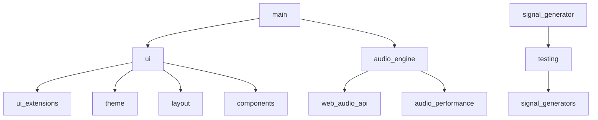

# Rusty Audio - Developer Guide

## Table of Contents

1. [Architecture Overview](#architecture-overview)
2. [Project Structure](#project-structure)
3. [Core Components](#core-components)
4. [Audio Processing Pipeline](#audio-processing-pipeline)
5. [UI Architecture](#ui-architecture)
6. [API Reference](#api-reference)
7. [Performance Optimization](#performance-optimization)
8. [Testing Framework](#testing-framework)
9. [Build and Deployment](#build-and-deployment)
10. [Contributing Guidelines](#contributing-guidelines)

---

## Architecture Overview

### System Architecture

Rusty Audio follows a modular, event-driven architecture with clear separation of concerns:

```
┌─────────────────────────────────────────────────────────┐
│                    Application Layer                     │
│  ┌─────────────┐  ┌──────────────┐  ┌──────────────┐  │
│  │ UI (egui)   │  │ State Mgmt   │  │ Event Bus    │  │
│  └──────┬──────┘  └──────┬───────┘  └──────┬───────┘  │
│         │                 │                  │          │
├─────────┼─────────────────┼──────────────────┼─────────┤
│         │     Core Services Layer            │         │
│  ┌──────▼──────┐  ┌──────▼───────┐  ┌──────▼───────┐  │
│  │Audio Engine │  │ File Manager │  │ Config Mgr   │  │
│  └──────┬──────┘  └──────┬───────┘  └──────┬───────┘  │
│         │                 │                  │          │
├─────────┼─────────────────┼──────────────────┼─────────┤
│         │     Audio Processing Layer         │         │
│  ┌──────▼──────┐  ┌──────▼───────┐  ┌──────▼───────┐  │
│  │ Web Audio   │  │ DSP Pipeline │  │ Generators   │  │
│  │ API         │  │              │  │              │  │
│  └──────┬──────┘  └──────┬───────┘  └──────┬───────┘  │
│         │                 │                  │          │
├─────────┼─────────────────┼──────────────────┼─────────┤
│         │     Platform Abstraction Layer     │         │
│  ┌──────▼──────────────────────────────────────────┐  │
│  │              CPAL (Audio Backend)               │  │
│  └──────────────────────────────────────────────────┘  │
└─────────────────────────────────────────────────────────┘
```

### Design Principles

1. **Separation of Concerns**: Each module has a single, well-defined responsibility
2. **Event-Driven Communication**: Loose coupling through message passing
3. **Immutable State Management**: Predictable state updates using Rust's ownership
4. **Zero-Copy Audio Processing**: Efficient buffer management for real-time audio
5. **Progressive Enhancement**: Core functionality works without advanced features

### Threading Model

```rust
// Main Thread: UI rendering and event handling
// Audio Thread: Real-time audio processing
// Worker Thread Pool: File I/O, spectrum analysis, metadata extraction

pub struct ThreadingModel {
    main_thread: ThreadId,        // UI and application logic
    audio_thread: ThreadId,       // Real-time audio processing
    worker_pool: ThreadPool,      // Background tasks
}
```

---

## Project Structure

### Directory Layout

```
rusty-audio/
├── src/
│   ├── main.rs                 # Application entry point
│   ├── lib.rs                  # Library interface
│   ├── audio_engine.rs         # Core audio processing
│   ├── audio_performance.rs    # Performance monitoring
│   ├── error.rs               # Error types and handling
│   ├── metadata.rs            # Audio metadata extraction
│   ├── ui_extensions.rs       # Custom UI components
│   │
│   ├── ui/                    # UI module
│   │   ├── mod.rs            # Module exports
│   │   ├── theme.rs          # Theme system
│   │   ├── layout.rs         # Layout management
│   │   ├── spectrum.rs       # Spectrum visualizer
│   │   ├── components.rs     # Reusable UI components
│   │   ├── controls.rs       # Custom controls
│   │   ├── utils.rs          # UI utilities
│   │   └── signal_generator.rs # Signal generation UI
│   │
│   └── testing/               # Testing utilities
│       ├── mod.rs            # Testing module
│       ├── signal_generators.rs # Test signal generation
│       └── benchmarks.rs     # Performance benchmarks
│
├── assets/                    # Static assets
│   ├── fonts/                # Custom fonts
│   ├── icons/               # Application icons
│   └── themes/              # Theme definitions
│
├── benches/                  # Benchmark tests
├── tests/                    # Integration tests
└── examples/                 # Example usage
```

### Module Dependencies



---

## Core Components

### Audio Engine

The audio engine manages all audio processing and playback:

```rust
pub struct AudioEngine {
    context: AudioContext,
    source_node: Option<AudioBufferSourceNode>,
    gain_node: GainNode,
    analyser: AnalyserNode,
    eq_bands: Vec<BiquadFilterNode>,
    effects_chain: EffectsChain,
    state: PlaybackState,
}

impl AudioEngine {
    /// Initialize the audio engine with default settings
    pub fn new() -> Result<Self, AudioError> {
        let context = AudioContext::new()?;
        let gain_node = context.create_gain();
        let analyser = context.create_analyser();

        // Connect audio graph
        gain_node.connect(&analyser);
        analyser.connect(&context.destination());

        Ok(Self {
            context,
            source_node: None,
            gain_node,
            analyser,
            eq_bands: Self::create_eq_bands(&context)?,
            effects_chain: EffectsChain::new(&context)?,
            state: PlaybackState::Stopped,
        })
    }

    /// Load and decode audio file
    pub async fn load_file(&mut self, path: &Path) -> Result<(), AudioError> {
        let file_data = tokio::fs::read(path).await?;
        let audio_buffer = self.context.decode_audio_data(file_data).await?;
        self.prepare_source(audio_buffer)?;
        Ok(())
    }

    /// Start playback
    pub fn play(&mut self) -> Result<(), AudioError> {
        if let Some(source) = &self.source_node {
            source.start()?;
            self.state = PlaybackState::Playing;
        }
        Ok(())
    }
}
```

### State Management

Application state is managed through a centralized state store:

```rust
pub struct AppState {
    // Audio state
    playback: PlaybackState,
    volume: f32,
    position: Duration,
    duration: Duration,

    // File state
    current_file: Option<PathBuf>,
    metadata: Option<TrackMetadata>,
    playlist: Vec<PathBuf>,

    // UI state
    active_tab: Tab,
    theme: Theme,
    layout: LayoutConfig,

    // Settings
    audio_settings: AudioSettings,
    performance_settings: PerformanceSettings,
}

impl AppState {
    /// Update state with action
    pub fn dispatch(&mut self, action: Action) {
        match action {
            Action::Play => self.handle_play(),
            Action::Pause => self.handle_pause(),
            Action::SetVolume(v) => self.volume = v.clamp(0.0, 1.0),
            Action::Seek(pos) => self.position = pos,
            // ... other actions
        }
    }
}
```

### Event System

Events flow through a central event bus:

```rust
pub enum Event {
    // Audio events
    AudioLoaded(AudioBuffer),
    PlaybackStarted,
    PlaybackStopped,
    VolumeChanged(f32),
    PositionUpdated(Duration),

    // UI events
    TabChanged(Tab),
    ThemeChanged(Theme),
    WindowResized(Vec2),

    // File events
    FileOpened(PathBuf),
    MetadataLoaded(TrackMetadata),

    // Error events
    Error(AudioError),
}

pub struct EventBus {
    sender: mpsc::Sender<Event>,
    receiver: mpsc::Receiver<Event>,
}
```

---

## Audio Processing Pipeline

### Signal Flow

```
Input File → Decoder → Source Node → EQ → Effects → Gain → Analyser → Output
                           ↓
                      Generator ←── Test Signals
```

### DSP Components

#### Equalizer (8-Band Parametric)

```rust
pub struct Equalizer {
    bands: Vec<EqBand>,
    bypass: bool,
}

pub struct EqBand {
    filter: BiquadFilterNode,
    frequency: f32,
    gain: f32,
    q_factor: f32,
    enabled: bool,
}

impl EqBand {
    pub fn new(context: &AudioContext, freq: f32) -> Self {
        let filter = context.create_biquad_filter();
        filter.set_type(BiquadFilterType::Peaking);
        filter.frequency().set_value(freq);
        filter.q().set_value(1.0);
        filter.gain().set_value(0.0);

        Self {
            filter,
            frequency: freq,
            gain: 0.0,
            q_factor: 1.0,
            enabled: true,
        }
    }

    pub fn set_gain(&mut self, gain_db: f32) {
        self.gain = gain_db.clamp(-24.0, 24.0);
        self.filter.gain().set_value(self.gain);
    }
}
```

#### Effects Chain

```rust
pub struct EffectsChain {
    reverb: Option<ReverbNode>,
    delay: Option<DelayNode>,
    compressor: Option<DynamicsCompressorNode>,
    distortion: Option<WaveShaperNode>,
    chain_order: Vec<EffectType>,
}

impl EffectsChain {
    pub fn add_effect(&mut self, effect_type: EffectType) {
        match effect_type {
            EffectType::Reverb => self.add_reverb(),
            EffectType::Delay => self.add_delay(),
            EffectType::Compressor => self.add_compressor(),
            EffectType::Distortion => self.add_distortion(),
        }
        self.rebuild_chain();
    }

    fn rebuild_chain(&mut self) {
        // Reconnect all nodes in the specified order
        for effect in &self.chain_order {
            self.connect_effect(effect);
        }
    }
}
```

### Buffer Management

```rust
pub struct BufferManager {
    pool: Vec<AudioBuffer>,
    active_buffers: HashMap<BufferId, AudioBuffer>,
    cache_size: usize,
}

impl BufferManager {
    /// Get or allocate a buffer
    pub fn acquire_buffer(&mut self, size: usize) -> BufferId {
        if let Some(buffer) = self.pool.iter()
            .position(|b| b.length() >= size) {
            // Reuse existing buffer
            let buffer = self.pool.swap_remove(buffer);
            let id = BufferId::new();
            self.active_buffers.insert(id, buffer);
            id
        } else {
            // Allocate new buffer
            self.allocate_new(size)
        }
    }

    /// Return buffer to pool
    pub fn release_buffer(&mut self, id: BufferId) {
        if let Some(buffer) = self.active_buffers.remove(&id) {
            if self.pool.len() < self.cache_size {
                self.pool.push(buffer);
            }
        }
    }
}
```

---

## UI Architecture

### Component System

All UI components follow a consistent pattern:

```rust
pub trait UIComponent {
    /// Update component state
    fn update(&mut self, dt: f32);

    /// Render component
    fn show(&mut self, ui: &mut egui::Ui, colors: &ThemeColors);

    /// Handle events
    fn handle_event(&mut self, event: &Event);

    /// Get component size
    fn size_hint(&self) -> Vec2;
}
```

### Custom Controls

#### Enhanced Slider

```rust
pub struct EnhancedSlider {
    value: f32,
    range: RangeInclusive<f32>,
    orientation: SliderOrientation,
    style: SliderStyle,
    animation: AnimationState,
    tooltip: Option<String>,
}

impl EnhancedSlider {
    pub fn new(range: RangeInclusive<f32>) -> Self {
        Self {
            value: 0.0,
            range,
            orientation: SliderOrientation::Horizontal,
            style: SliderStyle::Default,
            animation: AnimationState::new(),
            tooltip: None,
        }
    }

    pub fn show(&mut self, ui: &mut egui::Ui) -> egui::Response {
        let desired_size = self.calculate_size(ui);
        let (rect, response) = ui.allocate_exact_size(
            desired_size,
            egui::Sense::click_and_drag()
        );

        if response.changed() {
            self.value = self.calculate_value_from_pos(
                response.interact_pointer_pos()
            );
        }

        self.draw(ui, rect, &response);

        if response.hovered() && self.tooltip.is_some() {
            self.show_tooltip(ui);
        }

        response
    }
}
```

#### Circular Knob

```rust
pub struct CircularKnob {
    value: f32,
    range: RangeInclusive<f32>,
    size: f32,
    color: Color32,
    notch_count: usize,
    bipolar: bool,
}

impl CircularKnob {
    pub fn paint(&self, ui: &mut egui::Ui, rect: Rect) {
        let painter = ui.painter();
        let center = rect.center();
        let radius = rect.width() / 2.0;

        // Draw outer ring
        painter.circle_stroke(
            center,
            radius,
            Stroke::new(2.0, self.color)
        );

        // Draw value indicator
        let angle = self.value_to_angle(self.value);
        let indicator_pos = center + Vec2::angled(angle) * (radius * 0.8);
        painter.circle_filled(indicator_pos, 4.0, self.color);

        // Draw notches
        for i in 0..self.notch_count {
            let notch_angle = lerp(0.0, TAU, i as f32 / self.notch_count as f32);
            self.draw_notch(painter, center, radius, notch_angle);
        }
    }
}
```

### Theme System

```rust
pub struct ThemeManager {
    current_theme: Theme,
    custom_themes: Vec<Theme>,
    colors: ThemeColors,
}

pub struct Theme {
    pub name: String,
    pub colors: ThemeColors,
    pub fonts: FontConfiguration,
    pub spacing: SpacingConfiguration,
}

pub struct ThemeColors {
    pub background: Color32,
    pub surface: Color32,
    pub primary: Color32,
    pub secondary: Color32,
    pub text: Color32,
    pub text_secondary: Color32,
    pub accent: Color32,
    pub error: Color32,
    pub warning: Color32,
    pub success: Color32,
}

impl ThemeManager {
    pub fn apply_theme(&mut self, ui: &mut egui::Ui) {
        let visuals = &mut ui.ctx().style_mut().visuals;
        visuals.override_text_color = Some(self.colors.text);
        visuals.widgets.noninteractive.bg_fill = self.colors.surface;
        visuals.widgets.inactive.bg_fill = self.colors.surface;
        visuals.widgets.active.bg_fill = self.colors.primary;
        // Apply more theme settings...
    }
}
```

### Responsive Layout

```rust
pub struct LayoutManager {
    panels: Vec<PanelConfig>,
    breakpoints: LayoutBreakpoints,
    current_layout: LayoutMode,
}

pub enum LayoutMode {
    Desktop,
    Tablet,
    Mobile,
}

impl LayoutManager {
    pub fn calculate_layout(&mut self, screen_size: Vec2) {
        self.current_layout = match screen_size.x {
            x if x >= 1200.0 => LayoutMode::Desktop,
            x if x >= 768.0 => LayoutMode::Tablet,
            _ => LayoutMode::Mobile,
        };
    }

    pub fn apply_layout(&self, ui: &mut egui::Ui) {
        match self.current_layout {
            LayoutMode::Desktop => self.desktop_layout(ui),
            LayoutMode::Tablet => self.tablet_layout(ui),
            LayoutMode::Mobile => self.mobile_layout(ui),
        }
    }
}
```

---

## API Reference

### Public API

#### AudioPlayer

```rust
/// Main audio player interface
pub struct AudioPlayer {
    engine: AudioEngine,
    state: AppState,
}

impl AudioPlayer {
    /// Create new audio player instance
    pub fn new() -> Result<Self, AudioError>;

    /// Load audio file
    pub async fn load_file(&mut self, path: impl AsRef<Path>) -> Result<(), AudioError>;

    /// Control playback
    pub fn play(&mut self) -> Result<(), AudioError>;
    pub fn pause(&mut self) -> Result<(), AudioError>;
    pub fn stop(&mut self) -> Result<(), AudioError>;

    /// Adjust parameters
    pub fn set_volume(&mut self, volume: f32);
    pub fn seek(&mut self, position: Duration);
    pub fn set_loop(&mut self, enabled: bool);

    /// Get current state
    pub fn is_playing(&self) -> bool;
    pub fn position(&self) -> Duration;
    pub fn duration(&self) -> Duration;
}
```

#### Signal Generator API

```rust
/// Signal generator for testing and measurement
pub struct SignalGenerator {
    sample_rate: f32,
    generators: Vec<Box<dyn Generator>>,
}

impl SignalGenerator {
    /// Create new signal generator
    pub fn new(sample_rate: f32) -> Self;

    /// Add generator to mix
    pub fn add_generator(&mut self, gen: Box<dyn Generator>);

    /// Generate samples
    pub fn generate(&mut self, num_samples: usize) -> Vec<f32>;

    /// Create specific generators
    pub fn sine(freq: f32, amp: f32) -> SineGenerator;
    pub fn square(freq: f32, amp: f32, duty: f32) -> SquareGenerator;
    pub fn sawtooth(freq: f32, amp: f32) -> SawtoothGenerator;
    pub fn triangle(freq: f32, amp: f32) -> TriangleGenerator;
    pub fn noise(amp: f32, color: NoiseColor) -> NoiseGenerator;
}
```

#### Effects API

```rust
/// Audio effects processor
pub trait Effect: Send + Sync {
    /// Process audio buffer in place
    fn process(&mut self, buffer: &mut [f32]);

    /// Get effect parameters
    fn parameters(&self) -> Vec<Parameter>;

    /// Set parameter value
    fn set_parameter(&mut self, id: ParameterId, value: f32);

    /// Reset effect state
    fn reset(&mut self);
}

/// Reverb effect
pub struct Reverb {
    room_size: f32,
    damping: f32,
    wet_mix: f32,
}

/// Delay effect
pub struct Delay {
    delay_time: Duration,
    feedback: f32,
    mix: f32,
}

/// Compressor effect
pub struct Compressor {
    threshold: f32,
    ratio: f32,
    attack: Duration,
    release: Duration,
}
```

### Extension Points

#### Custom Effects

```rust
/// Implement custom effect
pub struct CustomEffect {
    // Effect state
}

impl Effect for CustomEffect {
    fn process(&mut self, buffer: &mut [f32]) {
        // Custom processing logic
        for sample in buffer.iter_mut() {
            *sample = self.process_sample(*sample);
        }
    }

    fn parameters(&self) -> Vec<Parameter> {
        vec![
            Parameter {
                id: ParameterId(0),
                name: "Custom Param".to_string(),
                range: 0.0..=1.0,
                default: 0.5,
            },
        ]
    }

    fn set_parameter(&mut self, id: ParameterId, value: f32) {
        match id.0 {
            0 => self.custom_param = value,
            _ => {}
        }
    }

    fn reset(&mut self) {
        // Reset to initial state
    }
}
```

#### Custom Visualizers

```rust
/// Implement custom visualizer
pub struct CustomVisualizer {
    fft_size: usize,
    window: Vec<f32>,
}

impl Visualizer for CustomVisualizer {
    fn update(&mut self, audio_data: &[f32]) {
        // Process audio data for visualization
        let spectrum = self.compute_fft(audio_data);
        self.update_display(spectrum);
    }

    fn draw(&self, ui: &mut egui::Ui, rect: Rect) {
        // Custom drawing logic
        let painter = ui.painter();
        // Draw visualization
    }
}
```

---

## Performance Optimization

### Critical Path Optimizations

#### Audio Callback Optimization

```rust
// AVOID: Allocation in audio callback
fn audio_callback_bad(buffer: &mut [f32]) {
    let temp = vec![0.0; buffer.len()]; // ❌ Allocation!
    // Process...
}

// PREFER: Pre-allocated buffers
struct AudioProcessor {
    temp_buffer: Vec<f32>,
}

fn audio_callback_good(&mut self, buffer: &mut [f32]) {
    self.temp_buffer.resize(buffer.len(), 0.0); // ✓ Reuse
    // Process...
}
```

#### SIMD Optimization

```rust
use std::simd::*;

/// SIMD-optimized volume adjustment
pub fn apply_volume_simd(buffer: &mut [f32], volume: f32) {
    let volume_vec = f32x4::splat(volume);
    let chunks = buffer.chunks_exact_mut(4);

    for chunk in chunks {
        let samples = f32x4::from_slice(chunk);
        let result = samples * volume_vec;
        result.copy_to_slice(chunk);
    }

    // Handle remainder
    for sample in chunks.remainder_mut() {
        *sample *= volume;
    }
}
```

### Memory Management

#### Buffer Pooling

```rust
/// Thread-safe buffer pool
pub struct BufferPool {
    pool: Arc<Mutex<Vec<Vec<f32>>>>,
    max_buffers: usize,
}

impl BufferPool {
    pub fn acquire(&self, size: usize) -> PooledBuffer {
        let mut pool = self.pool.lock().unwrap();
        let buffer = pool.pop()
            .map(|mut b| { b.resize(size, 0.0); b })
            .unwrap_or_else(|| vec![0.0; size]);

        PooledBuffer {
            buffer,
            pool: Arc::clone(&self.pool),
        }
    }
}

pub struct PooledBuffer {
    buffer: Vec<f32>,
    pool: Arc<Mutex<Vec<Vec<f32>>>>,
}

impl Drop for PooledBuffer {
    fn drop(&mut self) {
        let mut pool = self.pool.lock().unwrap();
        if pool.len() < 32 { // Limit pool size
            pool.push(std::mem::take(&mut self.buffer));
        }
    }
}
```

### Profiling and Benchmarking

#### Performance Metrics

```rust
pub struct PerformanceMonitor {
    frame_times: VecDeque<Duration>,
    audio_latency: Duration,
    cpu_usage: f32,
    memory_usage: usize,
}

impl PerformanceMonitor {
    pub fn update(&mut self) {
        self.update_frame_time();
        self.update_cpu_usage();
        self.update_memory_usage();
    }

    pub fn report(&self) -> PerformanceReport {
        PerformanceReport {
            avg_frame_time: self.average_frame_time(),
            fps: self.calculate_fps(),
            audio_latency: self.audio_latency,
            cpu_percent: self.cpu_usage,
            memory_mb: self.memory_usage / 1_048_576,
        }
    }
}
```

#### Benchmarks

```rust
#[cfg(test)]
mod benches {
    use criterion::{black_box, criterion_group, criterion_main, Criterion};

    fn benchmark_fft(c: &mut Criterion) {
        let data = vec![0.0f32; 2048];
        c.bench_function("fft_2048", |b| {
            b.iter(|| {
                compute_fft(black_box(&data))
            });
        });
    }

    fn benchmark_eq_band(c: &mut Criterion) {
        let mut band = EqBand::new(1000.0);
        let buffer = vec![0.0f32; 1024];

        c.bench_function("eq_band_process", |b| {
            b.iter(|| {
                band.process(black_box(&buffer))
            });
        });
    }

    criterion_group!(benches, benchmark_fft, benchmark_eq_band);
    criterion_main!(benches);
}
```

---

## Testing Framework

### Unit Testing

```rust
#[cfg(test)]
mod tests {
    use super::*;

    #[test]
    fn test_volume_control() {
        let mut player = AudioPlayer::new().unwrap();
        player.set_volume(0.5);
        assert_eq!(player.volume(), 0.5);

        player.set_volume(1.5); // Should clamp
        assert_eq!(player.volume(), 1.0);

        player.set_volume(-0.5); // Should clamp
        assert_eq!(player.volume(), 0.0);
    }

    #[test]
    fn test_eq_band_frequency() {
        let mut band = EqBand::new(1000.0);
        band.set_frequency(2000.0);
        assert_eq!(band.frequency(), 2000.0);

        band.set_frequency(25000.0); // Should clamp to Nyquist
        assert!(band.frequency() <= 22050.0);
    }

    #[test]
    fn test_signal_generator() {
        let mut gen = SignalGenerator::new(44100.0);
        gen.add_generator(Box::new(SineGenerator::new(440.0, 0.5)));

        let samples = gen.generate(1024);
        assert_eq!(samples.len(), 1024);

        // Verify amplitude
        let max = samples.iter().fold(0.0f32, |a, &b| a.max(b.abs()));
        assert!((max - 0.5).abs() < 0.01);
    }
}
```

### Integration Testing

```rust
#[tokio::test]
async fn test_file_playback() {
    let mut player = AudioPlayer::new().unwrap();
    let test_file = Path::new("tests/assets/test.wav");

    player.load_file(test_file).await.unwrap();
    assert!(player.duration() > Duration::ZERO);

    player.play().unwrap();
    assert!(player.is_playing());

    tokio::time::sleep(Duration::from_millis(100)).await;
    assert!(player.position() > Duration::ZERO);

    player.stop().unwrap();
    assert!(!player.is_playing());
    assert_eq!(player.position(), Duration::ZERO);
}

#[test]
fn test_effects_chain() {
    let mut chain = EffectsChain::new();
    chain.add_effect(EffectType::Reverb);
    chain.add_effect(EffectType::Delay);

    let mut buffer = vec![0.5; 1024];
    chain.process(&mut buffer);

    // Verify processing occurred
    assert!(buffer.iter().any(|&s| (s - 0.5).abs() > 0.001));
}
```

### Property-Based Testing

```rust
use proptest::prelude::*;

proptest! {
    #[test]
    fn test_volume_always_in_range(volume in 0.0f32..=1.0f32) {
        let mut player = AudioPlayer::new().unwrap();
        player.set_volume(volume);
        let result = player.volume();
        assert!(result >= 0.0 && result <= 1.0);
    }

    #[test]
    fn test_frequency_response(freq in 20.0f32..=20000.0f32) {
        let mut band = EqBand::new(freq);
        band.set_gain(12.0);

        let test_signal = generate_sine(freq, 1024);
        let processed = band.process(&test_signal);

        // Verify gain applied
        let original_power = calculate_power(&test_signal);
        let processed_power = calculate_power(&processed);
        assert!(processed_power > original_power);
    }
}
```

---

## Build and Deployment

### Build Configuration

#### Cargo.toml

```toml
[package]
name = "rusty-audio"
version = "1.0.0"
edition = "2021"

[dependencies]
egui = "0.28"
eframe = "0.28"
web-audio-api = { path = "./libs/web-audio-api-rs" }
tokio = { version = "1.35", features = ["full"] }
cpal = "0.15"
hound = "3.5"
symphonia = { version = "0.5", features = ["all"] }

[profile.release]
opt-level = 3
lto = true
codegen-units = 1
strip = true

[profile.release-debug]
inherits = "release"
debug = true
strip = false
```

### Platform-Specific Build

#### Windows

```powershell
# Build for Windows
cargo build --release --target x86_64-pc-windows-msvc

# Create installer
cargo install cargo-wix
cargo wix init
cargo wix
```

#### Linux

```bash
# Build for Linux
cargo build --release --target x86_64-unknown-linux-gnu

# Create AppImage
./scripts/create-appimage.sh

# Create Flatpak
flatpak-builder --repo=repo builddir org.rustyaudio.RustyAudio.json
```

#### macOS

```bash
# Build for macOS
cargo build --release --target x86_64-apple-darwin
cargo build --release --target aarch64-apple-darwin

# Create universal binary
lipo -create -output RustyAudio \
    target/x86_64-apple-darwin/release/rusty-audio \
    target/aarch64-apple-darwin/release/rusty-audio

# Create .app bundle
./scripts/create-mac-bundle.sh
```

### Continuous Integration

#### GitHub Actions Workflow

```yaml
name: CI

on:
  push:
    branches: [main]
  pull_request:
    branches: [main]

jobs:
  test:
    strategy:
      matrix:
        os: [ubuntu-latest, windows-latest, macos-latest]
    runs-on: ${{ matrix.os }}

    steps:
    - uses: actions/checkout@v3

    - name: Install Rust
      uses: dtolnay/rust-toolchain@stable

    - name: Cache dependencies
      uses: Swatinem/rust-cache@v2

    - name: Run tests
      run: cargo test --all-features

    - name: Run benchmarks
      run: cargo bench --no-run

    - name: Check formatting
      run: cargo fmt -- --check

    - name: Run clippy
      run: cargo clippy -- -D warnings

    - name: Build release
      run: cargo build --release
```

---

## Contributing Guidelines

### Development Setup

1. **Clone Repository**
```bash
git clone https://github.com/yourusername/rusty-audio.git
cd rusty-audio
```

2. **Install Dependencies**
```bash
# Install Rust
curl --proto '=https' --tlsv1.2 -sSf https://sh.rustup.rs | sh

# Install development tools
cargo install cargo-watch cargo-edit cargo-audit
```

3. **Setup Pre-commit Hooks**
```bash
cp scripts/pre-commit .git/hooks/
chmod +x .git/hooks/pre-commit
```

### Code Style

#### Rust Style Guide

- Follow standard Rust naming conventions
- Use `rustfmt` for formatting
- Use `clippy` for linting
- Document all public APIs
- Write unit tests for new functionality

```rust
/// Example of properly documented function
///
/// # Arguments
/// * `input` - The input signal to process
/// * `gain` - The gain to apply (0.0 to 1.0)
///
/// # Returns
/// The processed signal
///
/// # Example
/// ```
/// let output = process_audio(&input, 0.5);
/// ```
pub fn process_audio(input: &[f32], gain: f32) -> Vec<f32> {
    input.iter().map(|&s| s * gain).collect()
}
```

### Pull Request Process

1. **Create Feature Branch**
```bash
git checkout -b feature/your-feature-name
```

2. **Make Changes**
- Write code
- Add tests
- Update documentation

3. **Run Tests**
```bash
cargo test
cargo fmt
cargo clippy
```

4. **Commit Changes**
```bash
git add .
git commit -m "feat: add new feature"
```

5. **Push and Create PR**
```bash
git push origin feature/your-feature-name
```

### Commit Message Format

Follow conventional commits:
- `feat:` New feature
- `fix:` Bug fix
- `docs:` Documentation
- `style:` Formatting
- `refactor:` Code restructuring
- `perf:` Performance improvement
- `test:` Testing
- `chore:` Maintenance

### Code Review Checklist

- [ ] Tests pass
- [ ] Documentation updated
- [ ] No compiler warnings
- [ ] Clippy warnings addressed
- [ ] Performance impact considered
- [ ] Breaking changes documented
- [ ] UI changes tested on all platforms

---

## Architecture Decisions

### ADR-001: Use Web Audio API

**Status**: Accepted

**Context**: Need a cross-platform audio processing solution

**Decision**: Use web-audio-api-rs for audio processing

**Consequences**:
- ✅ Cross-platform compatibility
- ✅ Rich DSP capabilities
- ✅ Good performance
- ❌ Additional abstraction layer
- ❌ Some platform-specific features unavailable

### ADR-002: Event-Driven Architecture

**Status**: Accepted

**Context**: Need loose coupling between components

**Decision**: Use event bus for component communication

**Consequences**:
- ✅ Loose coupling
- ✅ Easy testing
- ✅ Extensible
- ❌ Slight performance overhead
- ❌ Event ordering complexity

### ADR-003: Immediate Mode GUI

**Status**: Accepted

**Context**: Need responsive, customizable UI

**Decision**: Use egui for immediate mode rendering

**Consequences**:
- ✅ Simple state management
- ✅ Highly customizable
- ✅ Good performance
- ❌ Higher CPU usage than retained mode
- ❌ Custom controls require more work

---

*End of Developer Guide - Version 1.0*

*For additional resources:*
- API Documentation: Run `cargo doc --open`
- GitHub: [github.com/yourusername/rusty-audio](https://github.com/yourusername/rusty-audio)
- Discord: [discord.gg/rustyaudio](https://discord.gg/rustyaudio)