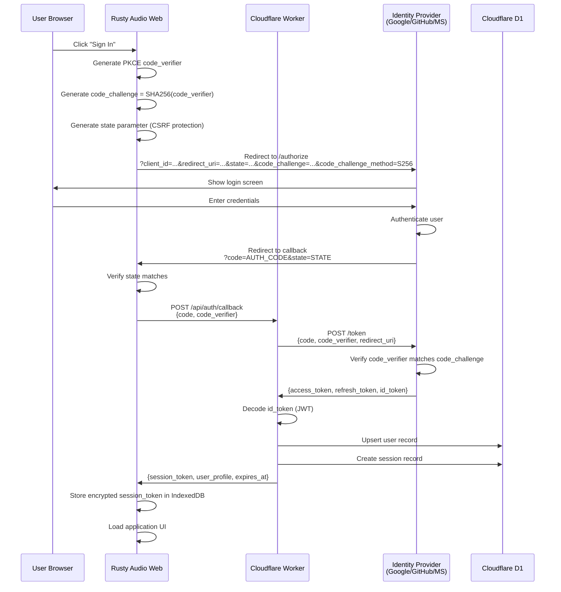
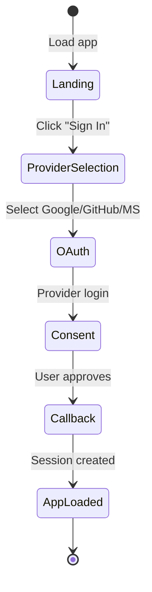
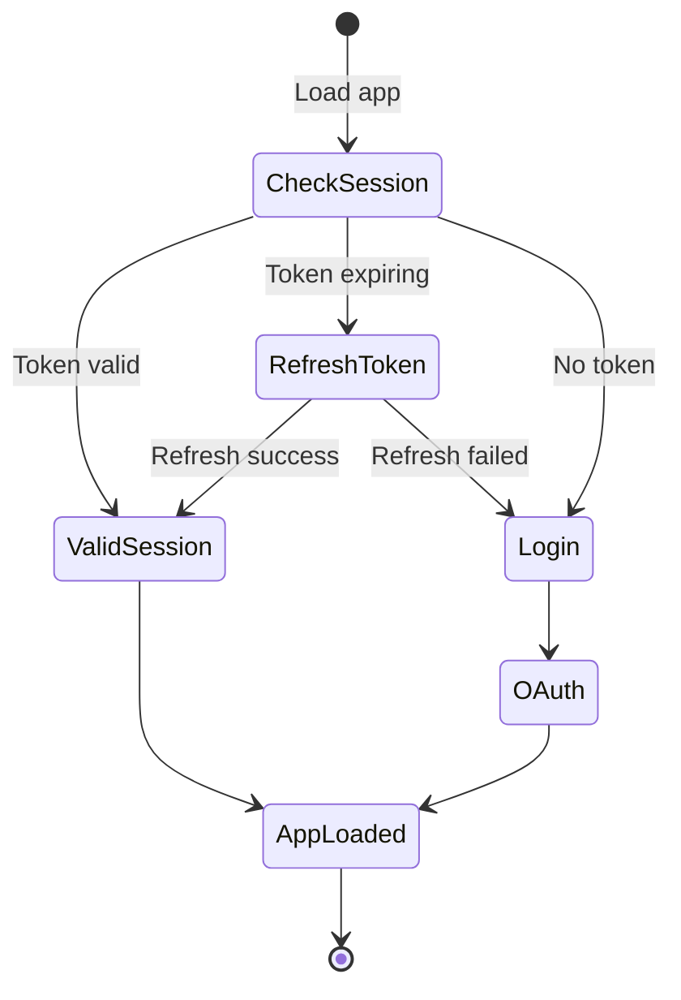

# OAuth 2.0 Authentication Architecture

## Executive Summary

This document specifies the OAuth 2.0 authentication system for the Rusty Audio web application, using the **Authorization Code Flow with PKCE** (Proof Key for Code Exchange) for maximum security. The system supports multiple identity providers (Google, GitHub, Microsoft) and includes token management, session handling, and role-based access control.

---

## 1. OAuth 2.0 Flow Overview

### 1.1 Authorization Code Flow with PKCE

**Why PKCE?**
- Required for public clients (browser-based apps) per OAuth 2.0 security best practices
- Prevents authorization code interception attacks
- No client secret exposure in WASM bundle
- Supported by all major identity providers

**Flow Sequence:**



---

## 2. Identity Provider Configurations

### 2.1 Google OAuth 2.0

**Authorization Endpoint:**
```
https://accounts.google.com/o/oauth2/v2/auth
```

**Token Endpoint:**
```
https://oauth2.googleapis.com/token
```

**Scopes:**
```
openid email profile
```

**Client Configuration:**
```rust
pub struct GoogleOAuthConfig {
    pub client_id: String,
    pub redirect_uri: String,
    pub scopes: Vec<String>,
}

impl GoogleOAuthConfig {
    pub fn new() -> Self {
        Self {
            client_id: env!("GOOGLE_CLIENT_ID").to_string(),
            redirect_uri: "https://rusty-audio.example.com/auth/callback".to_string(),
            scopes: vec![
                "openid".to_string(),
                "email".to_string(),
                "profile".to_string(),
            ],
        }
    }
}
```

**User Info Endpoint:**
```
GET https://www.googleapis.com/oauth2/v3/userinfo
Authorization: Bearer {access_token}
```

**Response:**
```json
{
  "sub": "1234567890",
  "email": "user@gmail.com",
  "email_verified": true,
  "name": "John Doe",
  "picture": "https://lh3.googleusercontent.com/..."
}
```

---

### 2.2 GitHub OAuth 2.0

**Authorization Endpoint:**
```
https://github.com/login/oauth/authorize
```

**Token Endpoint:**
```
https://github.com/login/oauth/access_token
```

**Scopes:**
```
read:user user:email
```

**Client Configuration:**
```rust
pub struct GitHubOAuthConfig {
    pub client_id: String,
    pub redirect_uri: String,
    pub scopes: Vec<String>,
}

impl GitHubOAuthConfig {
    pub fn new() -> Self {
        Self {
            client_id: env!("GITHUB_CLIENT_ID").to_string(),
            redirect_uri: "https://rusty-audio.example.com/auth/callback".to_string(),
            scopes: vec![
                "read:user".to_string(),
                "user:email".to_string(),
            ],
        }
    }
}
```

**User Info Endpoint:**
```
GET https://api.github.com/user
Authorization: Bearer {access_token}
```

**Response:**
```json
{
  "id": 1234567,
  "login": "johndoe",
  "email": "john@example.com",
  "name": "John Doe",
  "avatar_url": "https://avatars.githubusercontent.com/u/1234567"
}
```

---

### 2.3 Microsoft OAuth 2.0

**Authorization Endpoint:**
```
https://login.microsoftonline.com/common/oauth2/v2.0/authorize
```

**Token Endpoint:**
```
https://login.microsoftonline.com/common/oauth2/v2.0/token
```

**Scopes:**
```
openid email profile
```

**Client Configuration:**
```rust
pub struct MicrosoftOAuthConfig {
    pub client_id: String,
    pub redirect_uri: String,
    pub scopes: Vec<String>,
    pub tenant: String,
}

impl MicrosoftOAuthConfig {
    pub fn new() -> Self {
        Self {
            client_id: env!("MICROSOFT_CLIENT_ID").to_string(),
            redirect_uri: "https://rusty-audio.example.com/auth/callback".to_string(),
            scopes: vec![
                "openid".to_string(),
                "email".to_string(),
                "profile".to_string(),
            ],
            tenant: "common".to_string(),  // Multi-tenant
        }
    }
}
```

**User Info Endpoint:**
```
GET https://graph.microsoft.com/v1.0/me
Authorization: Bearer {access_token}
```

**Response:**
```json
{
  "id": "00000000-0000-0000-0000-000000000000",
  "userPrincipalName": "user@outlook.com",
  "displayName": "John Doe",
  "mail": "john@example.com"
}
```

---

## 3. PKCE Implementation

### 3.1 Code Verifier Generation

**File:** `rusty-audio-web/src/auth/pkce.rs`

```rust
use rand::Rng;
use sha2::{Digest, Sha256};
use base64::{Engine as _, engine::general_purpose::URL_SAFE_NO_PAD};

/// Generate cryptographically secure code verifier
///
/// Spec: RFC 7636
/// - Length: 43-128 characters
/// - Charset: [A-Z] [a-z] [0-9] - . _ ~
pub fn generate_code_verifier() -> String {
    let mut rng = rand::thread_rng();
    let random_bytes: Vec<u8> = (0..32).map(|_| rng.gen()).collect();
    URL_SAFE_NO_PAD.encode(&random_bytes)
}

/// Generate code challenge from verifier
///
/// Method: S256 (SHA-256 hash)
/// Formula: code_challenge = BASE64URL(SHA256(code_verifier))
pub fn generate_code_challenge(verifier: &str) -> String {
    let mut hasher = Sha256::new();
    hasher.update(verifier.as_bytes());
    let hash = hasher.finalize();
    URL_SAFE_NO_PAD.encode(&hash)
}

/// Generate random state parameter for CSRF protection
pub fn generate_state() -> String {
    let mut rng = rand::thread_rng();
    let random_bytes: Vec<u8> = (0..32).map(|_| rng.gen()).collect();
    URL_SAFE_NO_PAD.encode(&random_bytes)
}

#[cfg(test)]
mod tests {
    use super::*;

    #[test]
    fn test_code_verifier_length() {
        let verifier = generate_code_verifier();
        assert!(verifier.len() >= 43 && verifier.len() <= 128);
    }

    #[test]
    fn test_code_challenge_deterministic() {
        let verifier = "test_verifier_123";
        let challenge1 = generate_code_challenge(verifier);
        let challenge2 = generate_code_challenge(verifier);
        assert_eq!(challenge1, challenge2);
    }

    #[test]
    fn test_state_uniqueness() {
        let state1 = generate_state();
        let state2 = generate_state();
        assert_ne!(state1, state2);
    }
}
```

---

### 3.2 OAuth Client Implementation

**File:** `rusty-audio-web/src/auth/oauth.rs`

```rust
use crate::auth::pkce::{generate_code_challenge, generate_code_verifier, generate_state};
use crate::auth::storage::SecureStorage;
use crate::error::AuthError;
use gloo_net::http::Request;
use serde::{Deserialize, Serialize};
use wasm_bindgen::JsValue;
use web_sys::window;

#[derive(Debug, Clone, Copy, PartialEq, Eq, Serialize, Deserialize)]
pub enum OAuthProvider {
    Google,
    GitHub,
    Microsoft,
}

impl OAuthProvider {
    pub fn authorize_url(&self) -> &'static str {
        match self {
            Self::Google => "https://accounts.google.com/o/oauth2/v2/auth",
            Self::GitHub => "https://github.com/login/oauth/authorize",
            Self::Microsoft => "https://login.microsoftonline.com/common/oauth2/v2.0/authorize",
        }
    }

    pub fn token_url(&self) -> &'static str {
        match self {
            Self::Google => "https://oauth2.googleapis.com/token",
            Self::GitHub => "https://github.com/login/oauth/access_token",
            Self::Microsoft => "https://login.microsoftonline.com/common/oauth2/v2.0/token",
        }
    }

    pub fn client_id(&self) -> &'static str {
        match self {
            Self::Google => env!("GOOGLE_CLIENT_ID"),
            Self::GitHub => env!("GITHUB_CLIENT_ID"),
            Self::Microsoft => env!("MICROSOFT_CLIENT_ID"),
        }
    }

    pub fn scopes(&self) -> Vec<&'static str> {
        match self {
            Self::Google => vec!["openid", "email", "profile"],
            Self::GitHub => vec!["read:user", "user:email"],
            Self::Microsoft => vec!["openid", "email", "profile"],
        }
    }
}

pub struct OAuthClient {
    provider: OAuthProvider,
    redirect_uri: String,
    storage: SecureStorage,
}

impl OAuthClient {
    pub fn new(provider: OAuthProvider) -> Self {
        let redirect_uri = window()
            .and_then(|w| w.location().origin().ok())
            .map(|origin| format!("{}/auth/callback", origin))
            .unwrap_or_else(|| "http://localhost:8080/auth/callback".to_string());

        Self {
            provider,
            redirect_uri,
            storage: SecureStorage::new(),
        }
    }

    /// Initiate OAuth flow - redirect to provider
    pub async fn initiate_auth(&self) -> Result<(), AuthError> {
        // Generate PKCE parameters
        let code_verifier = generate_code_verifier();
        let code_challenge = generate_code_challenge(&code_verifier);
        let state = generate_state();

        // Store verifier and state for callback verification
        self.storage.set("oauth_code_verifier", &code_verifier).await?;
        self.storage.set("oauth_state", &state).await?;
        self.storage.set("oauth_provider", &serde_json::to_string(&self.provider)?).await?;

        // Build authorization URL
        let auth_url = format!(
            "{}?client_id={}&redirect_uri={}&response_type=code&scope={}&state={}&code_challenge={}&code_challenge_method=S256",
            self.provider.authorize_url(),
            self.provider.client_id(),
            urlencoding::encode(&self.redirect_uri),
            urlencoding::encode(&self.provider.scopes().join(" ")),
            state,
            code_challenge
        );

        // Redirect to provider
        window()
            .ok_or(AuthError::WindowNotAvailable)?
            .location()
            .set_href(&auth_url)
            .map_err(|_| AuthError::RedirectFailed)?;

        Ok(())
    }

    /// Handle OAuth callback - exchange code for tokens
    pub async fn handle_callback(
        &self,
        code: &str,
        state: &str,
    ) -> Result<AuthResponse, AuthError> {
        // Verify state parameter (CSRF protection)
        let stored_state = self.storage.get("oauth_state").await?
            .ok_or(AuthError::InvalidState)?;
        if state != stored_state {
            return Err(AuthError::InvalidState);
        }

        // Retrieve code verifier
        let code_verifier = self.storage.get("oauth_code_verifier").await?
            .ok_or(AuthError::MissingCodeVerifier)?;

        // Exchange authorization code for tokens via backend
        let request_body = TokenExchangeRequest {
            code: code.to_string(),
            code_verifier,
            provider: self.provider,
        };

        let response = Request::post("/api/auth/callback")
            .json(&request_body)?
            .send()
            .await?
            .json::<AuthResponse>()
            .await?;

        // Store session token
        self.storage.set_encrypted("session_token", &response.session_token).await?;
        self.storage.set("user_profile", &serde_json::to_string(&response.user)?).await?;

        // Clear temporary OAuth data
        self.storage.remove("oauth_code_verifier").await?;
        self.storage.remove("oauth_state").await?;
        self.storage.remove("oauth_provider").await?;

        Ok(response)
    }

    /// Refresh access token
    pub async fn refresh_token(&self) -> Result<(), AuthError> {
        let session_token = self.storage.get_encrypted("session_token").await?
            .ok_or(AuthError::NotAuthenticated)?;

        let response = Request::post("/api/auth/refresh")
            .header("Authorization", &format!("Bearer {}", session_token))
            .send()
            .await?
            .json::<RefreshResponse>()
            .await?;

        self.storage.set_encrypted("session_token", &response.session_token).await?;

        Ok(())
    }

    /// Logout - invalidate tokens
    pub async fn logout(&self) -> Result<(), AuthError> {
        let session_token = self.storage.get_encrypted("session_token").await?
            .ok_or(AuthError::NotAuthenticated)?;

        Request::post("/api/auth/logout")
            .header("Authorization", &format!("Bearer {}", session_token))
            .send()
            .await?;

        // Clear local storage
        self.storage.clear().await?;

        Ok(())
    }
}

#[derive(Serialize)]
struct TokenExchangeRequest {
    code: String,
    code_verifier: String,
    provider: OAuthProvider,
}

#[derive(Deserialize)]
pub struct AuthResponse {
    pub session_token: String,
    pub user: UserProfile,
    pub expires_at: i64,
}

#[derive(Deserialize)]
struct RefreshResponse {
    session_token: String,
}

#[derive(Debug, Clone, Serialize, Deserialize)]
pub struct UserProfile {
    pub id: String,
    pub email: String,
    pub name: String,
    pub avatar_url: Option<String>,
    pub tier: UserTier,
}

#[derive(Debug, Clone, Copy, PartialEq, Eq, Serialize, Deserialize)]
pub enum UserTier {
    Free,
    Premium,
}
```

---

## 4. Secure Token Storage

### 4.1 IndexedDB Wrapper with Encryption

**File:** `rusty-audio-web/src/storage/indexed_db.rs`

```rust
use rexie::{Rexie, TransactionMode};
use serde::{Deserialize, Serialize};
use wasm_bindgen::JsValue;
use crate::error::StorageError;

const DB_NAME: &str = "rusty_audio_db";
const DB_VERSION: u32 = 1;
const STORE_NAME: &str = "auth_storage";

pub struct IndexedDBStorage {
    db: Rexie,
}

impl IndexedDBStorage {
    pub async fn new() -> Result<Self, StorageError> {
        let db = Rexie::builder(DB_NAME)
            .version(DB_VERSION)
            .add_object_store(rexie::ObjectStore::new(STORE_NAME).key_path("key"))
            .build()
            .await?;

        Ok(Self { db })
    }

    pub async fn set(&self, key: &str, value: &str) -> Result<(), StorageError> {
        let transaction = self.db.transaction(&[STORE_NAME], TransactionMode::ReadWrite)?;
        let store = transaction.store(STORE_NAME)?;

        let entry = StorageEntry {
            key: key.to_string(),
            value: value.to_string(),
            timestamp: js_sys::Date::now() as i64,
        };

        store.put(&serde_wasm_bindgen::to_value(&entry)?).await?;
        transaction.commit().await?;

        Ok(())
    }

    pub async fn get(&self, key: &str) -> Result<Option<String>, StorageError> {
        let transaction = self.db.transaction(&[STORE_NAME], TransactionMode::ReadOnly)?;
        let store = transaction.store(STORE_NAME)?;

        let value = store.get(&JsValue::from_str(key)).await?;

        match value {
            Some(js_value) => {
                let entry: StorageEntry = serde_wasm_bindgen::from_value(js_value)?;
                Ok(Some(entry.value))
            }
            None => Ok(None),
        }
    }

    pub async fn remove(&self, key: &str) -> Result<(), StorageError> {
        let transaction = self.db.transaction(&[STORE_NAME], TransactionMode::ReadWrite)?;
        let store = transaction.store(STORE_NAME)?;

        store.delete(&JsValue::from_str(key)).await?;
        transaction.commit().await?;

        Ok(())
    }

    pub async fn clear(&self) -> Result<(), StorageError> {
        let transaction = self.db.transaction(&[STORE_NAME], TransactionMode::ReadWrite)?;
        let store = transaction.store(STORE_NAME)?;

        store.clear().await?;
        transaction.commit().await?;

        Ok(())
    }
}

#[derive(Serialize, Deserialize)]
struct StorageEntry {
    key: String,
    value: String,
    timestamp: i64,
}
```

---

### 4.2 Encryption Layer

**File:** `rusty-audio-web/src/storage/encryption.rs`

```rust
use aes_gcm::{
    aead::{Aead, KeyInit, OsRng},
    Aes256Gcm, Nonce,
};
use base64::{Engine as _, engine::general_purpose::STANDARD};
use rand::RngCore;
use crate::error::CryptoError;

const NONCE_SIZE: usize = 12;

pub struct Encryptor {
    cipher: Aes256Gcm,
}

impl Encryptor {
    /// Create new encryptor with random key
    ///
    /// Note: In production, derive key from user password or use Web Crypto API
    pub fn new() -> Self {
        let key = Aes256Gcm::generate_key(OsRng);
        let cipher = Aes256Gcm::new(&key);
        Self { cipher }
    }

    /// Encrypt plaintext and return base64-encoded ciphertext
    ///
    /// Format: base64(nonce || ciphertext)
    pub fn encrypt(&self, plaintext: &str) -> Result<String, CryptoError> {
        // Generate random nonce
        let mut nonce_bytes = [0u8; NONCE_SIZE];
        OsRng.fill_bytes(&mut nonce_bytes);
        let nonce = Nonce::from_slice(&nonce_bytes);

        // Encrypt
        let ciphertext = self.cipher
            .encrypt(nonce, plaintext.as_bytes())
            .map_err(|_| CryptoError::EncryptionFailed)?;

        // Prepend nonce to ciphertext
        let mut output = nonce_bytes.to_vec();
        output.extend_from_slice(&ciphertext);

        Ok(STANDARD.encode(&output))
    }

    /// Decrypt base64-encoded ciphertext
    pub fn decrypt(&self, ciphertext_b64: &str) -> Result<String, CryptoError> {
        // Decode base64
        let data = STANDARD.decode(ciphertext_b64)
            .map_err(|_| CryptoError::InvalidFormat)?;

        if data.len() < NONCE_SIZE {
            return Err(CryptoError::InvalidFormat);
        }

        // Extract nonce and ciphertext
        let (nonce_bytes, ciphertext) = data.split_at(NONCE_SIZE);
        let nonce = Nonce::from_slice(nonce_bytes);

        // Decrypt
        let plaintext = self.cipher
            .decrypt(nonce, ciphertext)
            .map_err(|_| CryptoError::DecryptionFailed)?;

        String::from_utf8(plaintext)
            .map_err(|_| CryptoError::InvalidUtf8)
    }
}

#[cfg(test)]
mod tests {
    use super::*;

    #[test]
    fn test_encrypt_decrypt() {
        let encryptor = Encryptor::new();
        let plaintext = "sensitive_session_token_12345";

        let ciphertext = encryptor.encrypt(plaintext).unwrap();
        let decrypted = encryptor.decrypt(&ciphertext).unwrap();

        assert_eq!(plaintext, decrypted);
    }

    #[test]
    fn test_different_ciphertexts() {
        let encryptor = Encryptor::new();
        let plaintext = "same_plaintext";

        let ct1 = encryptor.encrypt(plaintext).unwrap();
        let ct2 = encryptor.encrypt(plaintext).unwrap();

        // Different nonces should produce different ciphertexts
        assert_ne!(ct1, ct2);
    }
}
```

---

### 4.3 Secure Storage Facade

**File:** `rusty-audio-web/src/auth/storage.rs`

```rust
use crate::storage::{encryption::Encryptor, indexed_db::IndexedDBStorage};
use crate::error::StorageError;
use once_cell::sync::Lazy;
use parking_lot::Mutex;

static ENCRYPTOR: Lazy<Mutex<Encryptor>> = Lazy::new(|| Mutex::new(Encryptor::new()));

pub struct SecureStorage {
    db: IndexedDBStorage,
}

impl SecureStorage {
    pub async fn new() -> Self {
        Self {
            db: IndexedDBStorage::new().await.expect("Failed to initialize IndexedDB"),
        }
    }

    /// Store plaintext value
    pub async fn set(&self, key: &str, value: &str) -> Result<(), StorageError> {
        self.db.set(key, value).await
    }

    /// Retrieve plaintext value
    pub async fn get(&self, key: &str) -> Result<Option<String>, StorageError> {
        self.db.get(key).await
    }

    /// Store encrypted value
    pub async fn set_encrypted(&self, key: &str, value: &str) -> Result<(), StorageError> {
        let encryptor = ENCRYPTOR.lock();
        let encrypted = encryptor.encrypt(value)
            .map_err(|e| StorageError::EncryptionError(e.to_string()))?;
        self.db.set(key, &encrypted).await
    }

    /// Retrieve and decrypt value
    pub async fn get_encrypted(&self, key: &str) -> Result<Option<String>, StorageError> {
        match self.db.get(key).await? {
            Some(encrypted) => {
                let encryptor = ENCRYPTOR.lock();
                let decrypted = encryptor.decrypt(&encrypted)
                    .map_err(|e| StorageError::DecryptionError(e.to_string()))?;
                Ok(Some(decrypted))
            }
            None => Ok(None),
        }
    }

    /// Remove value
    pub async fn remove(&self, key: &str) -> Result<(), StorageError> {
        self.db.remove(key).await
    }

    /// Clear all data
    pub async fn clear(&self) -> Result<(), StorageError> {
        self.db.clear().await
    }
}
```

---

## 5. Backend API Design

### 5.1 Cloudflare Worker Architecture

**Deployment:** Cloudflare Workers (edge functions)
**Database:** Cloudflare D1 (SQLite at edge)
**Storage:** Cloudflare KV (session tokens, optional)

---

### 5.2 API Endpoints

#### POST /api/auth/callback

**Purpose:** Exchange authorization code for tokens

**Request:**
```json
{
  "code": "4/0AY0e...",
  "code_verifier": "dBjftJeZ...",
  "provider": "Google"
}
```

**Response:**
```json
{
  "session_token": "eyJhbGciOiJIUzI1NiIs...",
  "user": {
    "id": "550e8400-e29b-41d4-a716-446655440000",
    "email": "user@gmail.com",
    "name": "John Doe",
    "avatar_url": "https://...",
    "tier": "Free"
  },
  "expires_at": 1735689600
}
```

**Implementation:**
```typescript
// Cloudflare Worker
export async function onRequestPost(context) {
  const { code, code_verifier, provider } = await context.request.json();

  // Exchange code for tokens with provider
  const tokens = await exchangeCodeForTokens(provider, code, code_verifier);

  // Fetch user profile from provider
  const userProfile = await fetchUserProfile(provider, tokens.access_token);

  // Upsert user in database
  const user = await upsertUser(context.env.DB, userProfile, provider);

  // Create session
  const sessionToken = generateSessionToken(user.id);
  await createSession(context.env.DB, user.id, sessionToken);

  return Response.json({
    session_token: sessionToken,
    user: {
      id: user.id,
      email: user.email,
      name: user.name,
      avatar_url: user.avatar_url,
      tier: user.tier,
    },
    expires_at: Date.now() + 30 * 24 * 60 * 60 * 1000, // 30 days
  });
}
```

---

#### POST /api/auth/refresh

**Purpose:** Refresh access token

**Request:**
```
Authorization: Bearer {session_token}
```

**Response:**
```json
{
  "session_token": "eyJhbGciOiJIUzI1NiIs...",
  "expires_at": 1735689600
}
```

---

#### POST /api/auth/logout

**Purpose:** Invalidate session

**Request:**
```
Authorization: Bearer {session_token}
```

**Response:**
```json
{
  "success": true
}
```

---

#### GET /api/auth/user

**Purpose:** Get current user profile

**Request:**
```
Authorization: Bearer {session_token}
```

**Response:**
```json
{
  "id": "550e8400-e29b-41d4-a716-446655440000",
  "email": "user@gmail.com",
  "name": "John Doe",
  "avatar_url": "https://...",
  "tier": "Premium",
  "created_at": "2024-01-01T00:00:00Z"
}
```

---

### 5.3 Cloudflare D1 Schema

**File:** `rusty-audio-web/migrations/0001_initial.sql`

```sql
-- Users table
CREATE TABLE users (
    id TEXT PRIMARY KEY,  -- UUID v4
    email TEXT NOT NULL UNIQUE,
    name TEXT NOT NULL,
    avatar_url TEXT,
    provider TEXT NOT NULL,  -- 'Google', 'GitHub', 'Microsoft'
    provider_id TEXT NOT NULL,  -- Provider's user ID
    tier TEXT NOT NULL DEFAULT 'Free',  -- 'Free' or 'Premium'
    created_at INTEGER NOT NULL,  -- Unix timestamp
    updated_at INTEGER NOT NULL,
    UNIQUE(provider, provider_id)
);

CREATE INDEX idx_users_email ON users(email);
CREATE INDEX idx_users_provider ON users(provider, provider_id);

-- Sessions table
CREATE TABLE sessions (
    id TEXT PRIMARY KEY,  -- Session token (JWT)
    user_id TEXT NOT NULL REFERENCES users(id) ON DELETE CASCADE,
    expires_at INTEGER NOT NULL,  -- Unix timestamp
    created_at INTEGER NOT NULL,
    last_accessed INTEGER NOT NULL,
    ip_address TEXT,
    user_agent TEXT
);

CREATE INDEX idx_sessions_user_id ON sessions(user_id);
CREATE INDEX idx_sessions_expires_at ON sessions(expires_at);

-- Audio presets table
CREATE TABLE audio_presets (
    id TEXT PRIMARY KEY,  -- UUID v4
    user_id TEXT NOT NULL REFERENCES users(id) ON DELETE CASCADE,
    name TEXT NOT NULL,
    description TEXT,
    eq_settings TEXT NOT NULL,  -- JSON array: [band1, band2, ...]
    effects_config TEXT,  -- JSON object
    is_public INTEGER NOT NULL DEFAULT 0,  -- Boolean (0/1)
    created_at INTEGER NOT NULL,
    updated_at INTEGER NOT NULL
);

CREATE INDEX idx_presets_user_id ON presets(user_id);
CREATE INDEX idx_presets_public ON presets(is_public);

-- Usage metrics table (for premium tier analytics)
CREATE TABLE usage_metrics (
    id TEXT PRIMARY KEY,
    user_id TEXT NOT NULL REFERENCES users(id) ON DELETE CASCADE,
    event_type TEXT NOT NULL,  -- 'playback', 'preset_save', etc.
    event_data TEXT,  -- JSON object
    timestamp INTEGER NOT NULL
);

CREATE INDEX idx_metrics_user_id ON metrics(user_id);
CREATE INDEX idx_metrics_timestamp ON metrics(timestamp);
```

---

## 6. Session Management

### 6.1 JWT Token Structure

**Algorithm:** HS256 (HMAC with SHA-256)
**Secret:** Cloudflare Worker environment variable

**Payload:**
```json
{
  "sub": "550e8400-e29b-41d4-a716-446655440000",
  "email": "user@gmail.com",
  "tier": "Free",
  "iat": 1704067200,
  "exp": 1706659200
}
```

**Claims:**
- `sub` - User ID (UUID)
- `email` - User email
- `tier` - User tier (Free/Premium)
- `iat` - Issued at (Unix timestamp)
- `exp` - Expires at (Unix timestamp, 30 days from issue)

---

### 6.2 Token Refresh Strategy

**Automatic Refresh:**
- Check token expiration on app startup
- Refresh token 7 days before expiration
- Retry on 401 responses from API

**Implementation:**
```rust
// rusty-audio-web/src/auth/session.rs
pub struct SessionManager {
    oauth_client: OAuthClient,
    storage: SecureStorage,
}

impl SessionManager {
    pub async fn ensure_valid_session(&self) -> Result<(), AuthError> {
        let session_token = self.storage.get_encrypted("session_token").await?
            .ok_or(AuthError::NotAuthenticated)?;

        // Decode JWT to check expiration
        let claims = decode_jwt(&session_token)?;
        let expires_at = claims.exp;
        let now = js_sys::Date::now() as i64 / 1000;

        // Refresh if expiring within 7 days
        if expires_at - now < 7 * 24 * 60 * 60 {
            self.oauth_client.refresh_token().await?;
        }

        Ok(())
    }

    pub async fn is_authenticated(&self) -> bool {
        self.ensure_valid_session().await.is_ok()
    }
}
```

---

## 7. Security Checklist

### 7.1 OAuth Security

- [x] **PKCE Implementation**: Code challenge + verifier
- [x] **State Parameter**: CSRF protection
- [x] **HTTPS Only**: All OAuth flows over TLS
- [x] **Redirect URI Validation**: Whitelist exact URIs
- [x] **Token Encryption**: AES-256-GCM for storage
- [x] **Secure Random Generation**: Cryptographically secure RNG
- [x] **Token Expiration**: 30-day sessions with auto-refresh
- [x] **Logout Invalidation**: Server-side session revocation

### 7.2 Application Security

- [x] **Content Security Policy (CSP)**: Strict CSP headers
- [x] **CORS Configuration**: Restrict to known origins
- [x] **Rate Limiting**: Auth endpoints rate-limited
- [x] **Input Validation**: Sanitize all user inputs
- [x] **SQL Injection Protection**: Parameterized queries
- [x] **XSS Protection**: Escape all outputs
- [x] **Subresource Integrity**: SRI hashes for scripts

### 7.3 CSP Headers

```
Content-Security-Policy:
  default-src 'self';
  script-src 'self' 'wasm-unsafe-eval';
  style-src 'self' 'unsafe-inline';
  img-src 'self' data: https:;
  connect-src 'self' https://api.rusty-audio.example.com;
  font-src 'self';
  frame-ancestors 'none';
  base-uri 'self';
  form-action 'self';
```

---

## 8. Threat Model

### 8.1 Threats and Mitigations

| Threat | Mitigation |
|--------|------------|
| **Authorization Code Interception** | PKCE code challenge prevents code reuse |
| **CSRF Attacks** | State parameter validation |
| **Token Theft** | AES-256-GCM encryption in IndexedDB |
| **Man-in-the-Middle** | HTTPS everywhere, HSTS headers |
| **Session Fixation** | Regenerate session on login |
| **Brute Force** | Rate limiting on auth endpoints |
| **XSS** | CSP headers, output escaping |
| **Clickjacking** | X-Frame-Options: DENY |
| **Subdomain Takeover** | SameSite cookies, strict CORS |

---

## 9. User Experience Flow

### 9.1 First-Time Login



### 9.2 Returning User



---

## 10. Error Handling

### 10.1 Error Types

**File:** `rusty-audio-web/src/error.rs`

```rust
use thiserror::Error;

#[derive(Error, Debug)]
pub enum AuthError {
    #[error("User not authenticated")]
    NotAuthenticated,

    #[error("Invalid state parameter (CSRF protection)")]
    InvalidState,

    #[error("Missing code verifier")]
    MissingCodeVerifier,

    #[error("OAuth provider error: {0}")]
    ProviderError(String),

    #[error("Token exchange failed")]
    TokenExchangeFailed,

    #[error("Token refresh failed")]
    RefreshFailed,

    #[error("Network error: {0}")]
    NetworkError(#[from] gloo_net::Error),

    #[error("Storage error: {0}")]
    StorageError(#[from] StorageError),

    #[error("Window not available")]
    WindowNotAvailable,

    #[error("Redirect failed")]
    RedirectFailed,
}

#[derive(Error, Debug)]
pub enum StorageError {
    #[error("IndexedDB error: {0}")]
    IndexedDB(String),

    #[error("Encryption error: {0}")]
    EncryptionError(String),

    #[error("Decryption error: {0}")]
    DecryptionError(String),

    #[error("Serialization error: {0}")]
    Serialization(#[from] serde_json::Error),
}

#[derive(Error, Debug)]
pub enum CryptoError {
    #[error("Encryption failed")]
    EncryptionFailed,

    #[error("Decryption failed")]
    DecryptionFailed,

    #[error("Invalid ciphertext format")]
    InvalidFormat,

    #[error("Invalid UTF-8 in decrypted data")]
    InvalidUtf8,
}
```

---

## 11. Testing Strategy

### 11.1 Unit Tests

```rust
#[cfg(test)]
mod tests {
    use super::*;
    use wasm_bindgen_test::*;

    wasm_bindgen_test_configure!(run_in_browser);

    #[wasm_bindgen_test]
    async fn test_oauth_initiate() {
        let client = OAuthClient::new(OAuthProvider::Google);
        // Mock window.location redirect
        // Verify authorization URL is correct
    }

    #[wasm_bindgen_test]
    async fn test_pkce_flow() {
        let verifier = generate_code_verifier();
        let challenge = generate_code_challenge(&verifier);
        assert!(challenge.len() > 0);
    }

    #[wasm_bindgen_test]
    async fn test_secure_storage() {
        let storage = SecureStorage::new().await;
        storage.set_encrypted("test_key", "test_value").await.unwrap();
        let value = storage.get_encrypted("test_key").await.unwrap();
        assert_eq!(value, Some("test_value".to_string()));
    }
}
```

### 11.2 Integration Tests

- Test full OAuth flow with mock provider
- Test session persistence across page reloads
- Test token refresh logic
- Test logout and session cleanup

---

## 12. Deployment Checklist

### Pre-Deployment

- [ ] Register OAuth applications with Google/GitHub/Microsoft
- [ ] Configure redirect URIs for production domain
- [ ] Set up Cloudflare Workers with D1 database
- [ ] Configure environment variables (client IDs, JWT secret)
- [ ] Run security audit (`cargo audit`)
- [ ] Test OAuth flow in staging environment

### Post-Deployment

- [ ] Monitor auth error rates
- [ ] Set up alerts for failed logins
- [ ] Review session metrics
- [ ] Test cross-browser compatibility
- [ ] Verify CSP headers are active
- [ ] Test token refresh automation

---

## 13. Future Enhancements

1. **Social Login Providers:** Add Twitter, Discord, Apple
2. **Two-Factor Authentication:** TOTP via authenticator apps
3. **Email Verification:** Send confirmation emails
4. **Password Recovery:** For future email/password option
5. **SSO Integration:** Enterprise SAML/OIDC support
6. **Biometric Auth:** WebAuthn for passwordless login
7. **Session Management UI:** View/revoke active sessions
8. **Audit Logging:** Track all auth events

---

## Conclusion

This OAuth 2.0 architecture provides:
- **Security:** PKCE, encrypted storage, CSRF protection
- **Usability:** Single sign-on with major providers
- **Scalability:** Edge-deployed with Cloudflare Workers
- **Flexibility:** Easy to add new providers
- **Privacy:** Minimal data collection, user-controlled sessions

The design follows OAuth 2.0 best practices and is production-ready for deployment.
