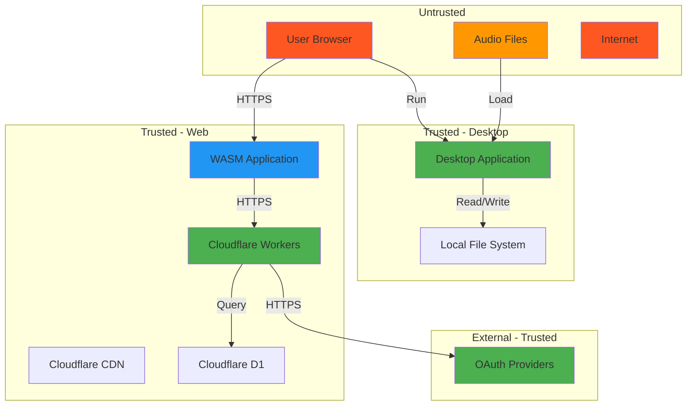
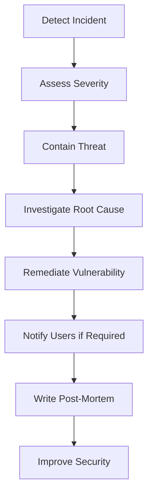

# Security Threat Model and Checklist

## Executive Summary

This document provides a comprehensive security threat model for Rusty Audio, covering both the desktop application (which has no authentication) and the web application (with OAuth 2.0 authentication). It identifies potential security threats, attack vectors, mitigations, and validation procedures.

**Security Goals:**
1. **Desktop:** Protect local file system, prevent malicious audio files from exploiting vulnerabilities
2. **Web:** Secure OAuth 2.0 implementation, protect user data, prevent unauthorized access

---

## 1. Threat Model Overview

### 1.1 Assets to Protect

| Asset | Location | Sensitivity | Impact if Compromised |
|-------|----------|-------------|----------------------|
| User credentials (OAuth tokens) | Web: IndexedDB | High | Account takeover |
| Audio presets | Web: Cloudflare D1 | Medium | Data loss, privacy leak |
| User email/profile | Web: Cloudflare D1 | Medium | Privacy violation |
| Local audio files | Desktop: File system | Low | Privacy violation |
| Session tokens | Web: IndexedDB + KV | High | Unauthorized access |
| OAuth client secrets | Server: Environment vars | Critical | Mass account compromise |

### 1.2 Trust Boundaries



### 1.3 Attacker Profiles

**Attacker Type 1: Opportunistic Web Attacker**
- **Motivation:** Steal session tokens for account access
- **Capabilities:** Basic web exploitation (XSS, CSRF)
- **Resources:** Low

**Attacker Type 2: Malicious Audio File Creator**
- **Motivation:** Exploit desktop application via crafted audio files
- **Capabilities:** Audio file format knowledge, binary exploitation
- **Resources:** Medium

**Attacker Type 3: Nation-State Actor**
- **Motivation:** Mass surveillance, data exfiltration
- **Capabilities:** Advanced persistent threats, zero-days
- **Resources:** High

**Attacker Type 4: Insider Threat**
- **Motivation:** Data theft, sabotage
- **Capabilities:** Access to source code, infrastructure
- **Resources:** High

---

## 2. Desktop Application Threats

### 2.1 Malicious Audio File Exploitation

**Threat:** Crafted audio file exploits buffer overflow in decoder

**Attack Vector:**
1. Attacker creates malicious MP3/FLAC/etc. file
2. User loads file in desktop application
3. Decoder vulnerability triggered
4. Arbitrary code execution

**Likelihood:** Medium
**Impact:** High (full system compromise)

**Mitigations:**
- [x] Use memory-safe Rust for all audio processing
- [x] Use well-vetted libraries (Symphonia, lofty)
- [x] Validate file headers before decoding
- [x] Implement file size limits (security::file_validator)
- [x] Sandbox audio decoding (future: separate process)
- [ ] Fuzzing audio decoders with crafted files

**Validation:**
```rust
// security::file_validator
pub fn validate_audio_file(path: &Path) -> Result<(), SecurityError> {
    // Check file size
    let metadata = fs::metadata(path)?;
    if metadata.len() > MAX_FILE_SIZE {
        return Err(SecurityError::FileTooLarge);
    }

    // Validate magic bytes
    let mut file = File::open(path)?;
    let mut header = [0u8; 16];
    file.read_exact(&mut header)?;

    match &header[0..4] {
        b"RIFF" | b"ID3\x03" | b"fLaC" | b"OggS" => Ok(()),
        _ => Err(SecurityError::InvalidFileFormat),
    }
}
```

**Testing:**
```bash
# Fuzzing test suite
cargo install cargo-fuzz
cargo fuzz run audio_decoder_fuzz
```

---

### 2.2 Path Traversal in File Loading

**Threat:** User-provided file path escapes intended directory

**Attack Vector:**
1. Attacker tricks user into loading file with path like `../../../etc/passwd`
2. Application attempts to read file outside music directory
3. Sensitive system files leaked

**Likelihood:** Low
**Impact:** Medium (information disclosure)

**Mitigations:**
- [x] Use `std::fs::canonicalize()` to resolve paths
- [x] Validate paths are within allowed directories
- [x] Use file dialog (rfd) which provides sandboxed access
- [x] Never construct file paths from user input strings

**Validation:**
```rust
pub fn validate_file_path(path: &Path) -> Result<PathBuf, SecurityError> {
    // Canonicalize path (resolves symlinks, .., etc.)
    let canonical = path.canonicalize()?;

    // Ensure path is within allowed directories
    let allowed_dirs = vec![
        dirs::audio_dir(),
        dirs::home_dir().map(|p| p.join("Music")),
    ];

    for allowed in allowed_dirs.into_iter().flatten() {
        if canonical.starts_with(&allowed) {
            return Ok(canonical);
        }
    }

    Err(SecurityError::PathTraversalAttempt)
}
```

---

### 2.3 Audio Output Volume Exploit

**Threat:** Malicious EQ settings cause hearing damage

**Attack Vector:**
1. Attacker creates preset with extremely high EQ gains
2. User loads preset
3. Audio output exceeds safe levels

**Likelihood:** Low
**Impact:** High (physical harm)

**Mitigations:**
- [x] Implement maximum gain limits (security::audio_safety)
- [x] Clamp all volume/gain values to safe ranges
- [x] Warn user before applying extreme settings
- [x] Soft-limiter on master output

**Validation:**
```rust
// security::audio_safety
pub const MAX_EQ_GAIN_DB: f32 = 12.0;
pub const MAX_MASTER_VOLUME: f32 = 1.0;
pub const HEARING_DAMAGE_THRESHOLD_DB: f32 = 85.0;

pub fn validate_eq_band(band: &mut EqBand) -> Result<(), SecurityError> {
    if band.gain > MAX_EQ_GAIN_DB {
        log::warn!("EQ gain {} exceeds safe limit, clamping", band.gain);
        band.gain = MAX_EQ_GAIN_DB;
    }
    if band.gain < -MAX_EQ_GAIN_DB {
        band.gain = -MAX_EQ_GAIN_DB;
    }
    Ok(())
}
```

---

### 2.4 Dependency Vulnerabilities

**Threat:** Vulnerable dependency exploited

**Attack Vector:**
1. Security advisory published for cpal/symphonia/etc.
2. Attacker crafts exploit targeting vulnerability
3. Desktop application compromised

**Likelihood:** Medium
**Impact:** High

**Mitigations:**
- [x] Regular dependency audits (`cargo audit`)
- [x] Pin dependency versions in Cargo.lock
- [x] Monitor GitHub security advisories
- [x] Automated Dependabot updates
- [ ] Security policy for patching timelines

**Validation:**
```bash
# Run weekly
cargo audit

# Example output:
# Crate:     smallvec
# Version:   1.6.0
# Warning:   CVE-2021-25900
# Solution:  Update to >= 1.6.1
```

---

## 3. Web Application Threats

### 3.1 OAuth Authorization Code Interception

**Threat:** Attacker intercepts OAuth authorization code

**Attack Vector:**
1. Attacker intercepts redirect containing authorization code
2. Attacker exchanges code for tokens before legitimate client
3. Attacker gains access to user account

**Likelihood:** Low (with PKCE)
**Impact:** High (account takeover)

**Mitigations:**
- [x] **PKCE implementation** (primary defense)
- [x] State parameter validation (CSRF protection)
- [x] HTTPS only (prevents network interception)
- [x] Short-lived authorization codes (1 minute TTL)
- [x] Bind authorization code to redirect URI

**Validation:**
```rust
// PKCE verification on backend
async fn verify_pkce(
    code_verifier: &str,
    code_challenge: &str,
) -> Result<bool, AuthError> {
    let mut hasher = Sha256::new();
    hasher.update(code_verifier.as_bytes());
    let hash = hasher.finalize();
    let computed_challenge = URL_SAFE_NO_PAD.encode(&hash);

    Ok(computed_challenge == code_challenge)
}
```

**Testing:**
```bash
# Test PKCE flow
curl -X POST https://api.rusty-audio.example.com/api/auth/callback \
  -H "Content-Type: application/json" \
  -d '{
    "code": "AUTH_CODE",
    "code_verifier": "WRONG_VERIFIER"
  }'

# Expected: 401 Unauthorized
```

---

### 3.2 Session Token Theft (XSS)

**Threat:** XSS vulnerability allows attacker to steal session token

**Attack Vector:**
1. Attacker injects malicious JavaScript via user input
2. Script executes in victim's browser
3. Script reads session token from IndexedDB
4. Token exfiltrated to attacker's server

**Likelihood:** Low (with CSP)
**Impact:** Critical (account takeover)

**Mitigations:**
- [x] **Content Security Policy** (CSP) headers
- [x] Token encryption in IndexedDB (defense in depth)
- [x] HttpOnly cookies for sensitive data (if applicable)
- [x] Input sanitization on all user inputs
- [x] Output escaping in UI rendering
- [x] Subresource Integrity (SRI) for external scripts

**CSP Configuration:**
```
Content-Security-Policy:
  default-src 'self';
  script-src 'self' 'wasm-unsafe-eval';
  style-src 'self' 'unsafe-inline';
  img-src 'self' data: https:;
  connect-src 'self' https://api.rusty-audio.example.com;
  font-src 'self';
  frame-ancestors 'none';
  base-uri 'self';
  form-action 'self';
  upgrade-insecure-requests;
```

**Validation:**
```bash
# Test CSP headers
curl -I https://rusty-audio.example.com

# Verify CSP header present
# Test with CSP evaluator: https://csp-evaluator.withgoogle.com/
```

---

### 3.3 CSRF Attack on API Endpoints

**Threat:** Cross-Site Request Forgery on authenticated endpoints

**Attack Vector:**
1. User logged into Rusty Audio
2. User visits attacker's malicious site
3. Malicious site makes authenticated API requests
4. Victim's session used to modify data

**Likelihood:** Low (with SameSite cookies + CORS)
**Impact:** Medium (unauthorized actions)

**Mitigations:**
- [x] SameSite cookies (if using cookies)
- [x] CORS configured to allow only known origins
- [x] Require custom headers (Authorization: Bearer)
- [x] Double-submit cookie pattern
- [x] State parameter in OAuth flow

**CORS Configuration:**
```typescript
// Cloudflare Worker
const ALLOWED_ORIGINS = [
  'https://rusty-audio.example.com',
  'https://www.rusty-audio.example.com',
];

function handleCORS(request: Request): Response {
  const origin = request.headers.get('Origin');

  if (origin && ALLOWED_ORIGINS.includes(origin)) {
    return new Response(null, {
      headers: {
        'Access-Control-Allow-Origin': origin,
        'Access-Control-Allow-Methods': 'GET, POST, PUT, DELETE',
        'Access-Control-Allow-Headers': 'Content-Type, Authorization',
        'Access-Control-Max-Age': '86400',
      },
    });
  }

  return new Response('Forbidden', { status: 403 });
}
```

---

### 3.4 SQL Injection in Cloudflare D1

**Threat:** SQL injection via user input

**Attack Vector:**
1. Attacker submits malicious preset name: `'; DROP TABLE users; --`
2. Poorly constructed SQL query executed
3. Database compromised

**Likelihood:** Low (with prepared statements)
**Impact:** Critical (data loss, unauthorized access)

**Mitigations:**
- [x] **Always use prepared statements** (parameterized queries)
- [x] Never concatenate user input into SQL
- [x] Input validation and sanitization
- [x] Principle of least privilege (database permissions)

**Secure Query Pattern:**
```typescript
// GOOD: Prepared statement
const result = await env.DB.prepare(
  'SELECT * FROM audio_presets WHERE user_id = ? AND name = ?'
).bind(userId, presetName).all();

// BAD: String concatenation (NEVER DO THIS)
// const query = `SELECT * FROM audio_presets WHERE name = '${presetName}'`;
// const result = await env.DB.prepare(query).all();
```

**Validation:**
```bash
# SQL injection test
curl -X POST https://api.rusty-audio.example.com/api/presets \
  -H "Authorization: Bearer TOKEN" \
  -H "Content-Type: application/json" \
  -d '{
    "name": "Test'; DROP TABLE users; --",
    "eq_settings": [...]
  }'

# Expected: Preset created with literal name, no SQL injection
```

---

### 3.5 Token Storage Vulnerabilities

**Threat:** Session tokens leaked from browser storage

**Attack Vector:**
1. Attacker gains access to victim's device
2. Reads IndexedDB directly
3. Extracts encrypted tokens
4. Attempts to decrypt tokens

**Likelihood:** Low
**Impact:** High (account takeover)

**Mitigations:**
- [x] **AES-256-GCM encryption** for tokens in IndexedDB
- [x] Derive encryption key from user password (future enhancement)
- [x] Auto-logout after 30 days
- [x] Token expiration and rotation
- [x] Device fingerprinting (optional)

**Encryption Implementation:**
```rust
// See OAUTH_ARCHITECTURE.md Section 4.2 for full implementation
pub struct Encryptor {
    cipher: Aes256Gcm,
}

impl Encryptor {
    pub fn encrypt(&self, plaintext: &str) -> Result<String, CryptoError> {
        // Generate random nonce
        let nonce = generate_nonce();
        // Encrypt with AES-256-GCM
        let ciphertext = self.cipher.encrypt(&nonce, plaintext.as_bytes())?;
        // Return base64(nonce || ciphertext)
        Ok(encode_with_nonce(&nonce, &ciphertext))
    }
}
```

---

### 3.6 Rate Limiting Bypass

**Threat:** Attacker bypasses rate limiting to brute force or DoS

**Attack Vector:**
1. Attacker uses multiple IP addresses (botnet)
2. Circumvents IP-based rate limiting
3. Floods authentication endpoints

**Likelihood:** Medium
**Impact:** Medium (service degradation)

**Mitigations:**
- [x] IP-based rate limiting
- [x] User-based rate limiting (after auth)
- [x] CAPTCHA for suspicious activity
- [x] Cloudflare Bot Management
- [x] Exponential backoff on failed logins

**Rate Limiting Implementation:**
```typescript
// Cloudflare Worker
async function rateLimit(
  request: Request,
  env: Env,
  key: string,
  limit: number
): Promise<boolean> {
  const count = await env.SESSIONS.get(`ratelimit:${key}`);
  const current = parseInt(count || '0', 10);

  if (current >= limit) {
    return false; // Rate limit exceeded
  }

  await env.SESSIONS.put(
    `ratelimit:${key}`,
    (current + 1).toString(),
    { expirationTtl: 60 } // 1 minute window
  );

  return true;
}
```

---

### 3.7 Subdomain Takeover

**Threat:** Attacker takes over unused subdomain

**Attack Vector:**
1. Old subdomain points to deleted Cloudflare Pages deployment
2. Attacker creates new deployment with same name
3. Attacker serves malicious content on subdomain
4. Users tricked into visiting malicious site

**Likelihood:** Low
**Impact:** High (phishing, credential theft)

**Mitigations:**
- [x] Remove DNS records for unused subdomains
- [x] Monitor for dangling DNS entries
- [x] Use HSTS with includeSubDomains
- [x] CAA records to restrict certificate issuance

**DNS Security Configuration:**
```
; CAA record (restrict certificate issuance)
rusty-audio.example.com. CAA 0 issue "letsencrypt.org"
rusty-audio.example.com. CAA 0 issuewild ";"

; DNSSEC (if supported)
; Enable DNSSEC on domain registrar
```

---

## 4. Infrastructure Threats

### 4.1 OAuth Client Secret Leakage

**Threat:** OAuth client secrets exposed in source code or logs

**Attack Vector:**
1. Developer accidentally commits secrets to Git
2. Secrets exposed in public repository
3. Attacker uses secrets to impersonate application

**Likelihood:** Medium
**Impact:** Critical (mass account compromise)

**Mitigations:**
- [x] **Never commit secrets to Git**
- [x] Use environment variables for all secrets
- [x] Use Cloudflare Workers secrets management
- [x] Rotate secrets regularly (every 90 days)
- [x] Git pre-commit hooks to detect secrets
- [x] Use tools like `git-secrets` or `truffleHog`

**Secret Management:**
```bash
# Set secret via Wrangler CLI
wrangler secret put GOOGLE_CLIENT_SECRET

# Never log secrets
# BAD: console.log(`Secret: ${env.JWT_SECRET}`);
// GOOD: console.log('JWT secret configured');
```

**Pre-commit Hook:**
```bash
#!/bin/bash
# .git/hooks/pre-commit

# Check for secrets in staged files
if git diff --cached | grep -E 'CLIENT_SECRET|API_KEY|JWT_SECRET'; then
  echo "ERROR: Potential secret detected in commit"
  exit 1
fi
```

---

### 4.2 Database Backup Security

**Threat:** Unencrypted database backups leaked

**Attack Vector:**
1. Attacker gains access to backup storage
2. Backups contain plaintext user data
3. Mass data breach

**Likelihood:** Low
**Impact:** Critical (data breach)

**Mitigations:**
- [x] Encrypt backups at rest (S3 server-side encryption)
- [x] Restrict backup access (IAM policies)
- [x] Encrypt backups in transit (HTTPS)
- [x] Regular backup restoration tests
- [x] Audit backup access logs

**S3 Backup Configuration:**
```bash
# Upload encrypted backup to S3
aws s3 cp backup.sql.gz s3://rusty-audio-backups/ \
  --sse AES256 \
  --acl private \
  --metadata "encrypted=true"
```

---

### 4.3 Supply Chain Attack

**Threat:** Compromised dependency introduces malicious code

**Attack Vector:**
1. Attacker compromises npm/crates.io package
2. Malicious version published
3. Application builds with compromised dependency
4. Malicious code executes in production

**Likelihood:** Low
**Impact:** Critical (backdoor, data exfiltration)

**Mitigations:**
- [x] Pin all dependencies in Cargo.lock / package-lock.json
- [x] Use `cargo audit` for known vulnerabilities
- [x] Review dependency updates before merging
- [x] Verify package checksums
- [x] Use Dependabot with manual approval
- [x] Minimal dependency philosophy

**Dependency Audit:**
```bash
# Check for known vulnerabilities
cargo audit

# Review new dependencies
cargo tree --depth 1

# Verify checksums
cargo verify-project
```

---

## 5. Privacy Threats

### 5.1 User Tracking and Profiling

**Threat:** Excessive user tracking without consent

**Attack Vector:**
1. Application collects more data than necessary
2. Data shared with third parties
3. User privacy violated

**Likelihood:** N/A (design choice)
**Impact:** High (privacy violation, GDPR violation)

**Mitigations:**
- [x] Minimal data collection (only email, name, provider)
- [x] No third-party analytics (self-hosted analytics only)
- [x] Clear privacy policy
- [x] GDPR compliance (data export, deletion)
- [x] No persistent cookies without consent

**Privacy Policy Checklist:**
- [ ] What data is collected
- [ ] How data is used
- [ ] How long data is retained
- [ ] User rights (access, deletion, portability)
- [ ] Data sharing practices (none)
- [ ] Cookie usage disclosure

---

### 5.2 Audio File Metadata Leakage

**Threat:** Desktop application leaks sensitive metadata from audio files

**Attack Vector:**
1. User loads audio file with embedded GPS coordinates
2. Application exposes metadata in UI
3. User unknowingly shares screenshot revealing location

**Likelihood:** Low
**Impact:** Medium (privacy leak)

**Mitigations:**
- [x] Strip sensitive metadata before display
- [x] Warn user about embedded metadata
- [x] Provide metadata deletion tool (future)

**Metadata Sanitization:**
```rust
pub fn sanitize_metadata(metadata: &mut AudioMetadata) {
    // Remove potentially sensitive fields
    metadata.gps_coordinates = None;
    metadata.recording_location = None;
    metadata.device_serial = None;
}
```

---

## 6. Compliance and Legal

### 6.1 GDPR Compliance

**Requirements:**
- [x] User consent for data collection
- [x] Right to access (GET /api/auth/user)
- [x] Right to deletion (account deletion endpoint)
- [x] Right to portability (export user data)
- [x] Data processing agreement with Cloudflare
- [x] Privacy policy and terms of service

**Data Deletion API:**
```typescript
// DELETE /api/auth/account
async function deleteAccount(userId: string, env: Env) {
  // Delete user data
  await env.DB.prepare('DELETE FROM audio_presets WHERE user_id = ?').bind(userId).run();
  await env.DB.prepare('DELETE FROM sessions WHERE user_id = ?').bind(userId).run();
  await env.DB.prepare('DELETE FROM usage_metrics WHERE user_id = ?').bind(userId).run();
  await env.DB.prepare('DELETE FROM users WHERE id = ?').bind(userId).run();

  // Clear cached sessions
  await env.SESSIONS.delete(`session:${userId}`);
}
```

---

## 7. Security Testing Plan

### 7.1 Static Analysis

```bash
# Rust security linting
cargo clippy -- -W clippy::all -W clippy::pedantic

# Dependency audit
cargo audit

# Secret scanning
git-secrets --scan

# SAST (Static Application Security Testing)
cargo install cargo-geiger
cargo geiger
```

### 7.2 Dynamic Analysis

```bash
# Fuzzing audio decoders
cargo fuzz run audio_decoder_fuzz -- -max_total_time=3600

# Memory safety (Miri)
cargo +nightly miri test

# WASM vulnerability scanning
npm install -g @webassembly/wabt
wasm2wat rusty_audio_web_bg.wasm > disassembly.wat
# Manual review for unsafe patterns
```

### 7.3 Penetration Testing

**OAuth Flow Testing:**
- [ ] PKCE bypass attempt
- [ ] State parameter manipulation
- [ ] Authorization code replay
- [ ] Token theft via XSS
- [ ] CSRF on API endpoints

**API Security Testing:**
- [ ] SQL injection attempts
- [ ] NoSQL injection (if using NoSQL)
- [ ] Rate limiting bypass
- [ ] Authentication bypass
- [ ] Authorization bypass (access other users' data)

**Infrastructure Testing:**
- [ ] Subdomain takeover
- [ ] DNS rebinding
- [ ] CORS misconfiguration
- [ ] CSP bypass attempts

---

## 8. Incident Response Plan

### 8.1 Security Incident Severity Levels

| Severity | Definition | Response Time | Example |
|----------|------------|---------------|---------|
| P0 - Critical | Active exploitation, data breach | Immediate (< 1 hour) | OAuth token theft, database dump |
| P1 - High | Vulnerability with high impact | 24 hours | XSS vulnerability, SQLi found |
| P2 - Medium | Vulnerability with medium impact | 7 days | CSRF, rate limiting bypass |
| P3 - Low | Minor security issue | 30 days | Missing security header |

### 8.2 Incident Response Workflow



### 8.3 Breach Notification

**If user data compromised:**
1. Notify affected users within 72 hours (GDPR requirement)
2. Publish security advisory on GitHub
3. Reset all session tokens
4. Recommend password changes (if applicable)
5. Offer credit monitoring (if sensitive data leaked)

**Communication Template:**
```
Subject: Security Incident Notification - Rusty Audio

Dear Rusty Audio User,

On [DATE], we discovered a security incident affecting your account.
We have taken immediate action to secure our systems and protect your data.

What happened:
[BRIEF DESCRIPTION]

What data was affected:
[LIST OF DATA TYPES]

What we're doing:
[REMEDIATION STEPS]

What you should do:
[USER ACTION ITEMS]

We sincerely apologize for this incident. If you have questions, please contact security@rusty-audio.example.com.

Sincerely,
The Rusty Audio Team
```

---

## 9. Security Monitoring

### 9.1 Metrics to Monitor

**Authentication Metrics:**
- Failed login attempts per IP
- Unusual geographic login patterns
- Token refresh failures
- OAuth provider errors

**API Metrics:**
- 4xx/5xx error rates
- Rate limit violations
- Unusual API usage patterns
- Database query errors

**Infrastructure Metrics:**
- Cloudflare WAF blocks
- D1 database connection errors
- Worker invocation errors
- KV write failures

### 9.2 Alerting Thresholds

```yaml
# Example alerting configuration
alerts:
  - name: High Failed Login Rate
    condition: failed_logins_per_minute > 100
    severity: P1
    action: Trigger CAPTCHA, alert security team

  - name: Database Query Error Spike
    condition: db_errors_per_minute > 50
    severity: P0
    action: Alert on-call engineer, rollback deployment

  - name: Unusual Geographic Access
    condition: login_from_new_country AND account_age < 7_days
    severity: P2
    action: Send email verification to user
```

---

## 10. Security Checklist

### 10.1 Pre-Launch Security Checklist

**Authentication:**
- [ ] OAuth 2.0 with PKCE implemented
- [ ] State parameter validated
- [ ] Token encryption enabled
- [ ] Session expiration configured (30 days)
- [ ] Logout functionality tested

**API Security:**
- [ ] All endpoints use prepared statements (no SQL injection)
- [ ] Rate limiting configured
- [ ] CORS restricted to known origins
- [ ] Authentication required for sensitive endpoints
- [ ] Authorization checks on all user data access

**Infrastructure:**
- [ ] HTTPS enforced (HSTS enabled)
- [ ] CSP headers configured
- [ ] Security headers set (X-Frame-Options, etc.)
- [ ] Secrets stored in environment variables (not code)
- [ ] Database backups encrypted and tested

**Monitoring:**
- [ ] Error tracking configured (Sentry)
- [ ] Security metrics monitored
- [ ] Alerts configured for anomalies
- [ ] Incident response plan documented

**Compliance:**
- [ ] Privacy policy published
- [ ] GDPR compliance verified
- [ ] Data deletion endpoint implemented
- [ ] User consent mechanisms in place

**Code Quality:**
- [ ] Security linting passed (clippy)
- [ ] Dependency audit passed (cargo audit)
- [ ] No secrets in Git history
- [ ] Pre-commit hooks configured

---

## 11. Security Contacts

**Report Security Vulnerabilities:**
- Email: security@rusty-audio.example.com
- PGP Key: [PUBLIC KEY]
- GitHub Security Advisories: https://github.com/yourusername/rusty-audio/security/advisories

**Bug Bounty Program (Future):**
- Platform: HackerOne or Bugcrowd
- Scope: Web application and API
- Rewards: $50-$5000 based on severity

---

## Conclusion

This threat model provides a comprehensive security framework for Rusty Audio. By following these mitigations and maintaining vigilant monitoring, the application can achieve a strong security posture suitable for production deployment.

**Key Takeaways:**
1. **Desktop:** Focus on malicious file handling and memory safety
2. **Web:** OAuth 2.0 with PKCE is critical for security
3. **Infrastructure:** Secrets management and rate limiting prevent most attacks
4. **Monitoring:** Proactive detection enables rapid incident response

**Security is an ongoing process.** Regular audits, penetration testing, and security updates are essential for maintaining a secure application.
