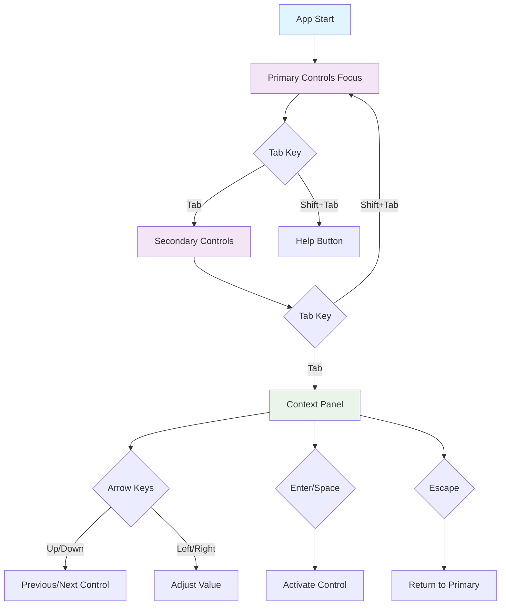
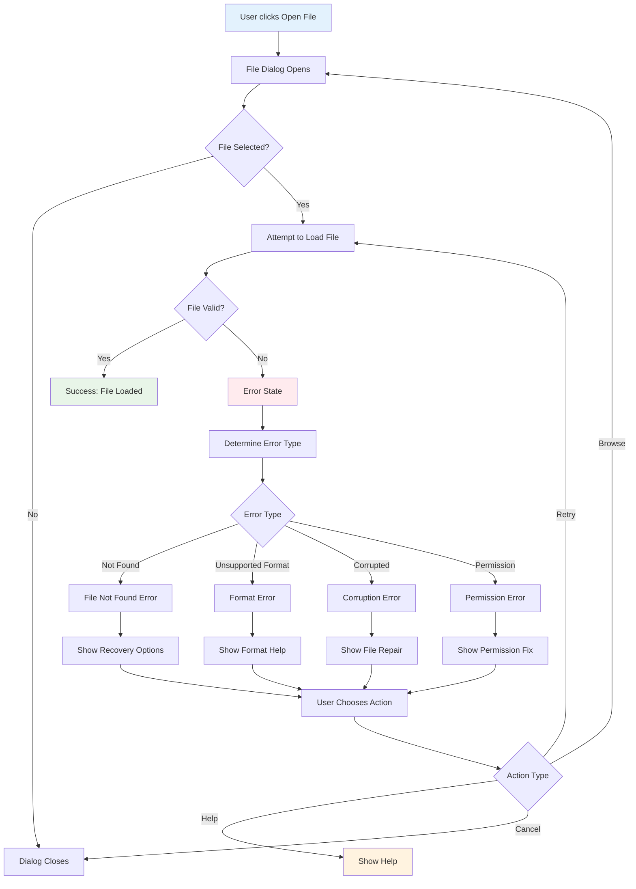

# Rusty Audio - UI Mockups and User Flow Diagrams

## Table of Contents

1. [Improved Information Hierarchy](#improved-information-hierarchy)
2. [Enhanced Keyboard Navigation](#enhanced-keyboard-navigation)
3. [Signal Generator Interface](#signal-generator-interface)
4. [In-App Help System](#in-app-help-system)
5. [Preset Management System](#preset-management-system)
6. [Error Handling Flows](#error-handling-flows)
7. [Accessibility Features](#accessibility-features)

---

## 1. Improved Information Hierarchy

### Current vs. Improved Layout

#### Current Flat Structure
```
┌─────────────────────────────────────────────────────────┐
│ 🎵 Rusty Audio                            [Theme ▼] [?] │
├─────────────────────────────────────────────────────────┤
│ [🎵 Playback] [🎛️ Effects] [📊 EQ] [⚙️ Settings]      │
├─────────────────────────────────────────────────────────┤
│                                                         │
│              ┌───────────────┐                         │
│              │   Album Art   │                         │
│              │   200x200     │                         │
│              └───────────────┘                         │
│                                                         │
│         Song Title - Artist Name                        │
│         Album Name (Year)                               │
│                                                         │
│ ░░░░░░█████░░░░░░░░░░░░░░░░░░░░░░░ 2:30 / 4:15         │
│                                                         │
│ [📁 Open] [▶️ Play] [⏹️ Stop] [🔁 Loop]                │
│                                                         │
│ 🔊 Volume: ████████░░ 80%                              │
│                                                         │
└─────────────────────────────────────────────────────────┘
```

#### Improved Hierarchical Structure
```
┌─────────────────────────────────────────────────────────┐
│ 🎵 Rusty Audio                            [Theme ▼] [?] │
├─────────────────────────────────────────────────────────┤
│                                                         │
│ ┌─── PRIMARY CONTROLS (Always Visible) ───────────────┐ │
│ │     [▶️]     [⏸️]     [⏹️]     🔊████░ 80%        │ │
│ │   PLAY/PAUSE  STOP   VOLUME                        │ │
│ └─────────────────────────────────────────────────────┘ │
│                                                         │
│ ┌─── TRACK INFORMATION ─────────────────────────────────┐ │
│ │ ┌─────────────┐  ♪ "Bohemian Rhapsody"              │ │
│ │ │ Album Art   │  👤 Queen                           │ │
│ │ │  150x150    │  💿 A Night at the Opera (1975)     │ │
│ │ └─────────────┘                                     │ │
│ │                                                     │ │
│ │ ████████████████████████░░░░░ 3:45 / 5:55          │ │
│ │ ← Seek anywhere on timeline                        │ │
│ └─────────────────────────────────────────────────────┘ │
│                                                         │
│ ┌─── SECONDARY CONTROLS ───────────────────────────────┐ │
│ │ [📁 Open File] [🔁 Loop] [🎚️ EQ] [🎛️ Effects]     │ │
│ └─────────────────────────────────────────────────────┘ │
│                                                         │
│ ┌─── CONTEXT PANEL ────────────────────────────────────┐ │
│ │ [🎵 Playback] [🎛️ Generator] [📊 Analysis] [⚙️ Set] │ │
│ │                                                     │ │
│ │ (Content changes based on selected context)        │ │
│ └─────────────────────────────────────────────────────┘ │
└─────────────────────────────────────────────────────────┘
```

### Visual Weight Hierarchy

#### Button Hierarchy Specification
```
PRIMARY ACTIONS (Most Important)
┌──────────────────────────────────┐
│           ▶️ PLAY               │  Height: 48px
│                                  │  Font: Bold 16px
│        [Gradient Background]     │  Glow: 4px blur
│        [Drop Shadow: 2px]        │  Border Radius: 12px
└──────────────────────────────────┘

SECONDARY ACTIONS (Important)
┌────────────────────────┐
│     ⏹️ Stop           │           Height: 36px
│                        │           Font: Medium 14px
│   [Solid Background]   │           Hover: Subtle glow
│                        │           Border Radius: 8px
└────────────────────────┘

TERTIARY ACTIONS (Support)
┌──────────────────┐
│   📁 Open       │                 Height: 28px
│                  │                 Font: Regular 12px
│  [Text + Icon]   │                 Hover: Background tint
│                  │                 Border Radius: 6px
└──────────────────┘
```

### Responsive Layout Breakpoints

#### Desktop (>1024px)
```
┌─── Header Bar ────────────────────────────────────────────────┐
│ Logo                                           Settings Help │
└───────────────────────────────────────────────────────────────┘

┌─── Control Dock (Fixed) ──────────────────────────────────────┐
│ [▶️] [⏸️] [⏹️]    🔊████░    [Open] [Loop]                   │
└───────────────────────────────────────────────────────────────┘

┌─── Main Content Area ─────────────────────────────────────────┐
│ ┌─ Track Info ─┐ ┌─ Context Panel ──────────────────────────┐ │
│ │              │ │                                          │ │
│ │  Album Art   │ │  [Selected Tab Content]                │ │
│ │              │ │                                          │ │
│ │  Metadata    │ │  Changes based on:                     │ │
│ │              │ │  • Playback controls                   │ │
│ │  Progress    │ │  • EQ settings                         │ │
│ │              │ │  • Signal generator                    │ │
│ └──────────────┘ │  • Effects rack                        │ │
│                  │  • Settings                            │ │
│                  └────────────────────────────────────────────┘ │
└───────────────────────────────────────────────────────────────┘
```

#### Tablet (768px - 1024px)
```
┌─── Compact Header ────────────────────────────────────────────┐
│ 🎵 Rusty Audio                                   [≡] [?]     │
└───────────────────────────────────────────────────────────────┘

┌─── Essential Controls ────────────────────────────────────────┐
│     [▶️]    [⏹️]    🔊████░    ████████████░░░ 2:30/4:15     │
└───────────────────────────────────────────────────────────────┘

┌─── Stacked Content ───────────────────────────────────────────┐
│ ┌─ Track Info (Condensed) ─────────────────────────────────┐   │
│ │ [🎵] "Song Title" by Artist                             │   │
│ └─────────────────────────────────────────────────────────┘   │
│                                                               │
│ ┌─ Tab Content ───────────────────────────────────────────┐   │
│ │ [🎵] [🎛️] [📊] [⚙️]                                   │   │
│ │                                                         │   │
│ │ (Full-width content area)                              │   │
│ └─────────────────────────────────────────────────────────┘   │
└───────────────────────────────────────────────────────────────┘
```

#### Mobile (≤768px)
```
┌─── Minimal Header ────────────────────┐
│ 🎵 RA              [≡]               │
└───────────────────────────────────────┘

┌─── Essential Info ────────────────────┐
│ ♪ "Song Title"                        │
│ 👤 Artist Name                        │
│ ████████░░ 2:30/4:15                 │
└───────────────────────────────────────┘

┌─── Primary Controls ──────────────────┐
│    [▶️]    [⏸️]    [⏹️]             │
└───────────────────────────────────────┘

┌─── Volume ────────────────────────────┐
│ 🔊 ████████░░ 80%                    │
└───────────────────────────────────────┘

┌─── Bottom Tab Bar ────────────────────┐
│ [🎵] [🎛️] [📊] [⚙️]                 │
└───────────────────────────────────────┘
```

---

## 2. Enhanced Keyboard Navigation

### Navigation Flow Diagram



### Keyboard Shortcut Overlay

#### Help Overlay Design
```
┌─── Keyboard Shortcuts (Press F1 to close) ─────────────────────┐
│                                                                 │
│ ┌─ PLAYBACK ─────────────┐ ┌─ NAVIGATION ───────────────────┐   │
│ │ Spacebar    Play/Pause │ │ Tab         Next control group │   │
│ │ S           Stop       │ │ Shift+Tab   Previous group     │   │
│ │ L           Loop       │ │ Arrow Keys  Navigate/Adjust    │   │
│ │ M           Mute       │ │ Enter       Activate           │   │
│ │ Home        Beginning  │ │ Escape      Cancel/Return      │   │
│ │ End         End        │ └────────────────────────────────┘   │
│ └────────────────────────┘                                     │
│                                                                 │
│ ┌─ VOLUME ───────────────┐ ┌─ FILES ────────────────────────┐   │
│ │ ↑/↓         Adjust     │ │ Ctrl+O      Open file          │   │
│ │ PgUp/PgDn   ±10%      │ │ Ctrl+S      Save preset        │   │
│ │ Ctrl+↑      Max        │ │ Ctrl+R      Recent files       │   │
│ │ Ctrl+↓      Mute       │ │ Del         Clear current      │   │
│ └────────────────────────┘ └────────────────────────────────┘   │
│                                                                 │
│ ┌─ ADVANCED ─────────────┐ ┌─ HELP ─────────────────────────┐   │
│ │ 1-8         EQ bands   │ │ F1          This help          │   │
│ │ Q/A         EQ adjust  │ │ Ctrl+?      Context help       │   │
│ │ E           Effects    │ │ F11         Fullscreen         │   │
│ │ G           Generator  │ │ Alt+H       High contrast      │   │
│ └────────────────────────┘ └────────────────────────────────┘   │
│                                                                 │
│                         [Print] [Close]                        │
└─────────────────────────────────────────────────────────────────┘
```

### Focus Indicators

#### Visual Focus States
```
┌─ Default Button ─────────┐
│      Play Music         │
│                         │
└─────────────────────────┘

┌─ Hovered Button ─────────┐
│      Play Music         │  ← Background: Lighter
│    [Subtle Glow]        │  ← Glow: 2px blur
└─────────────────────────┘

┌─ Focused Button ─────────┐
│ ╔═══════════════════════╗ │  ← Focus Ring: 2px solid
│ ║      Play Music       ║ │  ← High contrast outline
│ ║   [Enhanced Glow]     ║ │  ← Glow: 4px blur
│ ╚═══════════════════════╝ │
└─────────────────────────┘

┌─ Active Button ──────────┐
│ ░░░░░░░░░░░░░░░░░░░░░░░░░ │  ← Pressed appearance
│ ░      Play Music     ░ │  ← Slightly indented
│ ░░░░░░░░░░░░░░░░░░░░░░░░░ │
└─────────────────────────┘
```

### Accessibility Enhancements

#### Screen Reader Announcements
```rust
// Example ARIA live regions
<div aria-live="polite" aria-label="Playback status">
    "Now playing: Bohemian Rhapsody by Queen"
</div>

<div aria-live="assertive" aria-label="Error notifications">
    "Error: Could not load file. Please check the file format."
</div>

// Progress announcements (every 10% change)
<div aria-live="polite" aria-label="Progress">
    "Playback at 50% complete, 2 minutes 30 seconds of 5 minutes"
</div>
```

---

## 3. Signal Generator Interface

### Signal Generator Main Panel

```
┌─── 🎛️ Signal Generator ────────────────────────────────────────┐
│                                                  [📋] [ℹ️] [❌] │
├─────────────────────────────────────────────────────────────────┤
│                                                                 │
│ ┌─ Waveform Selection ─────────────────────────────────────────┐ │
│ │                                                             │ │
│ │ [Sine] [Square] [Triangle] [Sawtooth] [Noise] [Custom]     │ │
│ │   ∿      ⎍        △         ⩘        :::     📝         │ │
│ │                                                             │ │
│ │ ┌─ Live Preview ──────────────────────────────────────────┐ │ │
│ │ │ ∿∿∿∿∿∿∿∿∿∿∿∿∿∿∿∿∿∿∿∿∿∿∿∿∿∿∿∿∿∿∿∿∿∿∿∿∿∿∿∿∿∿∿∿∿∿∿∿∿∿∿ │ │ │
│ │ │                                                         │ │ │
│ │ │ Real-time waveform display with current parameters      │ │ │
│ │ └─────────────────────────────────────────────────────────┘ │ │
│ └─────────────────────────────────────────────────────────────┘ │
│                                                                 │
│ ┌─ Primary Parameters ────────────────────────────────────────┐ │
│ │                                                             │ │
│ │ Frequency: [440.00] Hz  [♪ A4]  ┌─ Quick Select ─────────┐ │ │
│ │ ████████████████████░░░         │ [220] [440] [880] [1K] │ │ │
│ │ 20 Hz                   20 kHz  │ [2K]  [5K]  [10K]     │ │ │
│ │                                 └───────────────────────┘ │ │
│ │                                                             │ │
│ │ Amplitude: [0.80]  ████████░░ 80%  [🔇] [🔊]             │ │
│ │                                                             │ │
│ │ Duration: [Continuous ▼] ⏱️ [5.0] seconds                │ │
│ │                                                             │ │
│ └─────────────────────────────────────────────────────────────┘ │
│                                                                 │
│ ┌▼ Advanced Parameters ───────────────────────────────────────┐ │
│ │                                                             │ │
│ │ Phase:     ████████░░░░ 90°     DC Offset: ░░░░░░░░░░ 0%  │ │
│ │ Harmonics: [2nd ✓] [3rd ✓] [5th] [7th]                   │ │
│ │ Envelope:  [None ▼] [Attack ▼] [Release ▼]                │ │
│ │ Stereo:    [● Both] [○ Left] [○ Right]                    │ │
│ │                                                             │ │
│ └─────────────────────────────────────────────────────────────┘ │
│                                                                 │
│ ┌─ Controls ──────────────────────────────────────────────────┐ │
│ │                                                             │ │
│ │ [▶️ Generate] [⏹️ Stop] [💾 Save Preset] [📂 Load Preset] │ │
│ │                                                             │ │
│ │ Status: ⚪ Ready  🎵 Output: Built-in  📊 Level: -12 dB   │ │
│ │                                                             │ │
│ └─────────────────────────────────────────────────────────────┘ │
└─────────────────────────────────────────────────────────────────┘
```

### Signal Generator Preset System

```
┌─── Signal Presets ─────────────────────────────────────────────┐
│                                                                 │
│ Search: [🔍 Filter presets...]  [Category ▼]  [⭐ Favorites]   │
│                                                                 │
│ ┌─ Audio Testing ────────┐ ┌─ Music & Tuning ──────┐          │
│ │                        │ │                        │          │
│ │ [🔧 1 kHz Test Tone]   │ │ [🎵 A4 - 440 Hz]      │          │
│ │ Pure sine wave at      │ │ Concert pitch A        │          │
│ │ 1000 Hz, -20 dB        │ │ reference tone         │          │
│ │                        │ │                        │          │
│ │ [📊 Frequency Sweep]   │ │ [🎼 Chromatic Scale]   │          │
│ │ 20 Hz to 20 kHz        │ │ C4 to C5 sequence      │          │
│ │ logarithmic sweep      │ │ with timing            │          │
│ │                        │ │                        │          │
│ │ [📢 Pink Noise]        │ │ [🎸 Guitar Tuning]     │          │
│ │ Equal energy per       │ │ E-A-D-G-B-E standard   │          │
│ │ octave, full spectrum  │ │ guitar frequencies     │          │
│ │                        │ │                        │          │
│ └────────────────────────┘ └────────────────────────┘          │
│                                                                 │
│ ┌─ Engineering ──────────┐ ┌─ Custom ──────────────┐           │
│ │                        │ │                        │          │
│ │ [⚡ Impulse Response]  │ │ [📝 My Settings 1]     │          │
│ │ Short impulse for      │ │ Custom waveform with   │          │
│ │ system testing         │ │ envelope settings      │          │
│ │                        │ │                        │          │
│ │ [🌊 White Noise]       │ │ [📈 Saved Config A]    │          │
│ │ Flat frequency         │ │ Complex multi-tone     │          │
│ │ response test          │ │ test signal            │          │
│ │                        │ │                        │          │
│ └────────────────────────┘ └────────────────────────┘          │
│                                                                 │
│ ┌─ Selected: "1 kHz Test Tone" ─────────────────────────────┐   │
│ │ Description: Standard reference tone for audio testing    │   │
│ │ Frequency: 1000 Hz | Amplitude: -20 dB | Duration: 10s   │   │
│ │ Tags: reference, calibration, sine-wave                  │   │
│ │ Rating: ⭐⭐⭐⭐⭐ (5.0) | Downloads: 1,247               │   │
│ │                                                           │   │
│ │ [👁️ Preview] [📋 Load] [❤️ Favorite] [📤 Share]         │   │
│ └───────────────────────────────────────────────────────────┘   │
│                                                                 │
│ [➕ Create New] [📂 Import] [📁 Export Selected] [❌ Close]    │
└─────────────────────────────────────────────────────────────────┘
```

### Frequency Input Widget Detail

```
┌─── Frequency Control ──────────────────────────────────────────┐
│                                                                 │
│ ┌─ Primary Input ────────────────────────────────────────────┐  │
│ │ Frequency: [440.00] Hz          [♪ Musical Note]          │  │
│ │           ↑                           ↑                    │  │
│ │        Numeric                    Note Picker              │  │
│ │        Input                      Button                   │  │
│ └────────────────────────────────────────────────────────────┘  │
│                                                                 │
│ ┌─ Visual Slider (Logarithmic Scale) ───────────────────────┐  │
│ │ 20Hz    100Hz   1kHz    10kHz   20kHz                     │  │
│ │ ├────────┼───────┼───────┼───────┤                        │  │
│ │ ░░░░░░░░░░░██████░░░░░░░░░░░░░░░░░                         │  │
│ │                  ↑                                         │  │
│ │                440 Hz                                      │  │
│ └────────────────────────────────────────────────────────────┘  │
│                                                                 │
│ ┌─ Quick Presets ────────────────────────────────────────────┐  │
│ │ [50Hz] [100Hz] [440Hz] [1kHz] [2kHz] [5kHz] [10kHz]       │  │
│ │  Sub    Low     A4     Test   Voice  High   Bright        │  │
│ └────────────────────────────────────────────────────────────┘  │
│                                                                 │
│ ┌─ Musical Note Picker (when ♪ is clicked) ─────────────────┐  │
│ │                                                           │  │
│ │ Octave: [4 ▼]                                            │  │
│ │                                                           │  │
│ │ [C] [C#] [D] [D#] [E] [F] [F#] [G] [G#] [A] [A#] [B]    │  │
│ │                              ↑                           │  │
│ │                          Selected: A4 (440.00 Hz)       │  │
│ │                                                           │  │
│ │ Scale: [Chromatic ▼] [Equal Temperament ▼]               │  │
│ │                                                           │  │
│ └───────────────────────────────────────────────────────────┘  │
│                                                                 │
│ ┌─ Input Validation ─────────────────────────────────────────┐  │
│ │ ✅ Valid range: 20.0 - 20000.0 Hz                         │  │
│ │ ⚠️  Above human hearing (>20kHz)                          │  │
│ │ 🔇 Below typical speaker range (<50Hz)                    │  │
│ └────────────────────────────────────────────────────────────┘  │
└─────────────────────────────────────────────────────────────────┘
```

### Waveform Preview Animation

```
Time: 0ms
┌─ Waveform Preview ─────────────────────────────────────────────┐
│ Sine Wave - 440 Hz                                [Settings] │
│                                                               │
│      ∿∿∿∿∿∿∿∿∿∿∿∿∿∿∿∿∿∿∿∿∿∿∿∿∿∿∿∿∿∿∿∿∿∿∿∿∿∿∿∿∿∿∿∿∿∿∿∿∿∿     │
│                                                               │
│ Controls: [⏸️ Pause Preview] [🔄 Loop] [📊 FFT View]         │
└───────────────────────────────────────────────────────────────┘

Time: 500ms
┌─ Waveform Preview ─────────────────────────────────────────────┐
│ Square Wave - 1000 Hz                             [Settings] │
│                                                               │
│ ⎍⎍⎍⎍⎍⎍⎍⎍⎍⎍⎍⎍⎍⎍⎍⎍⎍⎍⎍⎍⎍⎍⎍⎍⎍⎍⎍⎍⎍⎍⎍⎍⎍⎍⎍⎍⎍⎍⎍⎍⎍⎍⎍⎍⎍⎍⎍⎍⎍⎍⎍ │
│                                                               │
│ Controls: [▶️ Play Preview] [🔄 Loop] [📊 FFT View]          │
└───────────────────────────────────────────────────────────────┘
```

---

## 4. In-App Help System

### Progressive Help Disclosure

#### Level 1: Contextual Tooltips
```
┌─ Enhanced Tooltip Example ─────────────────────────────────────┐
│                                                                 │
│ ┌─ Play Button ─┐  ┌─ Tooltip ─────────────────────────────┐   │
│ │               │  │ 🎵 Play/Pause                          │   │
│ │   [▶️ PLAY]   │  │                                        │   │
│ │               │  │ Start or pause audio playback          │   │
│ │               │  │                                        │   │
│ └───────────────┘  │ ⌨️  Spacebar                           │   │
│         ↑          │ 🖱️  Click or Enter                     │   │
│     Hovered        │                                        │   │
│                    │ [💡 Learn More] [❌ Got It]           │   │
│                    └────────────────────────────────────────┘   │
└─────────────────────────────────────────────────────────────────┘
```

#### Level 2: Interactive Overlays
```
┌─── Help Mode Active ───────────────────────────────────────────┐
│ 🔍 Help Mode - Click any element for explanation              │
│                                               [❌ Exit Help] │
├─────────────────────────────────────────────────────────────────┤
│                                                                 │
│ ╔═══════════════╗   ┏━━━━━━━━━━━━━━━━━━━━━━━━━━━━━━━━━━━━━━━━━┓   │
│ ║ ① PRIMARY     ║   ┃ ③ CONTEXT PANEL                      ┃   │
│ ║   CONTROLS    ║   ┃                                       ┃   │
│ ║               ║   ┃ This area shows different content     ┃   │
│ ║ [▶️] [⏹️] [🔊] ║   ┃ based on your current selection:     ┃   │
│ ║               ║   ┃                                       ┃   │
│ ╚═══════════════╝   ┃ • Playback controls and track info   ┃   │
│                     ┃ • Equalizer settings                 ┃   │
│ ┌─────────────────┐ ┃ • Signal generator                   ┃   │
│ │ ② TRACK INFO    │ ┃ • Effects and processing             ┃   │
│ │                 │ ┃                                       ┃   │
│ │ Shows current   │ ┃ Click the tabs above to switch       ┃   │
│ │ song details    │ ┃ between different modes.             ┃   │
│ │ and progress    │ ┗━━━━━━━━━━━━━━━━━━━━━━━━━━━━━━━━━━━━━━━━━┛   │
│ └─────────────────┘                                             │
│                                                                 │
│ ┌─ Next: Click "Primary Controls" to learn about playback ────┐ │
│ │ [⏮️ Previous] [Skip Tour] [Continue] [🏠 Main Menu]          │ │
│ └───────────────────────────────────────────────────────────────┘ │
└─────────────────────────────────────────────────────────────────┘
```

#### Level 3: Interactive Tutorial
```
┌─── Welcome to Rusty Audio! (Step 1 of 5) ─────────────────────┐
│                                                                 │
│ Let's start with the basics. First, we'll open an audio file.  │
│                                                                 │
│ ┌─ Your Task ────────────────────────────────────────────────┐ │
│ │ Click the "📁 Open File" button to select an audio file    │ │
│ │                                                            │ │
│ │ ┌─────────────────────────────────────────────────────────┐ │ │
│ │ │                                                         │ │ │
│ │ │ ╔══════════════╗                                       │ │ │
│ │ │ ║ 📁 Open File ║  ← Click this highlighted button      │ │ │
│ │ │ ╚══════════════╝                                       │ │ │
│ │ │                                                         │ │ │
│ │ │ [▶️ Play] [⏹️ Stop] [🔊 Volume]                        │ │ │
│ │ │                                                         │ │ │
│ │ └─────────────────────────────────────────────────────────┘ │ │
│ └────────────────────────────────────────────────────────────┘ │
│                                                                 │
│ 💡 Tip: You can also use Ctrl+O or drag and drop a file!      │
│                                                                 │
│ [⏮️ Skip] [❓ Help] [⏭️ Skip Tutorial]                         │
└─────────────────────────────────────────────────────────────────┘
```

### Context-Sensitive Help

#### Help Content Based on Current State
```rust
// Help content that adapts to current application state
match app_state {
    AppState::NoFileLoaded => {
        show_help_content(HelpTopic::GettingStarted);
        highlight_elements(&["open-file-button", "drag-drop-area"]);
    },

    AppState::FileLoaded { playing: false } => {
        show_help_content(HelpTopic::PlaybackControls);
        highlight_elements(&["play-button", "volume-slider"]);
    },

    AppState::EqualizerOpen => {
        show_help_content(HelpTopic::EqualizerGuide);
        highlight_elements(&["eq-bands", "preset-buttons"]);
    },

    AppState::SignalGeneratorActive => {
        show_help_content(HelpTopic::SignalGeneration);
        highlight_elements(&["waveform-selector", "frequency-input"]);
    },
}
```

### Help Search and Navigation

```
┌─── Help & Documentation ───────────────────────────────────────┐
│                                                                 │
│ Search: [🔍 Type your question...]              [🔍 Search]   │
│                                                                 │
│ ┌─ Quick Answers ────────────────────────────────────────────┐ │
│ │ "How do I open a file?" → 📁 Opening Audio Files           │ │
│ │ "Keyboard shortcuts" → ⌨️ All Keyboard Commands            │ │
│ │ "Signal generator" → 🎛️ Signal Generation Guide           │ │
│ │ "Can't hear sound" → 🔊 Audio Troubleshooting             │ │
│ └────────────────────────────────────────────────────────────┘ │
│                                                                 │
│ ┌─ Browse by Topic ──────────────────────────────────────────┐ │
│ │                                                            │ │
│ │ 🎵 Getting Started                                         │ │
│ │   • Opening your first audio file                         │ │
│ │   • Basic playback controls                               │ │
│ │   • Understanding the interface                           │ │
│ │                                                            │ │
│ │ 🎛️ Audio Processing                                        │ │
│ │   • Using the equalizer                                   │ │
│ │   • Applying effects                                      │ │
│ │   • Signal generation                                     │ │
│ │                                                            │ │
│ │ ⚙️ Advanced Features                                       │ │
│ │   • Custom presets                                        │ │
│ │   • Keyboard shortcuts                                    │ │
│ │   • Accessibility options                                 │ │
│ │                                                            │ │
│ │ 🛠️ Troubleshooting                                         │ │
│ │   • Common audio problems                                 │ │
│ │   • File format support                                   │ │
│ │   • Performance issues                                    │ │
│ └────────────────────────────────────────────────────────────┘ │
│                                                                 │
│ [🎯 Interactive Tutorial] [📖 User Manual] [❓ FAQ] [📧 Support] │
└─────────────────────────────────────────────────────────────────┘
```

---

## 5. Preset Management System

### Preset Browser Interface

```
┌─── Preset Manager ─────────────────────────────────────────────┐
│                                                 [➕] [📥] [❌] │
│ Search: [🔍 Filter by name, tag, or category...]              │
│                                                                 │
│ Filters: [All ▼] [⭐ Favorites] [👤 Mine] [📅 Recent]         │
│                                                                 │
│ ┌─ Categories ─────────────────────────────────────────────────┐ │
│ │ ┌─ 🎵 Music Genres ─┐ ┌─ 🔧 Audio Testing ─┐ ┌─ ⭐ Custom ─┐ │ │
│ │ │                   │ │                     │ │             │ │ │
│ │ │ [🎸 Rock EQ]      │ │ [📊 Frequency Test] │ │ [💾 My EQ1] │ │ │
│ │ │ Punchy bass,      │ │ 20Hz-20kHz sweep    │ │ Custom rock │ │ │
│ │ │ crisp highs       │ │ for response test   │ │ setting     │ │ │
│ │ │ ⭐⭐⭐⭐⭐ (4.8)    │ │ ⭐⭐⭐⭐⭐ (5.0)      │ │ ⭐⭐⭐⭐⭐ (5.0) │ │ │
│ │ │                   │ │                     │ │             │ │ │
│ │ │ [🎹 Classical]    │ │ [🔊 Level Check]    │ │ [🎤 Vocal]  │ │ │
│ │ │ Balanced, natural │ │ Test tone at        │ │ Enhanced    │ │ │
│ │ │ frequency curve   │ │ multiple levels     │ │ clarity     │ │ │
│ │ │ ⭐⭐⭐⭐⭐ (4.5)    │ │ ⭐⭐⭐⭐⭐ (4.9)      │ │ ⭐⭐⭐⭐⭐ (4.7) │ │ │
│ │ │                   │ │                     │ │             │ │ │
│ │ │ [🎤 Vocal Boost]  │ │ [⚡ THD Analysis]   │ │ [🎛️ Test1] │ │ │
│ │ │ Enhanced speech   │ │ Harmonic distortion │ │ Experimental│ │ │
│ │ │ clarity           │ │ measurement         │ │ setup       │ │ │
│ │ │ ⭐⭐⭐⭐⭐ (4.3)    │ │ ⭐⭐⭐⭐⭐ (4.6)      │ │ ⭐⭐⭐⭐⭐ (3.8) │ │ │
│ │ └───────────────────┘ └─────────────────────┘ └─────────────┘ │ │
│ └─────────────────────────────────────────────────────────────┘ │
│                                                                 │
│ ┌─ Selected: "Rock EQ" ──────────────────────────────────────┐ │
│ │ 📝 Description: Punchy bass response with crisp highs      │ │
│ │ 🏷️ Tags: rock, guitar, bass-heavy, modern                  │ │
│ │ 👤 Author: AudioPro_42                                     │ │
│ │ 📅 Created: 2024-09-15  📈 Downloads: 2,847               │ │
│ │ ⭐ Rating: 4.8/5 (124 reviews)                             │ │
│ │                                                            │ │
│ │ 📊 EQ Settings Preview:                                    │ │
│ │ 60Hz: +3dB │ 250Hz: +1dB │ 1kHz: 0dB │ 4kHz: +2dB │ etc. │ │
│ │                                                            │ │
│ │ [👁️ Preview] [💾 Apply] [❤️ Favorite] [📤 Share] [💬]    │ │
│ └────────────────────────────────────────────────────────────┘ │
│                                                                 │
│ [📂 Import File] [📁 Export All] [🗑️ Delete Selected] [❌ Close] │
└─────────────────────────────────────────────────────────────────┘
```

### Preset Creation Wizard

```
┌─── Create New Preset ──────────────────────────────────────────┐
│                                              Step 2 of 4       │
│                                                                 │
│ ┌─ Progress ──────────────────────────────────────────────────┐ │
│ │ [✅ Basic Info] [●○○ Settings] [○○○ Details] [○○○ Save]     │ │
│ └─────────────────────────────────────────────────────────────┘ │
│                                                                 │
│ ┌─ Capture Current Settings ─────────────────────────────────┐ │
│ │                                                            │ │
│ │ Select which settings to include in this preset:          │ │
│ │                                                            │ │
│ │ ☑️ Equalizer Settings                                      │ │
│ │    📊 All 8 bands with current gain values                │ │
│ │                                                            │ │
│ │ ☑️ Volume Level                                            │ │
│ │    🔊 Current volume: 80%                                  │ │
│ │                                                            │ │
│ │ ☐ Effects Chain                                           │ │
│ │    🎛️ No effects currently active                         │ │
│ │                                                            │ │
│ │ ☐ Signal Generator                                         │ │
│ │    🎼 Include generator settings                           │ │
│ │                                                            │ │
│ │ ☐ Theme Settings                                           │ │
│ │    🎨 Current theme: Catppuccin Mocha                     │ │
│ │                                                            │ │
│ └────────────────────────────────────────────────────────────┘ │
│                                                                 │
│ ┌─ Preview Changes ──────────────────────────────────────────┐ │
│ │ This preset will restore:                                  │ │
│ │ • EQ: Bass boost (+3dB at 60Hz), treble enhance (+2dB)    │ │
│ │ • Volume: 80% playback level                              │ │
│ │                                                            │ │
│ │ 📊 Visual EQ Preview:                                      │ │
│ │ ██████▌░░░░░░░░██████                                      │ │
│ │                                                            │ │
│ └────────────────────────────────────────────────────────────┘ │
│ │                                                                 │
│ [⏮️ Back] [👁️ Test Settings] [Continue ⏭️] [❌ Cancel]        │
└─────────────────────────────────────────────────────────────────┘
```

---

## 6. Error Handling Flows

### Error State Hierarchy

#### User Flow for File Loading Error


### Comprehensive Error Dialog

```
┌─── Error: Unsupported File Format ────────────────────────────┐
│                                                                 │
│ 🚫 Cannot play "song.wma"                                     │
│                                                                 │
│ Windows Media Audio (.wma) files are not currently supported   │
│ by Rusty Audio.                                                │
│                                                                 │
│ ┌─ What can I do? ──────────────────────────────────────────┐  │
│ │                                                           │  │
│ │ ✅ RECOMMENDED SOLUTIONS:                                │  │
│ │                                                           │  │
│ │ [🔄 Convert to MP3/FLAC]  Convert using free software    │  │
│ │ [📂 Find MP3 Version]     Look for same song in MP3     │  │
│ │ [📋 Supported Formats]    See all supported file types   │  │
│ │                                                           │  │
│ │ 🛠️ OTHER OPTIONS:                                        │  │
│ │                                                           │  │
│ │ [🎵 Try Different File]   Select another audio file      │  │
│ │ [❓ Get Help]              Learn about file formats      │  │
│ │ [📧 Request Support]      Ask for WMA support            │  │
│ │                                                           │  │
│ └───────────────────────────────────────────────────────────┘  │
│                                                                 │
│ ┌─ Technical Details ───────────────────────────────────────┐  │
│ │ File: C:\Music\song.wma                                   │  │
│ │ Format: Windows Media Audio 9.1                          │  │
│ │ Codec: WMA2                                              │  │
│ │ Error Code: UnsupportedCodec(WMA)                        │  │
│ │                                                           │  │
│ │ [📋 Copy Details] [📝 Save Log]                          │  │
│ └───────────────────────────────────────────────────────────┘  │
│                                                                 │
│ [🔄 Try Again] [💡 Show Tips] [❌ Close]                      │
└─────────────────────────────────────────────────────────────────┘
```

### Progressive Error Recovery

#### Error Recovery Decision Tree
```
┌─── Automatic Recovery System ──────────────────────────────────┐
│                                                                 │
│ Error Detected: Audio device disconnected                      │
│                                                                 │
│ ┌─ Recovery Attempt 1 ────────────────────────────────────────┐ │
│ │ 🔄 Trying to reconnect to default audio device...           │ │
│ │ [████████████████████████░░░░░░] 80%                        │ │
│ │                                                              │ │
│ │ Status: Scanning available audio devices...                 │ │
│ └──────────────────────────────────────────────────────────────┘ │
│                                                                 │
│ ┌─ Available Actions ─────────────────────────────────────────┐ │
│ │ [⏸️ Pause Playback]     Pause until device is available     │ │
│ │ [🔊 Switch Device]       Choose different audio output      │ │
│ │ [❌ Stop]               Stop playback completely            │ │
│ │ [⚙️ Audio Settings]     Open system audio settings          │ │
│ └──────────────────────────────────────────────────────────────┘ │
│                                                                 │
│ Auto-retry in: 5 seconds [Cancel Auto-retry]                   │
└─────────────────────────────────────────────────────────────────┘
```

---

## 7. Accessibility Features

### High Contrast Mode

#### Standard Mode vs High Contrast
```
STANDARD MODE:
┌─────────────────────────────────────────────────────────────────┐
│ 🎵 Rusty Audio                              [Mocha ▼] [?]      │
├─────────────────────────────────────────────────────────────────┤
│                                                                 │
│ ┌─────────────┐  "Bohemian Rhapsody"                           │
│ │             │  Queen                                          │
│ │ Album Art   │  A Night at the Opera (1975)                   │
│ │             │                                                 │
│ └─────────────┘  ████████████████░░░░░░░ 3:45 / 5:55          │
│                                                                 │
│ [▶️ Play] [⏸️ Pause] [⏹️ Stop] 🔊 ████████░░ 80%             │
└─────────────────────────────────────────────────────────────────┘

HIGH CONTRAST MODE:
┌─────────────────────────────────────────────────────────────────┐
│ ███ RUSTY AUDIO ███                     [HIGH CONTRAST] [?]    │
├─────────────────────────────────────────────────────────────────┤
│                                                                 │
│ ┏━━━━━━━━━━━━━┓  ███ BOHEMIAN RHAPSODY ███                     │
│ ┃ ░░░░░░░░░░░ ┃  ███ QUEEN ███                                 │
│ ┃ ░ALBUM ART░ ┃  ███ A NIGHT AT THE OPERA (1975) ███          │
│ ┃ ░░░░░░░░░░░ ┃                                                 │
│ ┗━━━━━━━━━━━━━┛  ████████████████████████░░░░░ 3:45 / 5:55     │
│                                                                 │
│ [███ PLAY ███] [███ PAUSE ███] [███ STOP ███]                  │
│                                                                 │
│ ███ VOLUME ███ ████████████████████░░░░░ 80%                   │
└─────────────────────────────────────────────────────────────────┘
```

### Screen Reader Support

#### ARIA Implementation Examples
```html
<!-- Enhanced button with full accessibility -->
<button
    aria-label="Play current track"
    aria-pressed="false"
    aria-describedby="track-info playback-status"
    role="button"
    tabindex="0"
    class="primary-play-button">

    <span aria-hidden="true">▶️</span>
    <span class="sr-only">Play</span>
</button>

<!-- Slider with proper value announcements -->
<div
    role="slider"
    aria-label="Volume control"
    aria-valuemin="0"
    aria-valuemax="100"
    aria-valuenow="80"
    aria-valuetext="80 percent volume"
    aria-orientation="horizontal"
    tabindex="0">

    <div class="slider-track">
        <div class="slider-fill" style="width: 80%"></div>
        <div class="slider-handle" style="left: 80%"></div>
    </div>
</div>

<!-- Live region for status updates -->
<div
    aria-live="polite"
    aria-label="Playback status"
    id="playback-status"
    class="sr-only">
    Now playing: Bohemian Rhapsody by Queen, 3 minutes 45 seconds of 5 minutes 55 seconds
</div>

<!-- Error announcements -->
<div
    aria-live="assertive"
    aria-label="Error notifications"
    id="error-announcements"
    class="sr-only">
    Error: Could not load file. File format not supported.
</div>
```

### Keyboard Navigation Map

#### Focus Flow Diagram
```
┌─── APPLICATION FOCUS FLOW ─────────────────────────────────────┐
│                                                                 │
│ ┌─1─┐ TAB → ┌─2─┐ TAB → ┌─3─┐ TAB → ┌─4─┐ TAB → ┌─5─┐          │
│ │HLP│      │PLY│      │VOL│      │TAB│      │CNT│ ←─── ┌─6─┐ │
│ └───┘      └───┘      └───┘      └───┘      └───┘      │SET│ │
│   ↑                                           ↑        └───┘ │
│   └─── SHIFT+TAB ←←←←←←←←←←←←←←←←←←←←←←←←←←←←←←←─┘              │
│                                                                 │
│ KEY BEHAVIORS:                                                  │
│ • TAB: Move to next focusable element                          │
│ • SHIFT+TAB: Move to previous focusable element                │
│ • ENTER/SPACE: Activate focused element                        │
│ • ARROW KEYS: Navigate within complex controls                 │
│ • ESCAPE: Cancel operation or return to previous focus         │
│ • HOME/END: Go to first/last element in group                 │
│                                                                 │
│ FOCUS INDICATORS:                                               │
│ • Visible focus ring (2px solid outline)                      │
│ • High contrast compatible                                     │
│ • Minimum 3:1 contrast ratio with background                  │
│ • Never hidden or suppressed                                   │
│                                                                 │
└─────────────────────────────────────────────────────────────────┘
```

### Voice Control Integration

#### Voice Command Structure
```
VOICE COMMANDS SUPPORTED:

📢 PLAYBACK CONTROL:
"Play music"           → Start playback
"Pause"               → Pause playback
"Stop music"          → Stop playback
"Next track"          → Skip to next (if applicable)
"Previous track"      → Go to previous
"Restart song"        → Go to beginning

📢 VOLUME CONTROL:
"Volume up"           → Increase by 10%
"Volume down"         → Decrease by 10%
"Set volume to [number]" → Set specific level
"Mute"               → Set volume to 0
"Unmute"             → Restore previous volume

📢 NAVIGATION:
"Go to equalizer"     → Switch to EQ tab
"Open settings"       → Switch to settings tab
"Show signal generator" → Switch to generator tab
"Open file"           → Open file dialog
"Show help"           → Open help system

📢 ACCESSIBILITY:
"High contrast on"    → Enable high contrast mode
"High contrast off"   → Disable high contrast mode
"Larger text"         → Increase UI scale
"Smaller text"        → Decrease UI scale
"Read current song"   → Announce track information
```

---

## Implementation Priority Matrix

### High Priority (Phase 1 - 2-3 weeks)
1. **Enhanced Keyboard Navigation**
   - Complete keyboard accessibility
   - Focus management system
   - Visual focus indicators

2. **Basic Error Handling**
   - User-friendly error messages
   - Recovery action suggestions
   - Progressive error disclosure

3. **Information Hierarchy**
   - Visual weight system for controls
   - Progressive disclosure implementation
   - Responsive layout improvements

### Medium Priority (Phase 2 - 3-4 weeks)
1. **Signal Generator UI**
   - Core interface implementation
   - Parameter input widgets
   - Real-time preview system

2. **In-App Help System**
   - Contextual tooltips
   - Interactive help overlay
   - Basic tutorial system

3. **Accessibility Features**
   - Screen reader support
   - High contrast mode
   - ARIA implementation

### Lower Priority (Phase 3 - 4-5 weeks)
1. **Preset Management**
   - Complete preset system
   - Import/export functionality
   - Preset sharing features

2. **Advanced Help Features**
   - Interactive tutorials
   - Search functionality
   - Video help integration

3. **Advanced Visual Feedback**
   - Enhanced animations
   - Audio-reactive elements
   - Custom visualization modes

This comprehensive mockup and flow specification provides the detailed implementation guidance needed to transform Rusty Audio into a professional, accessible, and user-friendly audio application. Each component has been designed with specific attention to usability, accessibility, and progressive disclosure principles.