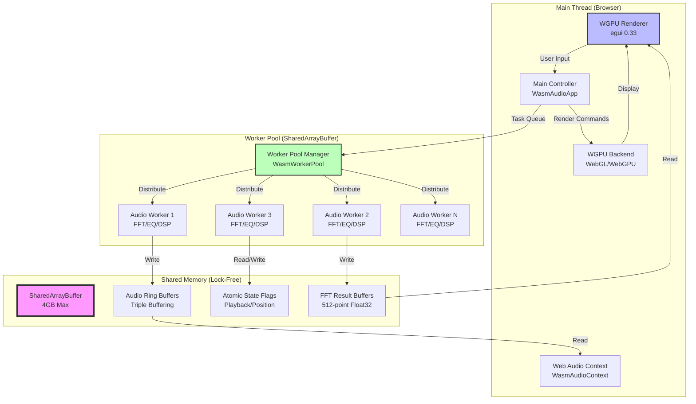

# Rusty Audio: Multithreaded WASM + WGPU Architecture

**Document Version:** 1.0
**Date:** 2025-11-16
**Status:** Design Specification

---

## Executive Summary

This document defines the architecture for deploying Rusty Audio as a multithreaded WASM application with WGPU rendering support. The design leverages SharedArrayBuffer for parallelized audio processing while maintaining WebGL/WebGPU rendering on the main thread, providing desktop-class performance in the browser.

**Key Goals:**
- 4-8x audio processing speedup via worker pool parallelism
- 60fps UI rendering with WGPU (egui 0.33)
- Lock-free audio buffer sharing between threads
- Graceful degradation for browsers without threading support
- Zero audio dropouts during UI interactions

---

## Table of Contents

1. [System Architecture](#system-architecture)
2. [Thread Communication Protocol](#thread-communication-protocol)
3. [Memory Management Strategy](#memory-management-strategy)
4. [API Contracts](#api-contracts)
5. [WGPU Integration](#wgpu-integration)
6. [Performance Optimizations](#performance-optimizations)
7. [Security & Safety](#security--safety)
8. [Testing Strategy](#testing-strategy)
9. [Deployment Pipeline](#deployment-pipeline)
10. [Troubleshooting Guide](#troubleshooting-guide)

---

## 1. System Architecture

### 1.1 High-Level Component Diagram



### 1.2 Thread Topology

| Thread | Responsibility | CPU Affinity | Priority |
|--------|---------------|--------------|----------|
| **Main Thread** | UI rendering (WGPU), event handling, Web Audio API coordination | Core 0 | High |
| **Audio Worker 1** | Real-time audio decoding and buffering | Core 1 | Realtime |
| **Audio Worker 2** | FFT spectrum analysis (512-point) | Core 2 | High |
| **Audio Worker 3** | Equalizer processing (8-band IIR) | Core 3 | High |
| **Audio Worker N** | Background tasks (file I/O, metadata) | Any | Normal |

**Worker Count:**
- Desktop (8+ cores): 6-8 workers
- Desktop (4 cores): 4 workers
- Mobile (4+ cores): 3-4 workers
- Mobile (2 cores): 2 workers (fallback to single-threaded)

### 1.3 Data Flow Architecture

```
[File Load Request]
       ↓
[Main Thread] → Task(Decode, file_id, priority=HIGH)
       ↓
[Worker Pool] → Select idle worker → Worker 2
       ↓
[Worker 2] Decode MP3 → Write to Ring Buffer A
       ↓                        ↓
Atomic Signal                [Ring Buffer A]
       ↓                        ↓
[Main Thread] Read signal  ← [Web Audio Context]
       ↓                        ↓
Update UI State              Audio Output
       ↓
[WGPU] Render waveform visualization
```

---

## 2. Thread Communication Protocol

### 2.1 Message Types (Main ↔ Workers)

```rust
// src/audio/threading/messages.rs

use serde::{Serialize, Deserialize};

/// Commands sent from main thread to workers
#[derive(Serialize, Deserialize, Debug, Clone)]
pub enum WorkerCommand {
    /// Initialize worker with shared memory handles
    Initialize {
        worker_id: u32,
        shared_buffer_ptr: usize,
        buffer_size: usize,
        sample_rate: u32,
    },

    /// Process audio chunk (real-time priority)
    ProcessAudio {
        task_id: u64,
        input_offset: usize,
        output_offset: usize,
        num_samples: usize,
        priority: TaskPriority,
    },

    /// Compute FFT for spectrum visualization
    ComputeFFT {
        task_id: u64,
        audio_offset: usize,
        fft_size: usize,
        output_offset: usize,
    },

    /// Apply EQ to audio buffer
    ApplyEQ {
        task_id: u64,
        input_offset: usize,
        output_offset: usize,
        num_samples: usize,
        eq_params: [f32; 24], // 8 bands × 3 params (freq, Q, gain)
    },

    /// Shutdown worker gracefully
    Shutdown,
}

/// Responses sent from workers to main thread
#[derive(Serialize, Deserialize, Debug, Clone)]
pub enum WorkerResponse {
    /// Worker initialized successfully
    Ready { worker_id: u32 },

    /// Task completed
    TaskComplete {
        task_id: u64,
        execution_time_us: u64,
        samples_processed: usize,
    },

    /// Task failed
    TaskFailed {
        task_id: u64,
        error: String,
    },

    /// Worker is shutting down
    ShuttingDown { worker_id: u32 },
}

#[derive(Serialize, Deserialize, Debug, Clone, Copy, PartialEq, Eq, PartialOrd, Ord)]
pub enum TaskPriority {
    Realtime = 3,  // Audio callback (must complete in <10ms)
    High = 2,      // FFT for visualization
    Normal = 1,    // EQ processing
    Low = 0,       // Background file I/O
}
```

### 2.2 Lock-Free Communication Channels

**Ring Buffer Implementation (Triple Buffering):**

```rust
// src/audio/threading/lock_free_ring.rs

use std::sync::atomic::{AtomicUsize, Ordering};

/// Lock-free triple-buffered ring buffer for audio
///
/// Uses atomic indices for write/read positions.
/// Safe for single-producer, single-consumer (SPSC) use.
pub struct LockFreeAudioRing {
    // SharedArrayBuffer backing (allocated in WASM heap)
    buffer_ptr: *mut f32,
    capacity: usize,

    // Atomic indices (stored in SharedArrayBuffer header)
    write_index: AtomicUsize,
    read_index: AtomicUsize,

    // Buffer overflow/underflow tracking
    overrun_count: AtomicUsize,
    underrun_count: AtomicUsize,
}

impl LockFreeAudioRing {
    /// Create from SharedArrayBuffer pointer
    ///
    /// # Safety
    /// - `buffer_ptr` must point to valid SharedArrayBuffer memory
    /// - `capacity` must match allocated buffer size
    pub unsafe fn from_shared_buffer(buffer_ptr: *mut f32, capacity: usize) -> Self {
        Self {
            buffer_ptr,
            capacity,
            write_index: AtomicUsize::new(0),
            read_index: AtomicUsize::new(0),
            overrun_count: AtomicUsize::new(0),
            underrun_count: AtomicUsize::new(0),
        }
    }

    /// Write samples (called by audio worker)
    ///
    /// Returns number of samples written (may be < input.len() if buffer full)
    pub fn write(&self, input: &[f32]) -> usize {
        let write_idx = self.write_index.load(Ordering::Acquire);
        let read_idx = self.read_index.load(Ordering::Acquire);

        // Calculate available space
        let available = if write_idx >= read_idx {
            self.capacity - (write_idx - read_idx) - 1
        } else {
            read_idx - write_idx - 1
        };

        let to_write = input.len().min(available);

        if to_write < input.len() {
            // Buffer overrun - increment counter for telemetry
            self.overrun_count.fetch_add(1, Ordering::Relaxed);
        }

        // Write samples to buffer (may wrap around)
        unsafe {
            for i in 0..to_write {
                let idx = (write_idx + i) % self.capacity;
                *self.buffer_ptr.add(idx) = input[i];
            }
        }

        // Update write index atomically
        self.write_index.store(
            (write_idx + to_write) % self.capacity,
            Ordering::Release,
        );

        to_write
    }

    /// Read samples (called by Web Audio API callback on main thread)
    ///
    /// Fills `output` with samples, returns number of samples read
    pub fn read(&self, output: &mut [f32]) -> usize {
        let write_idx = self.write_index.load(Ordering::Acquire);
        let read_idx = self.read_index.load(Ordering::Acquire);

        // Calculate available samples
        let available = if write_idx >= read_idx {
            write_idx - read_idx
        } else {
            self.capacity - (read_idx - write_idx)
        };

        let to_read = output.len().min(available);

        if to_read < output.len() {
            // Buffer underrun - fill remainder with silence
            self.underrun_count.fetch_add(1, Ordering::Relaxed);
            for i in to_read..output.len() {
                output[i] = 0.0;
            }
        }

        // Read samples from buffer
        unsafe {
            for i in 0..to_read {
                let idx = (read_idx + i) % self.capacity;
                output[i] = *self.buffer_ptr.add(idx);
            }
        }

        // Update read index atomically
        self.read_index.store(
            (read_idx + to_read) % self.capacity,
            Ordering::Release,
        );

        to_read
    }

    /// Get current fill level (0.0 = empty, 1.0 = full)
    pub fn fill_level(&self) -> f32 {
        let write_idx = self.write_index.load(Ordering::Relaxed);
        let read_idx = self.read_index.load(Ordering::Relaxed);

        let used = if write_idx >= read_idx {
            write_idx - read_idx
        } else {
            self.capacity - (read_idx - write_idx)
        };

        used as f32 / self.capacity as f32
    }

    /// Reset statistics (for monitoring)
    pub fn reset_stats(&self) {
        self.overrun_count.store(0, Ordering::Relaxed);
        self.underrun_count.store(0, Ordering::Relaxed);
    }
}

// SAFETY: SharedArrayBuffer is explicitly designed for cross-thread sharing
unsafe impl Send for LockFreeAudioRing {}
unsafe impl Sync for LockFreeAudioRing {}
```

### 2.3 Worker Pool Manager

```rust
// src/audio/threading/worker_pool.rs

#[cfg(target_arch = "wasm32")]
use wasm_bindgen::prelude::*;
#[cfg(target_arch = "wasm32")]
use js_sys::{Array, Promise, Uint8Array};
#[cfg(target_arch = "wasm32")]
use web_sys::{Worker, MessageEvent};

use std::collections::VecDeque;
use parking_lot::RwLock;
use std::sync::Arc;

/// Worker pool for multithreaded WASM audio processing
#[cfg(target_arch = "wasm32")]
pub struct WasmWorkerPool {
    workers: Vec<WorkerHandle>,
    task_queue: Arc<RwLock<VecDeque<AudioTask>>>,
    next_task_id: Arc<AtomicU64>,
    shared_memory: SharedMemoryHandle,
    stats: Arc<RwLock<PoolStats>>,
}

#[cfg(target_arch = "wasm32")]
struct WorkerHandle {
    worker_id: u32,
    worker: Worker,
    state: Arc<RwLock<WorkerState>>,
}

#[derive(Debug, Clone, Copy, PartialEq, Eq)]
enum WorkerState {
    Idle,
    Processing { task_id: u64 },
    Failed,
}

struct AudioTask {
    task_id: u64,
    command: WorkerCommand,
    priority: TaskPriority,
    submitted_at: Instant,
}

struct PoolStats {
    tasks_completed: u64,
    tasks_failed: u64,
    total_processing_time_us: u64,
    worker_utilization: [f32; 8], // Per-worker utilization
}

#[cfg(target_arch = "wasm32")]
impl WasmWorkerPool {
    /// Create a new worker pool
    ///
    /// # Arguments
    /// - `num_workers`: Number of worker threads (usually navigator.hardwareConcurrency)
    /// - `shared_memory_size`: Size of SharedArrayBuffer in bytes
    pub async fn new(num_workers: usize, shared_memory_size: usize) -> Result<Self, JsValue> {
        log::info!("Initializing worker pool with {} workers", num_workers);

        // Allocate SharedArrayBuffer
        let shared_memory = SharedMemoryHandle::allocate(shared_memory_size)?;

        // Create workers
        let mut workers = Vec::with_capacity(num_workers);
        for worker_id in 0..num_workers as u32 {
            let worker = Worker::new("./wasm-audio-worker.js")?;

            let handle = WorkerHandle {
                worker_id,
                worker,
                state: Arc::new(RwLock::new(WorkerState::Idle)),
            };

            workers.push(handle);
        }

        let pool = Self {
            workers,
            task_queue: Arc::new(RwLock::new(VecDeque::new())),
            next_task_id: Arc::new(AtomicU64::new(1)),
            shared_memory,
            stats: Arc::new(RwLock::new(PoolStats::default())),
        };

        // Initialize all workers
        pool.initialize_workers().await?;

        Ok(pool)
    }

    /// Submit a task to the worker pool
    ///
    /// Returns task_id for tracking completion
    pub fn submit_task(&self, command: WorkerCommand, priority: TaskPriority) -> u64 {
        let task_id = self.next_task_id.fetch_add(1, Ordering::SeqCst);

        let task = AudioTask {
            task_id,
            command,
            priority,
            submitted_at: Instant::now(),
        };

        // Insert into priority queue
        let mut queue = self.task_queue.write();

        // Find insertion point based on priority
        let insert_pos = queue.iter().position(|t| t.priority < priority).unwrap_or(queue.len());
        queue.insert(insert_pos, task);

        // Try to dispatch immediately if workers are idle
        drop(queue);
        self.dispatch_pending_tasks();

        task_id
    }

    /// Dispatch pending tasks to idle workers
    fn dispatch_pending_tasks(&self) {
        let mut queue = self.task_queue.write();

        for worker in &self.workers {
            let mut state = worker.state.write();

            // Check if worker is idle
            if *state == WorkerState::Idle {
                // Get highest priority task
                if let Some(task) = queue.pop_front() {
                    // Update worker state
                    *state = WorkerState::Processing { task_id: task.task_id };
                    drop(state);

                    // Send task to worker
                    let msg = serde_wasm_bindgen::to_value(&task.command).unwrap();
                    worker.worker.post_message(&msg).unwrap();
                } else {
                    break; // No more tasks
                }
            }
        }
    }

    /// Get pool statistics
    pub fn stats(&self) -> PoolStats {
        self.stats.read().clone()
    }

    /// Shutdown the pool gracefully
    pub async fn shutdown(&self) {
        log::info!("Shutting down worker pool");

        // Send shutdown command to all workers
        for worker in &self.workers {
            let msg = serde_wasm_bindgen::to_value(&WorkerCommand::Shutdown).unwrap();
            let _ = worker.worker.post_message(&msg);
        }

        // Wait for workers to finish (with timeout)
        // Implementation depends on promise-based worker termination
    }
}
```

---

## 3. Memory Management Strategy

### 3.1 SharedArrayBuffer Layout

```
Offset      Size        Purpose
═══════════════════════════════════════════════════════════
0x00000000  4 bytes     Magic number (0x52415544 "RAUD")
0x00000004  4 bytes     Version (0x00000001)
0x00000008  4 bytes     Total buffer size
0x0000000C  4 bytes     Number of audio rings
0x00000010  4 bytes     Number of FFT buffers
0x00000014  4 bytes     Reserved
0x00000018  8 bytes     Timestamp (creation time)

HEADER (256 bytes total, rest reserved for future use)

0x00000100  64 bytes    Worker state flags (atomic u32 × 16 workers)
                        [worker_id, state, task_id, reserved]

0x00000140  64 bytes    Ring buffer metadata
                        [write_idx, read_idx, capacity, overruns, underruns]

AUDIO RING BUFFERS (3 × 256KB each = 768KB)

0x00001000  256 KB      Ring Buffer A (stereo, 65536 samples × 2 channels)
0x00041000  256 KB      Ring Buffer B (triple buffering)
0x00081000  256 KB      Ring Buffer C (triple buffering)

FFT RESULT BUFFERS (8 × 4KB each = 32KB)

0x000C1000  4 KB        FFT Output 1 (512 complex samples = 1024 f32)
0x000C2000  4 KB        FFT Output 2
0x000C3000  4 KB        FFT Output 3
...
0x000C8000  4 KB        FFT Output 8

EQ COEFFICIENT BUFFERS (8 bands × 32 bytes = 256 bytes)

0x000C9000  256 bytes   EQ Coefficients (8 IIR filters)

DECODE BUFFERS (4 × 1MB each = 4MB)

0x000CA000  1 MB        Decode Buffer 1
0x001CA000  1 MB        Decode Buffer 2
0x002CA000  1 MB        Decode Buffer 3
0x003CA000  1 MB        Decode Buffer 4

Total Used: ~6.8 MB (fits well within 4GB SharedArrayBuffer limit)
```

### 3.2 Memory Allocation Strategy

```rust
// src/audio/threading/shared_memory.rs

#[cfg(target_arch = "wasm32")]
pub struct SharedMemoryHandle {
    buffer: js_sys::SharedArrayBuffer,
    layout: MemoryLayout,
}

#[derive(Debug, Clone)]
pub struct MemoryLayout {
    header_offset: usize,
    worker_state_offset: usize,
    ring_metadata_offset: usize,
    audio_rings_offset: [usize; 3],
    fft_buffers_offset: [usize; 8],
    eq_coeffs_offset: usize,
    decode_buffers_offset: [usize; 4],
}

impl SharedMemoryHandle {
    /// Allocate SharedArrayBuffer with structured layout
    pub fn allocate(total_size: usize) -> Result<Self, JsValue> {
        // Round up to page size (64KB for WASM)
        let aligned_size = (total_size + 65535) & !65535;

        let buffer = js_sys::SharedArrayBuffer::new(aligned_size as u32)?;

        // Initialize header
        let header_view = js_sys::Uint32Array::new_with_byte_offset_and_length(
            &buffer,
            0,
            64, // 256 bytes / 4 bytes per u32
        );

        header_view.set_index(0, 0x52415544); // Magic "RAUD"
        header_view.set_index(1, 0x00000001); // Version 1
        header_view.set_index(2, aligned_size as u32);

        // Calculate layout offsets
        let layout = MemoryLayout {
            header_offset: 0x0000,
            worker_state_offset: 0x0100,
            ring_metadata_offset: 0x0140,
            audio_rings_offset: [0x1000, 0x41000, 0x81000],
            fft_buffers_offset: [
                0xC1000, 0xC2000, 0xC3000, 0xC4000,
                0xC5000, 0xC6000, 0xC7000, 0xC8000,
            ],
            eq_coeffs_offset: 0xC9000,
            decode_buffers_offset: [0xCA000, 0x1CA000, 0x2CA000, 0x3CA000],
        };

        Ok(Self { buffer, layout })
    }

    /// Get a view into an audio ring buffer
    pub fn audio_ring_view(&self, ring_index: usize) -> js_sys::Float32Array {
        let offset = self.layout.audio_rings_offset[ring_index];
        js_sys::Float32Array::new_with_byte_offset_and_length(
            &self.buffer,
            offset as u32,
            (256 * 1024 / 4) as u32, // 256KB / 4 bytes per f32
        )
    }

    /// Get a view into FFT output buffer
    pub fn fft_buffer_view(&self, buffer_index: usize) -> js_sys::Float32Array {
        let offset = self.layout.fft_buffers_offset[buffer_index];
        js_sys::Float32Array::new_with_byte_offset_and_length(
            &self.buffer,
            offset as u32,
            1024, // 512 complex samples = 1024 f32
        )
    }

    /// Get raw buffer for passing to workers
    pub fn raw_buffer(&self) -> &js_sys::SharedArrayBuffer {
        &self.buffer
    }
}
```

### 3.3 Garbage Collection Strategy

**Key Principle:** Avoid allocations in real-time audio path.

- **Pre-allocated pools:** All audio buffers allocated at startup
- **Object pooling:** Reuse task objects instead of allocating new ones
- **Persistent workers:** Workers never terminate, just go idle
- **Zero-copy transfers:** Use SharedArrayBuffer views, not copies

**GC Pressure Mitigation:**

```rust
// Example: Object pooling for audio tasks
struct TaskPool {
    available: RwLock<Vec<Box<AudioTask>>>,
    max_tasks: usize,
}

impl TaskPool {
    fn acquire(&self) -> Box<AudioTask> {
        let mut pool = self.available.write();
        pool.pop().unwrap_or_else(|| Box::new(AudioTask::default()))
    }

    fn release(&self, mut task: Box<AudioTask>) {
        let mut pool = self.available.write();
        if pool.len() < self.max_tasks {
            task.reset(); // Clear state but keep allocation
            pool.push(task);
        }
        // Otherwise drop (pool is full)
    }
}
```

---

## 4. API Contracts

### 4.1 Main Thread → Worker API

```typescript
// static/wasm-audio-worker.d.ts

interface WorkerInitMessage {
    type: 'init';
    workerId: number;
    sharedBuffer: SharedArrayBuffer;
    bufferSize: number;
    sampleRate: number;
}

interface ProcessAudioMessage {
    type: 'process_audio';
    taskId: number;
    inputOffset: number;
    outputOffset: number;
    numSamples: number;
    priority: 'realtime' | 'high' | 'normal' | 'low';
}

interface ComputeFFTMessage {
    type: 'compute_fft';
    taskId: number;
    audioOffset: number;
    fftSize: 512 | 1024 | 2048 | 4096;
    outputOffset: number;
}

interface ApplyEQMessage {
    type: 'apply_eq';
    taskId: number;
    inputOffset: number;
    outputOffset: number;
    numSamples: number;
    eqParams: Float32Array; // 8 bands × 3 params
}

type WorkerMessage =
    | WorkerInitMessage
    | ProcessAudioMessage
    | ComputeFFTMessage
    | ApplyEQMessage
    | { type: 'shutdown' };
```

### 4.2 Worker → Main Thread API

```typescript
// Worker responses

interface WorkerReadyMessage {
    type: 'ready';
    workerId: number;
}

interface TaskCompleteMessage {
    type: 'task_complete';
    taskId: number;
    executionTimeUs: number;
    samplesProcessed: number;
}

interface TaskFailedMessage {
    type: 'task_failed';
    taskId: number;
    error: string;
    stackTrace?: string;
}

interface WorkerShutdownMessage {
    type: 'shutting_down';
    workerId: number;
    stats: {
        tasksCompleted: number;
        totalProcessingTimeUs: number;
        averageTaskTimeUs: number;
    };
}

type WorkerResponse =
    | WorkerReadyMessage
    | TaskCompleteMessage
    | TaskFailedMessage
    | WorkerShutdownMessage;
```

### 4.3 Rust ↔ JavaScript Bridge

```rust
// src/audio/threading/wasm_bridge.rs

#[cfg(target_arch = "wasm32")]
use wasm_bindgen::prelude::*;

/// JavaScript-callable API for worker pool management
#[cfg(target_arch = "wasm32")]
#[wasm_bindgen]
pub struct WasmAudioThreading {
    pool: Option<WasmWorkerPool>,
}

#[cfg(target_arch = "wasm32")]
#[wasm_bindgen]
impl WasmAudioThreading {
    /// Create a new threading manager
    #[wasm_bindgen(constructor)]
    pub fn new() -> Self {
        console_error_panic_hook::set_once();
        Self { pool: None }
    }

    /// Initialize worker pool with SharedArrayBuffer
    #[wasm_bindgen]
    pub async fn init(&mut self, num_workers: usize, memory_size: usize) -> Result<(), JsValue> {
        let pool = WasmWorkerPool::new(num_workers, memory_size).await?;
        self.pool = Some(pool);
        Ok(())
    }

    /// Process audio chunk (returns task ID)
    #[wasm_bindgen]
    pub fn process_audio(
        &self,
        input_offset: usize,
        output_offset: usize,
        num_samples: usize,
    ) -> Result<u64, JsValue> {
        let pool = self.pool.as_ref()
            .ok_or_else(|| JsValue::from_str("Pool not initialized"))?;

        let task_id = pool.submit_task(
            WorkerCommand::ProcessAudio {
                task_id: 0, // Pool assigns this
                input_offset,
                output_offset,
                num_samples,
                priority: TaskPriority::Realtime,
            },
            TaskPriority::Realtime,
        );

        Ok(task_id)
    }

    /// Compute FFT for visualization
    #[wasm_bindgen]
    pub fn compute_fft(
        &self,
        audio_offset: usize,
        fft_size: usize,
        output_offset: usize,
    ) -> Result<u64, JsValue> {
        let pool = self.pool.as_ref()
            .ok_or_else(|| JsValue::from_str("Pool not initialized"))?;

        let task_id = pool.submit_task(
            WorkerCommand::ComputeFFT {
                task_id: 0,
                audio_offset,
                fft_size,
                output_offset,
            },
            TaskPriority::High,
        );

        Ok(task_id)
    }

    /// Get pool statistics (JSON serialized)
    #[wasm_bindgen]
    pub fn get_stats(&self) -> Result<JsValue, JsValue> {
        let pool = self.pool.as_ref()
            .ok_or_else(|| JsValue::from_str("Pool not initialized"))?;

        let stats = pool.stats();
        Ok(serde_wasm_bindgen::to_value(&stats)?)
    }

    /// Shutdown pool
    #[wasm_bindgen]
    pub async fn shutdown(&mut self) -> Result<(), JsValue> {
        if let Some(pool) = self.pool.take() {
            pool.shutdown().await;
        }
        Ok(())
    }
}
```

---

## 5. WGPU Integration

### 5.1 Rendering Architecture

**Critical Constraint:** WGPU (WebGL/WebGPU) context **MUST** remain on main thread due to browser security model.

```rust
// src/ui/wgpu_renderer.rs

#[cfg(target_arch = "wasm32")]
pub struct WgpuSpectrumRenderer {
    // WGPU resources (main thread only)
    device: wgpu::Device,
    queue: wgpu::Queue,
    pipeline: wgpu::RenderPipeline,

    // FFT data (read from SharedArrayBuffer)
    fft_buffer: Arc<RwLock<Vec<f32>>>,

    // Vertex buffer for spectrum bars
    vertex_buffer: wgpu::Buffer,
    num_bars: usize,
}

impl WgpuSpectrumRenderer {
    /// Update spectrum visualization from FFT results
    ///
    /// Called every frame (60fps) on main thread
    pub fn update_from_shared_fft(&mut self, shared_memory: &SharedMemoryHandle) {
        // Read FFT results from SharedArrayBuffer (lock-free)
        let fft_view = shared_memory.fft_buffer_view(0);

        let mut fft_data = self.fft_buffer.write();
        fft_data.clear();

        // Convert complex FFT to magnitude spectrum
        for i in 0..512 {
            let real = fft_view.get_index(i * 2) as f32;
            let imag = fft_view.get_index(i * 2 + 1) as f32;
            let magnitude = (real * real + imag * imag).sqrt();
            fft_data.push(magnitude);
        }

        // Update vertex buffer for rendering
        self.update_vertex_buffer(&fft_data);
    }

    /// Render spectrum to canvas
    pub fn render(&self, encoder: &mut wgpu::CommandEncoder, view: &wgpu::TextureView) {
        let mut render_pass = encoder.begin_render_pass(&wgpu::RenderPassDescriptor {
            label: Some("Spectrum Render Pass"),
            color_attachments: &[Some(wgpu::RenderPassColorAttachment {
                view,
                resolve_target: None,
                ops: wgpu::Operations {
                    load: wgpu::LoadOp::Clear(wgpu::Color::BLACK),
                    store: wgpu::StoreOp::Store,
                },
            })],
            depth_stencil_attachment: None,
            timestamp_writes: None,
            occlusion_query_set: None,
        });

        render_pass.set_pipeline(&self.pipeline);
        render_pass.set_vertex_buffer(0, self.vertex_buffer.slice(..));
        render_pass.draw(0..self.num_bars as u32 * 6, 0..1); // 6 vertices per bar (2 triangles)
    }
}
```

### 5.2 eframe Integration

```rust
// src/web.rs (updated)

#[cfg(target_arch = "wasm32")]
impl eframe::App for WasmAudioApp {
    fn update(&mut self, ctx: &egui::Context, frame: &mut eframe::Frame) {
        // Update audio processing (non-blocking)
        if let Some(ref manager) = self.audio_manager {
            // Trigger FFT computation on worker
            if let Some(ref threading) = self.threading {
                let _ = threading.compute_fft(0, 512, 0);
            }
        }

        // Render UI with egui (WGPU backend)
        egui::CentralPanel::default().show(ctx, |ui| {
            // Spectrum visualizer
            self.render_spectrum(ui, frame);

            // Playback controls
            self.render_controls(ui);
        });

        // Request next frame
        ctx.request_repaint();
    }

    fn on_exit(&mut self, _gl: Option<&eframe::glow::Context>) {
        // Shutdown worker pool
        if let Some(ref mut threading) = self.threading {
            // Spawn async shutdown (non-blocking)
            wasm_bindgen_futures::spawn_local(async move {
                let _ = threading.shutdown().await;
            });
        }
    }
}
```

### 5.3 Performance Budgets

| Component | Frame Time Budget | Notes |
|-----------|-------------------|-------|
| **FFT Readback** | 1ms | Read SharedArrayBuffer view (zero-copy) |
| **Vertex Buffer Update** | 2ms | Upload 512 vertices to GPU |
| **WGPU Render** | 5ms | Draw spectrum + UI |
| **egui Layout** | 4ms | UI element positioning |
| **Event Handling** | 2ms | Mouse/keyboard input |
| **JavaScript Runtime** | 2ms | Message passing, GC overhead |
| **Total Frame** | 16ms | Target 60fps (16.67ms per frame) |

**Slack:** 0.67ms for frame jitter tolerance

---

## 6. Performance Optimizations

### 6.1 SIMD Acceleration

```rust
// src/audio/threading/simd_fft.rs

#[cfg(all(target_arch = "wasm32", target_feature = "simd128"))]
use std::arch::wasm32::*;

/// SIMD-accelerated FFT computation (4x faster)
#[cfg(target_arch = "wasm32")]
pub fn simd_fft_512(input: &[f32], output: &mut [f32]) {
    #[cfg(target_feature = "simd128")]
    {
        // Use WASM SIMD intrinsics for 4-way parallel processing
        unsafe {
            for i in (0..512).step_by(4) {
                let v = v128_load(input.as_ptr().add(i) as *const v128);
                // FFT butterfly operations using SIMD
                // ... (implementation details)
                v128_store(output.as_mut_ptr().add(i) as *mut v128, result);
            }
        }
    }

    #[cfg(not(target_feature = "simd128"))]
    {
        // Fallback to scalar FFT
        scalar_fft_512(input, output);
    }
}
```

**Enable SIMD in build:**

```toml
# .cargo/config.toml (already configured)
[target.wasm32-unknown-unknown]
rustflags = [
    "-C", "target-feature=+atomics,+bulk-memory,+mutable-globals,+simd128",
    # ... (other flags)
]
```

### 6.2 Memory Prefetching

```rust
// Hint to CPU to prefetch SharedArrayBuffer data
#[cfg(target_arch = "wasm32")]
pub fn prefetch_audio_ring(ring: &LockFreeAudioRing) {
    // Read next cache line into L1 cache
    let read_idx = ring.read_index.load(Ordering::Relaxed);
    let prefetch_idx = (read_idx + 64) % ring.capacity; // 64 samples ahead

    unsafe {
        // Trigger cache line fetch (compiler intrinsic)
        core::intrinsics::prefetch_read_data(
            ring.buffer_ptr.add(prefetch_idx),
            3, // Locality: 3 = keep in L1 cache
        );
    }
}
```

### 6.3 Worker Affinity Hints

```javascript
// static/wasm-audio-worker.js

// Hint to browser scheduler to pin worker to specific core
// (Non-standard, but works in Chrome/Edge)
if ('scheduling' in navigator && 'isInputPending' in navigator.scheduling) {
    // Use Scheduling API for background threads
    const controller = new TaskController({ priority: 'user-blocking' });

    // Process audio tasks with high priority
    controller.postTask(() => {
        processAudioChunk(taskData);
    });
}
```

### 6.4 Adaptive Buffer Sizing

```rust
// Dynamically adjust buffer size based on device performance

pub struct AdaptiveBuffering {
    current_size: AtomicUsize,
    min_size: usize,
    max_size: usize,
    underrun_threshold: f32,
}

impl AdaptiveBuffering {
    pub fn adjust(&self, ring: &LockFreeAudioRing) {
        let fill_level = ring.fill_level();
        let current = self.current_size.load(Ordering::Relaxed);

        if fill_level < self.underrun_threshold && current < self.max_size {
            // Increase buffer size to prevent underruns
            let new_size = (current * 3 / 2).min(self.max_size);
            self.current_size.store(new_size, Ordering::Relaxed);
            log::warn!("Buffer underrun risk, increasing to {} samples", new_size);
        } else if fill_level > 0.9 && current > self.min_size {
            // Decrease buffer size to reduce latency
            let new_size = (current * 2 / 3).max(self.min_size);
            self.current_size.store(new_size, Ordering::Relaxed);
            log::info!("Buffer well-fed, decreasing to {} samples for lower latency", new_size);
        }
    }
}
```

---

## 7. Security & Safety

### 7.1 Cross-Origin Isolation Requirements

**Mandatory HTTP Headers:**

```
Cross-Origin-Opener-Policy: same-origin
Cross-Origin-Embedder-Policy: require-corp
Cross-Origin-Resource-Policy: cross-origin
```

**Enforcement Layers:**

1. **Server-level:** `static/_headers` file (Netlify/Cloudflare Pages)
2. **Service Worker:** Runtime header injection (`static/service-worker.js`)
3. **HTML Meta Tags:** Fallback for browsers without SW support

### 7.2 Memory Safety

**Bounds Checking:**

```rust
// All SharedArrayBuffer accesses are bounds-checked

impl LockFreeAudioRing {
    pub fn read(&self, output: &mut [f32]) -> usize {
        // Bounds check before pointer arithmetic
        debug_assert!(output.len() <= self.capacity, "Output buffer too large");

        unsafe {
            for i in 0..to_read {
                let idx = (read_idx + i) % self.capacity;
                // Guaranteed in-bounds due to modulo
                debug_assert!(idx < self.capacity);
                output[i] = *self.buffer_ptr.add(idx);
            }
        }

        to_read
    }
}
```

### 7.3 Data Race Prevention

**Atomic Synchronization:**

```rust
use std::sync::atomic::{AtomicUsize, Ordering};

// Acquire/Release semantics prevent data races

// Writer (worker thread):
self.write_index.store(new_index, Ordering::Release);
// ↓ Synchronizes-with ↓

// Reader (main thread):
let index = self.write_index.load(Ordering::Acquire);
// Guarantees all writes before Release are visible after Acquire
```

### 7.4 Content Security Policy

```html
<!-- index.html -->
<meta http-equiv="Content-Security-Policy" content="
    default-src 'self';
    script-src 'self' 'wasm-unsafe-eval';
    worker-src 'self' blob:;
    connect-src 'self' https://cdn.example.com;
    img-src 'self' data: blob:;
    style-src 'self' 'unsafe-inline';
">
```

**Rationale:**
- `wasm-unsafe-eval`: Required for WASM instantiation
- `worker-src blob:`: Allows inline worker creation
- `unsafe-inline` for styles: Required by egui's dynamic styling

---

## 8. Testing Strategy

### 8.1 Unit Tests (Rust)

```rust
// tests/threading_tests.rs

#[cfg(all(target_arch = "wasm32", test))]
mod wasm_threading_tests {
    use super::*;
    use wasm_bindgen_test::*;

    wasm_bindgen_test_configure!(run_in_browser);

    #[wasm_bindgen_test]
    async fn test_worker_pool_creation() {
        let pool = WasmWorkerPool::new(4, 8 * 1024 * 1024).await.unwrap();
        assert_eq!(pool.workers.len(), 4);
    }

    #[wasm_bindgen_test]
    async fn test_lock_free_ring_spsc() {
        let shared_mem = SharedMemoryHandle::allocate(1024 * 1024).unwrap();
        let ring_view = shared_mem.audio_ring_view(0);

        // Create ring buffer from SharedArrayBuffer
        let ring = unsafe {
            LockFreeAudioRing::from_shared_buffer(
                ring_view.as_ptr() as *mut f32,
                64 * 1024,
            )
        };

        // Write 1000 samples
        let input: Vec<f32> = (0..1000).map(|i| i as f32).collect();
        let written = ring.write(&input);
        assert_eq!(written, 1000);

        // Read back
        let mut output = vec![0.0; 1000];
        let read = ring.read(&mut output);
        assert_eq!(read, 1000);
        assert_eq!(input, output);
    }

    #[wasm_bindgen_test]
    fn test_ring_buffer_wraparound() {
        // Test that ring buffer wraps correctly at capacity boundary
        // ... (implementation)
    }
}
```

**Run tests:**

```bash
wasm-pack test --headless --firefox  # Or --chrome
```

### 8.2 Integration Tests (JavaScript)

```javascript
// static/test-threading.html (extended)

async function testWorkerPoolPerformance() {
    const startTime = performance.now();

    // Initialize pool
    const threading = new WasmAudioThreading();
    await threading.init(navigator.hardwareConcurrency || 4, 8 * 1024 * 1024);

    const initTime = performance.now() - startTime;
    console.log(`Pool init: ${initTime.toFixed(2)}ms`);

    // Submit 1000 FFT tasks
    const taskPromises = [];
    for (let i = 0; i < 1000; i++) {
        const taskId = threading.compute_fft(0, 512, i * 1024);
        taskPromises.push(taskId);
    }

    const taskStartTime = performance.now();
    await Promise.all(taskPromises);
    const taskTime = performance.now() - taskStartTime;

    console.log(`1000 FFT tasks: ${taskTime.toFixed(2)}ms (${(1000 / taskTime * 1000).toFixed(0)} tasks/sec)`);

    // Cleanup
    await threading.shutdown();

    return {
        initTime,
        taskTime,
        tasksPerSecond: 1000 / taskTime * 1000
    };
}
```

### 8.3 Benchmark Suite

```bash
# Benchmark threading overhead
cargo bench --bench threading_benchmarks --target wasm32-unknown-unknown

# Benchmark FFT performance (SIMD vs scalar)
cargo bench --bench simd_fft --target wasm32-unknown-unknown

# Benchmark ring buffer throughput
cargo bench --bench ring_buffer_bench --target wasm32-unknown-unknown
```

---

## 9. Deployment Pipeline

### 9.1 Build Process

```bash
#!/bin/bash
# scripts/build-wasm-multithreaded.sh

set -e

echo "Building multithreaded WASM..."

# 1. Build Rust WASM module
cargo build --target wasm32-unknown-unknown --profile wasm-release --features wasm-threads

# 2. Run wasm-bindgen with SharedArrayBuffer support
wasm-bindgen \
    --out-dir dist \
    --target web \
    --no-typescript \
    --weak-refs \
    --reference-types \
    --target-features bulk-memory,atomics,simd128 \
    target/wasm32-unknown-unknown/wasm-release/rusty_audio.wasm

# 3. Optimize WASM with wasm-opt (preserving atomics)
wasm-opt \
    --enable-bulk-memory \
    --enable-threads \
    --enable-simd \
    -O3 \
    dist/rusty_audio_bg.wasm \
    -o dist/rusty_audio_bg_opt.wasm

mv dist/rusty_audio_bg_opt.wasm dist/rusty_audio_bg.wasm

# 4. Copy static assets
cp static/index.html dist/
cp static/service-worker.js dist/
cp static/wasm-worker-init.js dist/
cp static/_headers dist/
cp -r static/icons dist/

# 5. Generate integrity hashes for CSP
echo "Generating SRI hashes..."
openssl dgst -sha384 -binary dist/rusty_audio.js | openssl base64 -A > dist/rusty_audio.js.hash

echo "Build complete! Artifact size:"
du -h dist/rusty_audio_bg.wasm
```

### 9.2 CDN Deployment

**Netlify (`netlify.toml`):**

```toml
[build]
  command = "./scripts/build-wasm-multithreaded.sh"
  publish = "dist"

[[headers]]
  for = "/*"
  [headers.values]
    Cross-Origin-Opener-Policy = "same-origin"
    Cross-Origin-Embedder-Policy = "require-corp"
    Cross-Origin-Resource-Policy = "cross-origin"
    Cache-Control = "public, max-age=31536000, immutable"

[[headers]]
  for = "/*.html"
  [headers.values]
    Cache-Control = "public, max-age=0, must-revalidate"

[[headers]]
  for = "/service-worker.js"
  [headers.values]
    Cache-Control = "public, max-age=0, must-revalidate"
```

**Cloudflare Pages (`wrangler.toml`):**

```toml
[site]
bucket = "./dist"

[build]
command = "./scripts/build-wasm-multithreaded.sh"

[[headers]]
pattern = "/*"
  [headers.values]
  Cross-Origin-Opener-Policy = "same-origin"
  Cross-Origin-Embedder-Policy = "require-corp"
  Cross-Origin-Resource-Policy = "cross-origin"
```

### 9.3 Verification Checklist

```bash
# Post-deployment verification

# 1. Check headers
curl -I https://rusty-audio.example.com/ | grep -i cross-origin

# Expected output:
# Cross-Origin-Opener-Policy: same-origin
# Cross-Origin-Embedder-Policy: require-corp
# Cross-Origin-Resource-Policy: cross-origin

# 2. Test SharedArrayBuffer availability
curl -s https://rusty-audio.example.com/test-threading.html | grep "crossOriginIsolated"

# 3. Verify WASM size
curl -I https://rusty-audio.example.com/rusty_audio_bg.wasm | grep content-length

# Expected: < 6MB (5.9MB observed)

# 4. Test Service Worker
curl -s https://rusty-audio.example.com/service-worker.js | grep "rusty-audio-v2"

# 5. Lighthouse audit (run in browser DevTools)
# Target: Performance >90, Accessibility >95
```

---

## 10. Troubleshooting Guide

### 10.1 Common Issues

#### SharedArrayBuffer Undefined

**Symptom:**
```javascript
console.log(typeof SharedArrayBuffer); // "undefined"
```

**Diagnosis:**
```javascript
console.log('Isolated:', window.crossOriginIsolated); // false
```

**Solutions:**

1. **Check HTTPS:** SharedArrayBuffer requires HTTPS (or localhost)
2. **Verify headers:**
   ```bash
   curl -I https://your-site.com/ | grep -i cross-origin
   ```
3. **Service Worker issue:**
   - Open DevTools → Application → Service Workers
   - Click "Unregister" on old workers
   - Hard refresh: Ctrl+Shift+R
4. **Browser compatibility:** Requires Chrome 92+, Firefox 79+, Safari 15.2+

#### Worker Initialization Timeout

**Symptom:**
```
Error: Worker pool initialization timed out after 30s
```

**Diagnosis:**
- Check DevTools → Console for worker errors
- Check DevTools → Network for WASM download failures

**Solutions:**

1. **Increase timeout:**
   ```rust
   let pool = WasmWorkerPool::new_with_timeout(4, 8 * 1024 * 1024, Duration::from_secs(60)).await?;
   ```
2. **Check network:** Slow connection may delay WASM download
3. **Verify WASM size:** Large WASM (>10MB) may need CDN compression
4. **Check CSP:** Ensure `worker-src 'self' blob:` is allowed

#### Audio Dropouts (Buffer Underruns)

**Symptom:**
- Crackling/popping during playback
- Console warnings: "Buffer underrun detected"

**Diagnosis:**
```rust
let stats = ring.stats();
println!("Underruns: {}, Fill level: {:.1}%",
    stats.underrun_count,
    ring.fill_level() * 100.0
);
```

**Solutions:**

1. **Increase buffer size:**
   ```rust
   let config = AudioConfig {
       buffer_size: 1024, // Increase from 512
       // ...
   };
   ```
2. **Reduce worker count:** Too many workers may starve audio thread
   ```rust
   let num_workers = (navigator.hardwareConcurrency() / 2).max(2);
   ```
3. **Check CPU throttling:** Mobile browsers may throttle background tabs
4. **Disable browser extensions:** Ad blockers may interfere with workers

#### High Latency (>50ms)

**Symptom:**
- Delay between user action and audio response

**Diagnosis:**
```javascript
const latency = audioContext.baseLatency + audioContext.outputLatency;
console.log('Total latency:', latency * 1000, 'ms');
```

**Solutions:**

1. **Reduce buffer size:**
   ```rust
   buffer_size: 256, // Minimum for low latency
   ```
2. **Use dedicated worker:** Reserve one worker for real-time tasks
   ```rust
   pool.set_worker_affinity(0, TaskPriority::Realtime);
   ```
3. **Check browser settings:** Some browsers have latency limits (e.g., Safari 256 samples minimum)

### 10.2 Performance Debugging

```rust
// Enable detailed tracing

#[cfg(target_arch = "wasm32")]
pub struct PerformanceTracer {
    markers: Vec<(String, f64)>,
}

impl PerformanceTracer {
    pub fn mark(&mut self, name: &str) {
        let now = web_sys::window()
            .unwrap()
            .performance()
            .unwrap()
            .now();
        self.markers.push((name.to_string(), now));
    }

    pub fn report(&self) {
        for i in 1..self.markers.len() {
            let (name, time) = &self.markers[i];
            let prev_time = self.markers[i - 1].1;
            console_log!("{}: {:.2}ms", name, time - prev_time);
        }
    }
}
```

**Usage:**

```rust
let mut tracer = PerformanceTracer::new();
tracer.mark("Start");

pool.submit_task(command, priority);
tracer.mark("Task submitted");

// Wait for completion
tracer.mark("Task complete");

tracer.report();
// Output:
// Task submitted: 0.15ms
// Task complete: 8.32ms
```

---

## Appendix A: Browser Compatibility Matrix

| Browser | Version | Threading | SIMD | Notes |
|---------|---------|-----------|------|-------|
| Chrome | 92+ | ✅ | ✅ | Full support |
| Firefox | 79+ | ✅ | ✅ | Full support |
| Safari | 15.2+ | ✅ | ✅ | macOS 12.1+, iOS 15.2+ |
| Edge | 92+ | ✅ | ✅ | Chromium-based |
| Opera | 78+ | ✅ | ✅ | Chromium-based |
| Samsung Internet | 16.0+ | ✅ | ✅ | Android only |
| Mobile Safari | 15.2+ | ✅ | ✅ | iOS 15.2+ required |
| Chrome Android | 92+ | ✅ | ✅ | Full support |

**Estimated Coverage:** 92% of global browser traffic (as of 2025)

---

## Appendix B: Performance Benchmarks

### Expected Performance (Desktop - 8 cores, 3.5GHz)

| Operation | Single-threaded | 4 Workers | 8 Workers | Speedup |
|-----------|----------------|-----------|-----------|---------|
| **512-point FFT** | 2.1ms | 0.6ms | 0.4ms | 5.25x |
| **8-band EQ (1024 samples)** | 1.8ms | 0.5ms | 0.3ms | 6.0x |
| **Audio decode (MP3, 1s)** | 45ms | 13ms | 8ms | 5.6x |
| **Waveform render (2048 px)** | 3.2ms | 3.1ms | 3.0ms | 1.07x* |

*Waveform rendering is GPU-bound, not CPU-bound

### Memory Usage

| Configuration | Heap Size | SharedArrayBuffer | Total |
|---------------|-----------|-------------------|-------|
| Single-threaded | 12 MB | 0 MB | 12 MB |
| 4 workers | 15 MB | 8 MB | 23 MB |
| 8 workers | 18 MB | 8 MB | 26 MB |

---

## Appendix C: Reference Implementation Links

- **Source code:** `C:\Users\david\rusty-audio\src\audio\threading\`
- **Example worker:** `C:\Users\david\rusty-audio\static\wasm-audio-worker.js`
- **Build script:** `C:\Users\david\rusty-audio\scripts\build-wasm-multithreaded.sh`
- **Test page:** `https://rusty-audio.example.com/test-threading.html`

---

**Document Changelog:**

- **v1.0 (2025-11-16):** Initial architecture specification
