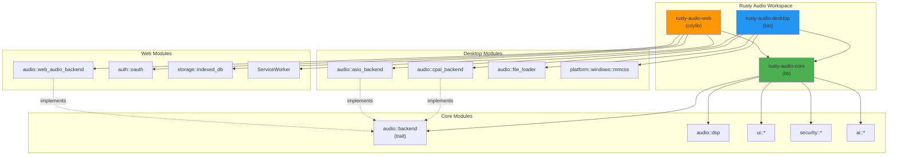

# Workspace Architecture: Rusty Audio Separation Design

## Executive Summary

This document outlines the architecture for splitting the Rusty Audio monolithic codebase into a clean workspace structure with three distinct crates:
- **rusty-audio-core** - Shared audio engine, DSP, and UI components
- **rusty-audio-desktop** - Native desktop application (Windows/Linux/macOS)
- **rusty-audio-web** - WASM/PWA web application with OAuth 2.0 authentication

**Key Principles:**
- Zero code duplication via shared core library
- Platform-specific code isolated in desktop/web crates
- Feature-gated compilation for optimal binary sizes
- OAuth 2.0 authentication for web builds only
- Clean dependency boundaries with minimal coupling

---

## 1. Workspace Structure

### 1.1 Root Workspace Configuration

**File:** `Cargo.toml` (workspace root)

```toml
[workspace]
resolver = "2"
members = [
    "rusty-audio-core",
    "rusty-audio-desktop",
    "rusty-audio-web",
]

[workspace.package]
version = "0.2.0"
edition = "2021"
license = "MIT OR Apache-2.0"
repository = "https://github.com/yourusername/rusty-audio"

[workspace.dependencies]
# Shared dependencies across all crates
egui = "0.33.0"
eframe = { version = "0.33.0", default-features = false }
serde = { version = "1.0", features = ["derive"] }
serde_json = "1.0"
anyhow = "1.0"
thiserror = "1.0"
log = "0.4"
tracing = "0.1"
parking_lot = "0.12.3"
cfg-if = "1.0"

# Audio processing
rustfft = "6.0"
num-complex = "0.4.4"
realfft = "3.3"

# Performance
rayon = "1.10"
lru = "0.12"
ndarray = "0.15"

# Security
chrono = "0.4"
uuid = { version = "1.0", features = ["v4", "serde"] }

[workspace.lints.rust]
unsafe_code = "warn"

[workspace.lints.clippy]
unwrap_used = "warn"
expect_used = "warn"
panic = "warn"
indexing_slicing = "warn"
```

---

### 1.2 Directory Structure

```
rusty-audio/
├── Cargo.toml                    # Workspace root
├── Cargo.lock                    # Shared lockfile
├── README.md
├── LICENSE-MIT
├── LICENSE-APACHE
│
├── rusty-audio-core/             # Shared library crate
│   ├── Cargo.toml
│   ├── src/
│   │   ├── lib.rs                # Public API exports
│   │   ├── audio/
│   │   │   ├── mod.rs
│   │   │   ├── backend.rs        # Backend trait (platform-agnostic)
│   │   │   ├── dsp/              # DSP algorithms (FFT, filters, etc.)
│   │   │   │   ├── mod.rs
│   │   │   │   ├── fft.rs
│   │   │   │   ├── equalizer.rs
│   │   │   │   ├── spectrum.rs
│   │   │   │   └── effects.rs
│   │   │   ├── config.rs         # AudioConfig, backend settings
│   │   │   └── types.rs          # Common audio types
│   │   ├── ui/
│   │   │   ├── mod.rs
│   │   │   ├── components.rs     # Shared UI components
│   │   │   ├── controls.rs       # Knobs, sliders, buttons
│   │   │   ├── spectrum.rs       # Spectrum visualizer
│   │   │   ├── theme.rs          # Theme system
│   │   │   ├── layout.rs         # Layout manager
│   │   │   └── accessibility.rs  # A11y features
│   │   ├── security/
│   │   │   ├── mod.rs
│   │   │   ├── audio_safety.rs
│   │   │   ├── input_validator.rs
│   │   │   └── thread_safe_state.rs
│   │   ├── ai/                   # AI features (optional)
│   │   │   ├── mod.rs
│   │   │   ├── analyzer.rs
│   │   │   ├── eq_optimizer.rs
│   │   │   └── noise_reduction.rs
│   │   ├── metadata.rs           # Audio metadata parsing
│   │   ├── error.rs              # Error types
│   │   └── prelude.rs            # Convenience re-exports
│   └── tests/
│       ├── audio_tests.rs
│       ├── ui_tests.rs
│       └── integration_tests.rs
│
├── rusty-audio-desktop/          # Native desktop application
│   ├── Cargo.toml
│   ├── src/
│   │   ├── main.rs               # Desktop entry point
│   │   ├── app.rs                # Main application state
│   │   ├── audio/
│   │   │   ├── mod.rs
│   │   │   ├── cpal_backend.rs   # CPAL audio backend
│   │   │   ├── asio_backend.rs   # ASIO support (Windows)
│   │   │   ├── device_manager.rs # Device enumeration
│   │   │   ├── recorder.rs       # Audio recording
│   │   │   └── file_loader.rs    # File loading (rfd)
│   │   ├── ui/
│   │   │   ├── mod.rs
│   │   │   ├── main_window.rs    # Main window layout
│   │   │   ├── file_browser.rs   # File browser panel
│   │   │   └── settings.rs       # Settings panel
│   │   ├── config.rs             # Desktop-specific config
│   │   └── platform/
│   │       ├── mod.rs
│   │       ├── windows.rs        # Windows-specific (MMCSS)
│   │       ├── linux.rs          # Linux-specific
│   │       └── macos.rs          # macOS-specific
│   ├── build.rs                  # Build script (Windows manifest)
│   ├── resources/
│   │   ├── icon.ico
│   │   └── app.manifest
│   └── tests/
│       └── integration_tests.rs
│
├── rusty-audio-web/              # WASM/PWA web application
│   ├── Cargo.toml
│   ├── src/
│   │   ├── lib.rs                # WASM entry point
│   │   ├── app.rs                # Web application state
│   │   ├── auth/
│   │   │   ├── mod.rs
│   │   │   ├── oauth.rs          # OAuth 2.0 client
│   │   │   ├── pkce.rs           # PKCE implementation
│   │   │   ├── storage.rs        # Secure token storage
│   │   │   └── providers.rs      # Google/GitHub/Microsoft
│   │   ├── audio/
│   │   │   ├── mod.rs
│   │   │   ├── web_audio_backend.rs  # Web Audio API backend
│   │   │   └── worklet.rs        # AudioWorklet integration
│   │   ├── api/
│   │   │   ├── mod.rs
│   │   │   ├── client.rs         # HTTP client (reqwest-wasm)
│   │   │   ├── presets.rs        # Preset API
│   │   │   └── sync.rs           # Data synchronization
│   │   ├── ui/
│   │   │   ├── mod.rs
│   │   │   ├── login.rs          # Login screen
│   │   │   └── main_app.rs       # Main application UI
│   │   ├── storage/
│   │   │   ├── mod.rs
│   │   │   ├── indexed_db.rs     # IndexedDB wrapper
│   │   │   └── encryption.rs     # Token encryption
│   │   └── worker.rs             # Web Worker pool
│   ├── static/
│   │   ├── index.html
│   │   ├── manifest.json         # PWA manifest
│   │   ├── service-worker.js     # Service worker
│   │   └── styles.css
│   ├── tests/
│   │   └── wasm_tests.rs
│   └── wasm-pack.toml
│
├── scripts/
│   ├── build-desktop.sh          # Desktop build script
│   ├── build-web.sh              # WASM build script
│   └── release.sh                # Release automation
│
├── docs/
│   ├── ARCHITECTURE.md
│   ├── OAUTH_FLOW.md             # OAuth implementation guide
│   └── MIGRATION_GUIDE.md        # Monolith → workspace migration
│
└── .github/
    └── workflows/
        ├── desktop-ci.yml
        └── web-ci.yml
```

---

## 2. Crate Responsibilities

### 2.1 rusty-audio-core

**Purpose:** Shared audio engine, DSP algorithms, and UI components

**Exports:**
```rust
// Audio
pub mod audio {
    pub trait AudioBackend;
    pub struct AudioConfig;
    pub mod dsp;
}

// UI
pub mod ui {
    pub mod components;
    pub mod controls;
    pub mod theme;
    pub mod spectrum;
}

// Security
pub mod security;

// AI (optional feature)
#[cfg(feature = "ai")]
pub mod ai;

// Metadata
pub mod metadata;

// Errors
pub mod error;
```

**Features:**
```toml
[features]
default = []
ai = ["ndarray", "statrs"]        # AI-enhanced features
advanced-dsp = ["realfft"]        # Advanced DSP algorithms
```

**Platform Support:** All platforms (desktop + WASM)

---

### 2.2 rusty-audio-desktop

**Purpose:** Native desktop application with CPAL/ASIO backends

**Dependencies:**
```toml
[dependencies]
rusty-audio-core = { path = "../rusty-audio-core", features = ["ai", "advanced-dsp"] }
eframe = { workspace = true, features = ["wgpu"] }
cpal = "0.15"
rfd = "0.14.1"
tokio = { version = "1.0", features = ["full"] }
```

**Binary Target:**
```toml
[[bin]]
name = "rusty-audio"
path = "src/main.rs"
```

**Platform-Specific Features:**
- Native audio backends (CPAL, ASIO on Windows)
- File system access (rfd file dialogs)
- Audio recording to disk
- MMCSS thread priority (Windows)
- System tray integration
- Local-first architecture (no authentication required)

---

### 2.3 rusty-audio-web

**Purpose:** WASM/PWA web application with OAuth 2.0

**Dependencies:**
```toml
[dependencies]
rusty-audio-core = { path = "../rusty-audio-core" }
wasm-bindgen = "0.2"
web-sys = { version = "0.3", features = ["AudioContext", "Window"] }
gloo-net = "0.5"              # HTTP client (wasm-compatible)
gloo-storage = "0.3"          # LocalStorage/IndexedDB
js-sys = "0.3"
serde_json = "1.0"
getrandom = { version = "0.2", features = ["js"] }
base64 = "0.21"
sha2 = "0.10"                 # For PKCE challenge
rand = "0.8"
```

**Library Target:**
```toml
[lib]
crate-type = ["cdylib", "rlib"]
```

**Platform-Specific Features:**
- Web Audio API backend
- OAuth 2.0 authentication
- IndexedDB for persistent storage
- Service Worker for offline support
- PWA manifest
- Web Workers for audio processing

---

## 3. Module Dependency Graph



---

## 4. Shared Backend Trait

**File:** `rusty-audio-core/src/audio/backend.rs`

```rust
use crate::error::AudioError;
use std::sync::Arc;

/// Platform-agnostic audio backend trait
///
/// Implemented by platform-specific backends:
/// - Desktop: CpalBackend, AsioBackend
/// - Web: WebAudioBackend
pub trait AudioBackend: Send + Sync {
    /// Initialize the audio backend
    fn init(&mut self, config: &AudioConfig) -> Result<(), AudioError>;

    /// Start audio playback
    fn play(&mut self) -> Result<(), AudioError>;

    /// Pause audio playback
    fn pause(&mut self) -> Result<(), AudioError>;

    /// Stop audio playback and reset position
    fn stop(&mut self) -> Result<(), AudioError>;

    /// Set playback position in seconds
    fn seek(&mut self, position_secs: f64) -> Result<(), AudioError>;

    /// Get current playback position in seconds
    fn position(&self) -> f64;

    /// Set master volume (0.0 to 1.0)
    fn set_volume(&mut self, volume: f32) -> Result<(), AudioError>;

    /// Get current volume
    fn volume(&self) -> f32;

    /// Apply equalizer settings
    fn set_eq_bands(&mut self, bands: &[EqBand]) -> Result<(), AudioError>;

    /// Get current playback state
    fn state(&self) -> PlaybackState;

    /// Get available audio devices (desktop only)
    #[cfg(not(target_arch = "wasm32"))]
    fn enumerate_devices(&self) -> Result<Vec<AudioDevice>, AudioError>;

    /// Set output device (desktop only)
    #[cfg(not(target_arch = "wasm32"))]
    fn set_output_device(&mut self, device_id: &str) -> Result<(), AudioError>;

    /// Get current spectrum data for visualization
    fn spectrum_data(&self) -> Vec<f32>;

    /// Backend health check
    fn health(&self) -> BackendHealth;
}

#[derive(Debug, Clone, Copy, PartialEq, Eq)]
pub enum PlaybackState {
    Stopped,
    Playing,
    Paused,
}

#[derive(Debug, Clone)]
pub struct AudioConfig {
    pub sample_rate: u32,
    pub buffer_size: usize,
    pub channels: u16,
}

#[derive(Debug, Clone)]
pub struct EqBand {
    pub frequency: f32,
    pub gain: f32,
    pub q: f32,
}

#[derive(Debug, Clone)]
pub struct BackendHealth {
    pub is_healthy: bool,
    pub latency_ms: f32,
    pub buffer_underruns: u32,
}

#[cfg(not(target_arch = "wasm32"))]
#[derive(Debug, Clone)]
pub struct AudioDevice {
    pub id: String,
    pub name: String,
    pub is_default: bool,
}
```

---

## 5. Migration Strategy

### Phase 1: Create Workspace Structure
1. Create workspace root `Cargo.toml`
2. Create `rusty-audio-core/` directory
3. Create `rusty-audio-desktop/` directory
4. Create `rusty-audio-web/` directory

### Phase 2: Extract Core Library
1. Move shared modules to `rusty-audio-core/src/`
   - `audio/backend.rs` (trait definition)
   - `audio/dsp/` (all DSP algorithms)
   - `ui/` (shared UI components)
   - `security/`
   - `ai/`
   - `metadata.rs`
   - `error.rs`
2. Update module visibility (`pub mod` exports)
3. Create feature gates for optional dependencies
4. Run tests: `cd rusty-audio-core && cargo test`

### Phase 3: Create Desktop Crate
1. Move desktop-specific code to `rusty-audio-desktop/src/`
   - `main.rs`
   - `audio/cpal_backend.rs`
   - `audio/asio_backend.rs`
   - `audio/device_manager.rs`
   - `audio/recorder.rs`
   - `platform/windows.rs` (MMCSS)
2. Update dependencies to use `rusty-audio-core`
3. Test desktop build: `cd rusty-audio-desktop && cargo run`

### Phase 4: Create Web Crate
1. Move WASM code to `rusty-audio-web/src/`
   - `lib.rs` (WASM entry)
   - `audio/web_audio_backend.rs`
   - `worker.rs`
2. Add OAuth 2.0 modules (Phase 5)
3. Test WASM build: `cd rusty-audio-web && wasm-pack build`

### Phase 5: Implement OAuth (detailed in OAUTH_ARCHITECTURE.md)

### Phase 6: Update CI/CD
1. Update GitHub Actions workflows
2. Configure separate build pipelines for desktop/web
3. Add automated testing for all crates

---

## 6. Build Commands

### Desktop Build
```bash
# Debug build
cargo build --package rusty-audio-desktop

# Release build
cargo build --package rusty-audio-desktop --release

# Run desktop app
cargo run --package rusty-audio-desktop

# Run with AI features
cargo run --package rusty-audio-desktop --features ai
```

### Web Build
```bash
# Development build
cd rusty-audio-web
wasm-pack build --dev --target web

# Production build (optimized)
wasm-pack build --release --target web

# Deploy to CDN
./scripts/deploy-web.sh
```

### Workspace-Wide Commands
```bash
# Test all crates
cargo test --workspace

# Build all crates
cargo build --workspace --release

# Check all crates
cargo check --workspace

# Format all code
cargo fmt --all

# Lint all code
cargo clippy --workspace -- -D warnings
```

---

## 7. Binary Size Optimization

### Desktop Binary
- LTO enabled: `lto = "fat"`
- Single codegen unit: `codegen-units = 1`
- Strip symbols: `strip = true`
- Expected size: ~15-20 MB (release)

### WASM Binary
- wasm-opt optimizations
- Code splitting via dynamic imports
- Tree-shaking via Webpack/Vite
- Expected size: ~2-3 MB (gzipped)

**Build configuration:**
```toml
# rusty-audio-web/Cargo.toml
[profile.release]
opt-level = "z"           # Optimize for size
lto = true
codegen-units = 1
panic = "abort"
strip = true

[package.metadata.wasm-pack.profile.release]
wasm-opt = ["-Oz", "--enable-mutable-globals"]
```

---

## 8. Testing Strategy

### Unit Tests
- Core: Test DSP algorithms, UI components
- Desktop: Test CPAL backend, file loading
- Web: Test OAuth flow, IndexedDB storage

### Integration Tests
- Core: Test audio pipeline with mock backend
- Desktop: Test end-to-end playback with test audio files
- Web: Test authentication + playback flow

### CI Matrix
```yaml
# .github/workflows/ci.yml
strategy:
  matrix:
    crate: [rusty-audio-core, rusty-audio-desktop, rusty-audio-web]
    os: [ubuntu-latest, windows-latest, macos-latest]
    exclude:
      - crate: rusty-audio-web
        os: macos-latest  # WASM build doesn't need macOS
```

---

## 9. Documentation Requirements

Each crate must include:
- `README.md` with usage examples
- `CHANGELOG.md` following Keep a Changelog
- Comprehensive API documentation (`cargo doc`)
- Architecture diagrams (mermaid)

---

## 10. Success Criteria

- [ ] Zero code duplication between desktop/web
- [ ] Clean separation of platform-specific code
- [ ] All tests passing in CI
- [ ] Desktop binary < 25 MB (release)
- [ ] WASM binary < 3 MB (gzipped)
- [ ] OAuth 2.0 fully functional in web build
- [ ] Desktop build works offline (no auth required)
- [ ] Comprehensive documentation for all crates

---

## Next Steps

1. Review and approve this architecture
2. Create detailed OAuth 2.0 architecture (OAUTH_ARCHITECTURE.md)
3. Begin Phase 1 migration (workspace setup)
4. Implement core library extraction
5. Test desktop build
6. Implement web build + OAuth
7. Update CI/CD pipelines
